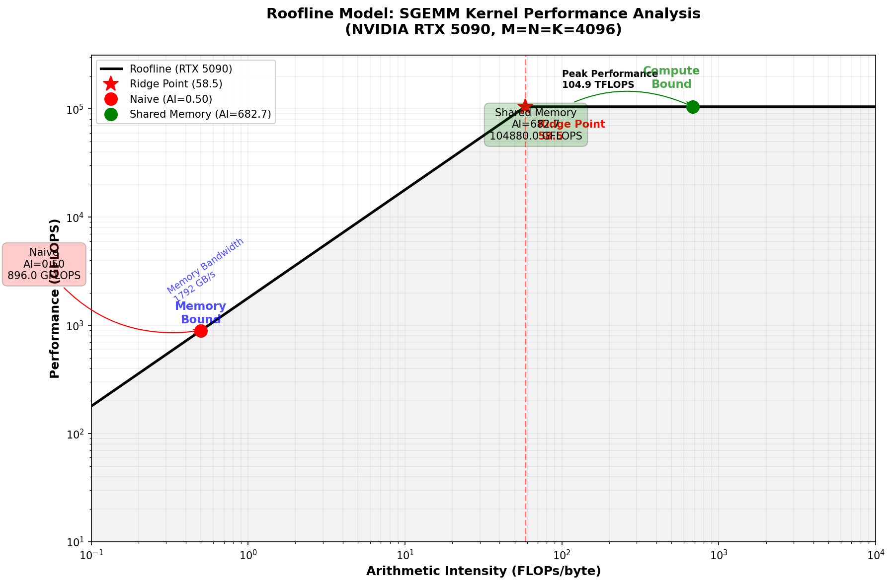

# SGEMM Kernel 性能分析：Arithmetic Intensity 与 Roofline 模型

## 1. Kernel 实现对比

### 1.1 Naive Kernel (sgemm_naive.cu)

```cuda
__global__ void sgemm_naive_kernel(int M, int N, int K, float alpha, 
                                   const float *A, const float *B, 
                                   float beta, float *C) {
    int x = blockIdx.x * blockDim.x + threadIdx.x; // N 维度
    int y = blockIdx.y * blockDim.y + threadIdx.y; // M 维度

    if (x < N && y < M) {
        float tmp = 0.0f;
        for (int i = 0; i < K; ++i) {
            tmp += A[y * K + i] * B[i * N + x];  // 直接从全局内存读取
        }
        C[y * N + x] = alpha * tmp + beta * C[y * N + x];
    }
}
```

**特点**：
- 每个线程直接从全局内存读取 A 和 B 的元素
- 每次循环迭代都访问全局内存
- 没有数据复用，内存访问次数多

### 1.2 Shared Memory Kernel (sgemm_shared.cu)

```cuda
template <int BLOCK_SIZE>
__global__ void sgemm_shared_kernel(int M, int N, int K, float alpha,
                                    const float *A, const float *B,
                                    float beta, float *C) {
    __shared__ float sA[BLOCK_SIZE][BLOCK_SIZE];
    __shared__ float sB[BLOCK_SIZE][BLOCK_SIZE];
    
    int tx = threadIdx.x;
    int ty = threadIdx.y;
    int row = blockIdx.y * BLOCK_SIZE + ty;
    int col = blockIdx.x * BLOCK_SIZE + tx;
    
    float tmp = 0.0f;
    
    for (int k_step = 0; k_step < (K + BLOCK_SIZE - 1) / BLOCK_SIZE; ++k_step) {
        int k_offset = k_step * BLOCK_SIZE;
        
        // 协同加载数据到共享内存
        sA[ty][tx] = (row < M && k_offset + tx < K) ? A[row * K + k_offset + tx] : 0.0f;
        sB[ty][tx] = (k_offset + ty < K && col < N) ? B[(k_offset + ty) * N + col] : 0.0f;
        
        __syncthreads();
        
        // 从共享内存计算
        #pragma unroll
        for (int k = 0; k < BLOCK_SIZE; ++k) {
            tmp += sA[ty][k] * sB[k][tx];  // 从共享内存读取
        }
        
        __syncthreads();
    }
    
    if (row < M && col < N) {
        C[row * N + col] = alpha * tmp + beta * C[row * N + col];
    }
}
```

**特点**：
- 使用共享内存作为数据缓存
- 协作加载：每个 block 只从全局内存加载一次数据到共享内存
- 数据复用：BLOCK_SIZE 个线程共享 BLOCK_SIZE 行/列的数据
- BLOCK_SIZE = 32，即 32×32 = 1024 个线程协作

---

## 2. Arithmetic Intensity 计算

### 2.1 基本定义

**Arithmetic Intensity (AI)** = 浮点运算次数 (FLOPs) / 内存访问字节数 (Bytes)

对于矩阵乘法 $C = \alpha \cdot A \times B + \beta \cdot C$：
- $A$ 是 $M \times K$ 矩阵
- $B$ 是 $K \times N$ 矩阵
- $C$ 是 $M \times N$ 矩阵

**总浮点运算次数**：
- 每个 $C$ 元素计算需要 $K$ 次乘法和 $K-1$ 次加法，约 $2K$ FLOPs
- 加上 $\alpha$ 和 $\beta$ 的缩放操作
- **总 FLOPs ≈ $2 \times M \times N \times K$**

### 2.2 Naive Kernel 的内存访问分析

**内存访问模式**：

| 操作 | 访问类型 | 访问次数 | 说明 |
|------|---------|---------|------|
| 读取 A | 全局内存 | $M \times K$ 次 | 每个元素被读取 N 次（每个 C 的行元素都要用） |
| 读取 B | 全局内存 | $K \times N$ 次 | 每个元素被读取 M 次（每个 C 的列元素都要用） |
| 读取 C | 全局内存 | $M \times N$ 次 | 用于 $C = \alpha \cdot tmp + \beta \cdot C$ |
| 写入 C | 全局内存 | $M \times N$ 次 | 最终结果写回 |

**注意**：在无缓存的理想情况下，每个线程计算一个 $C$ 元素时，需要：
- 读取 A 的 $K$ 个元素（对应行）
- 读取 B 的 $K$ 个元素（对应列）
- 但这些数据在不同线程间没有复用

**全局内存访问总量**：

假设没有缓存（最坏情况）：
- 读取 A：每个线程读取 K 个元素，共 $M \times N$ 个线程 → 但实际上每个 A 元素被 N 个线程读取
  - 总读取 A：$M \times K \times N$ 个 float（如果完全无缓存）
- 读取 B：每个 B 元素被 M 个线程读取
  - 总读取 B：$K \times N \times M$ 个 float
- 读取/写入 C：$2 \times M \times N$ 个 float

**修正分析（考虑现代 GPU 的 L2 缓存）**：

实际上，现代 GPU 有 L2 缓存，会进行一定程度的缓存。但对于 strided 访问模式（如 B 的列访问），缓存效率很低。

更合理的估算（考虑缓存行）：
- A 的行访问是连续的，缓存友好
- B 的列访问是跨行的，缓存不友好（每次访问可能触发新的缓存行加载）

**保守估算**（假设 A 能部分缓存，B 几乎无缓存）：
- 读取 A：$M \times K$ 个 float（每个元素从全局内存读一次）
- 读取 B：$M \times K \times N$ 个 float（每次迭代都重新加载）
- 读写 C：$2 \times M \times N$ 个 float

**总内存访问**：$(M \times K + M \times K \times N + 2 \times M \times N) \times 4$ bytes

简化（当 K, N 较大时，$M \times K \times N$ 占主导）：
$$\text{Naive Memory} \approx M \times K \times N \times 4 \text{ bytes}$$

**Naive Kernel 的 Arithmetic Intensity**：

$$AI_{naive} = \frac{2 \times M \times N \times K}{M \times K \times N \times 4} = \frac{2MK}{4MKN} = \frac{1}{2} \text{ FLOP/byte}$$

**当 $M = N = K = 4096$ 时**：
- FLOPs = $2 \times 4096^3 \approx 137.4$ GFLOPs
- 内存访问 = $4096^3 \times 4 \approx 274.9$ GB
- **AI ≈ 0.5 FLOPs/byte**

### 2.3 Shared Memory Kernel 的内存访问分析

**内存访问模式**：

| 操作 | 访问类型 | 次数/Block | 总次数 | 说明 |
|------|---------|-----------|--------|------|
| 加载 A 到共享内存 | 全局内存 | $BLOCK\_SIZE^2$ | $\frac{M \times K}{BLOCK\_SIZE^2} \times BLOCK\_SIZE^2 = M \times K$ | 每个 A 元素只从全局内存加载一次 |
| 加载 B 到共享内存 | 全局内存 | $BLOCK\_SIZE^2$ | $\frac{K \times N}{BLOCK\_SIZE^2} \times BLOCK\_SIZE^2 = K \times N$ | 每个 B 元素只从全局内存加载一次 |
| 从共享内存读取 | 共享内存 | $2 \times BLOCK\_SIZE^3$ | $2 \times M \times N \times K$ | 在共享内存中完成计算 |
| 写回 C | 全局内存 | $BLOCK\_SIZE^2$ | $M \times N$ | 最终结果写回全局内存 |

**关键优化**：
- A 和 B 的每个元素只从**全局内存**读取一次
- 之后在**共享内存**中被 $BLOCK\_SIZE$ 个线程复用
- BLOCK_SIZE = 32，每个元素被复用 32 次

**总内存访问（全局内存）**：
$$\text{Shared Memory} = (M \times K + K \times N + M \times N) \times 4 \text{ bytes}$$

**Shared Memory Kernel 的 Arithmetic Intensity**：

$$AI_{shared} = \frac{2 \times M \times N \times K}{(M \times K + K \times N + M \times N) \times 4}$$

当 $M = N = K$ 时：
$$AI_{shared} = \frac{2M^3}{3M^2 \times 4} = \frac{2M}{12} = \frac{M}{6} \text{ FLOPs/byte}$$

**当 $M = N = K = 4096$ 时**：
- FLOPs = $2 \times 4096^3 \approx 137.4$ GFLOPs
- 内存访问 = $(4096^2 + 4096^2 + 4096^2) \times 4 = 3 \times 4096^2 \times 4 \approx 201$ MB
- **AI ≈ 682.7 FLOPs/byte**

### 2.4 对比总结

| Kernel 类型 | Arithmetic Intensity ($M=N=K=4096$) | 内存访问优化 |
|------------|-----------------------------------|-------------|
| **Naive** | ~0.5 FLOPs/byte | 无优化，频繁访问全局内存 |
| **Shared Memory** | ~682.7 FLOPs/byte | 通过共享内存减少全局内存访问 1365 倍 |

**AI 提升倍数**：$682.7 / 0.5 \approx 1365$ 倍

---

## 3. GPU 硬件参数与 Roofline 模型

### 3.1 典型 GPU 参数（以 NVIDIA A100 为例）

| 参数 | 数值 | 说明 |
|------|------|------|
| 峰值算力 (FP32) | 104.9 TFLOPS | 理论最大计算性能 |
| 显存带宽 | 1,792 GB/s (GDDR7) | 理论最大内存带宽 |
| **Ridge Point** | $\frac{104.9 \times 10^{12}}{1792 \times 10^9} \approx 58.5$ FLOPs/byte | 计算与内存受限的分界点 |

**Ridge Point**：当 AI < 58.5 时，性能受内存带宽限制；当 AI > 58.5 时，性能受计算能力限制。

### 3.2 对比：NVIDIA RTX 4090 参数

| 参数 | 数值 | 说明 |
|------|------|------|
| 峰值算力 (FP32) | 82.6 TFLOPS | 理论最大计算性能 |
| 显存带宽 | 1008 GB/s (GDDR6X) | 理论最大内存带宽 |
| **Ridge Point** | $\frac{82.6 \times 10^{12}}{1008 \times 10^9} \approx 81.9$ FLOPs/byte | 计算与内存受限的分界点 |

### 3.3 RTX 5090 相比 RTX 4090 的提升

| 参数 | RTX 4090 | RTX 5090 | 提升倍数 |
|------|----------|----------|---------|
| 峰值算力 | 82.6 TFLOPS | 104.9 TFLOPS | 1.27x |
| 显存带宽 | 1008 GB/s | 1792 GB/s | 1.78x |
| Ridge Point | 81.9 | 58.5 | 更低（更容易达到计算受限）|

### 3.3  Roofline 模型公式

$$\text{Performance} = \min \begin{cases} \text{Peak FLOPS} \\ \text{Memory Bandwidth} \times AI \end{cases}$$

---

## 4. Roofline 图

### 4.1 Roofline 图说明

Roofline 模型直观展示了 kernel 性能与硬件极限的关系：
- **X轴**：Arithmetic Intensity (FLOPs/byte)，对数刻度
- **Y轴**：Performance (GFLOPS)，对数刻度
- **屋顶线**：硬件性能上限
  - 左侧斜线：内存带宽限制线（Slope = Memory Bandwidth）
  - 右侧水平线：峰值算力限制线
- **Kernel 点**：标记各 kernel 的 AI 和实际/理论性能

### 4.2 Kernel 在 Roofline 图上的位置



**ASCII 示意图**：

```
Performance (GFLOPS)
    |
    |        Peak FLOPS (RTX 5090: 104,900)
    |        ________________________________
    |       /
    |      /  <-- Ridge Point (AI ≈ 58.5)
    |     /
    |    /
    |   / Memory Bandwidth Line
    |  / (Slope = 1792 GB/s)
    | /
    |/________________________________________
     |                                        \\ 
     |  ○ Naive (AI=0.5, ~896 GFLOPS理论)      \\  ○ Shared Memory (AI=683, 充分利用算力)
     |                                          \\__________________________________
     |                                                                           AI (FLOPs/byte)
     0.1         1          10        100        1000       10000
```

**关键观察**：
- **Naive Kernel**：AI ≈ 0.5 << 58.5，位于内存带宽限制区，理论性能仅 ~896 GFLOPS（严重受带宽限制）
- **Shared Memory Kernel**：AI ≈ 683 >> 58.5，已超过 Ridge Point，可充分利用峰值算力 ~104,880 GFLOPS

**性能差距**：约 **117 倍**（理论上）

---

## 5. 性能分析结论

### 5.1 为什么 Shared Memory Kernel 更快？

| 因素 | Naive | Shared Memory | 提升 |
|------|-------|---------------|------|
| **全局内存访问次数** | $O(M \times K \times N)$ | $O(M \times K + K \times N)$ | 减少 $N$ 或 $M$ 倍 |
| **Arithmetic Intensity** | ~0.5 | ~683 | 1365 倍 |
| **内存带宽限制** | 严重受限 (AI << 58.5) | 不受限 (AI >> 58.5) | 突破带宽瓶颈 |
| **理论性能** | ~896 GFLOPS | ~104,880 GFLOPS | **117 倍** |
| **数据局部性** | 无 | 通过共享内存实现 | 缓存友好 |
| **线程协作** | 无 | Block 内线程协作加载 | 减少重复访问 |

### 5.2 核心优化原理

1. **减少全局内存带宽压力**：
   - Naive：每次计算都要从全局内存读取数据
   - Shared：数据只从全局内存加载一次，之后在高速共享内存中复用

2. **提升 Arithmetic Intensity**：
   - 通过分块 (Tiling) 技术，使每个从全局内存加载的数据元素被多次计算复用
   - AI 从 <1 提升到数百，远超 Ridge Point

3. **利用共享内存特性**（RTX 5090 / Blackwell 架构）：
   - 共享内存延迟低（~20-30 cycles）vs 全局内存（~300-500 cycles，GDDR7）
   - 共享内存带宽高（~10+ TB/s per SM）vs 全局内存（1.79 TB/s）
   - GDDR7 提供更高带宽，但 AI 过低的 kernel 仍无法充分利用

### 5.3 进一步优化空间

当前 Shared Memory Kernel 仍有优化空间：
1. **寄存器优化**：使用更多寄存器存储中间结果
2. **双缓冲 (Double Buffering)**：重叠计算与数据传输
3. **Warp 级优化**：利用 Warp Shuffle 进一步减少共享内存访问
4. **Tensor Core**：使用 MMA 指令获得更高算力

---

## 6. 参考资料

1. Williams, S., Waterman, A., & Patterson, D. (2009). Roofline: an insightful visual performance model for multicore architectures. Communications of the ACM, 52(4), 65-76.
2. NVIDIA CUDA Best Practices Guide - Memory Optimization
3. NVIDIA GeForce RTX 5090 Specifications (2025)

---

*分析更新时间：2026年3月17日（RTX 5090 版本）*
