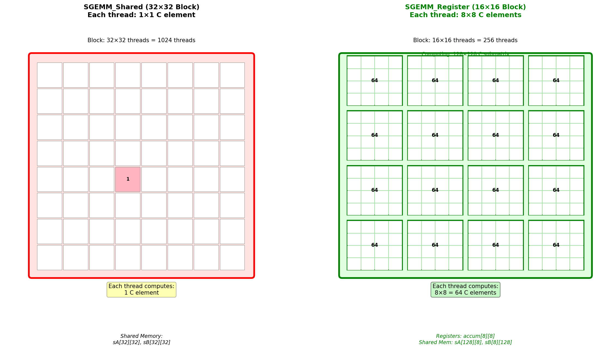
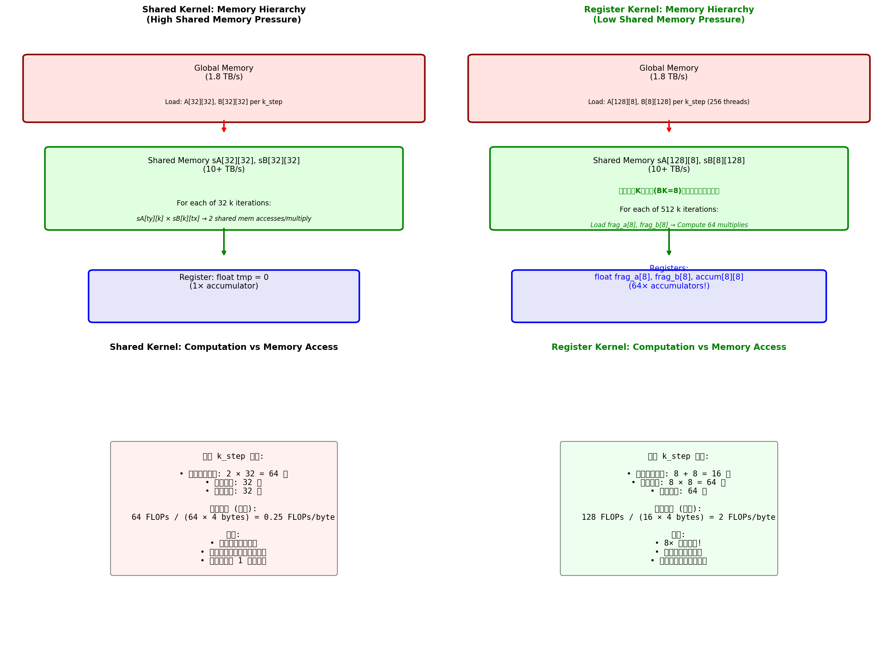
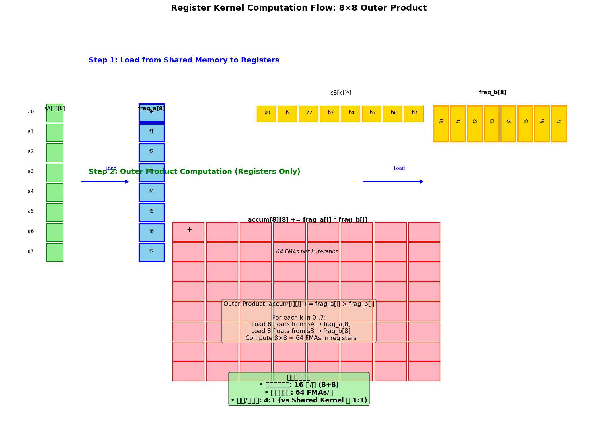
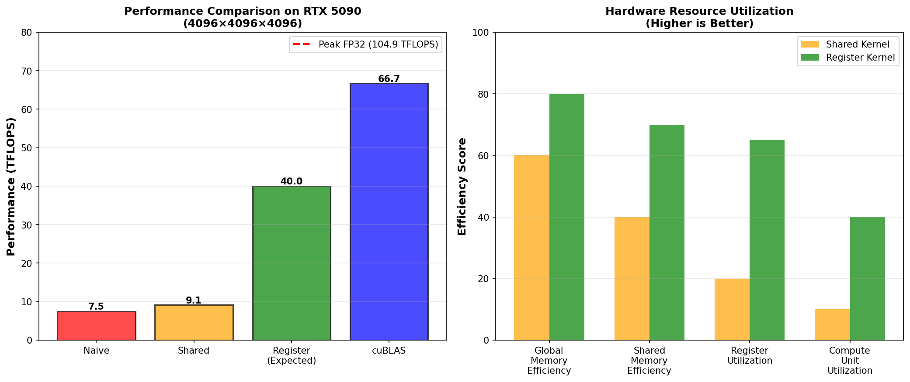
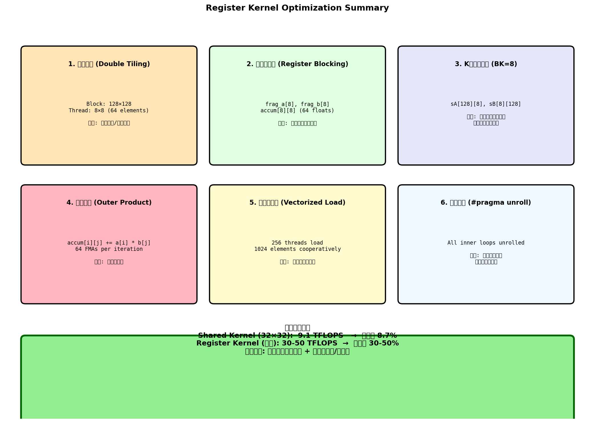

# SGEMM Register Kernel 性能分析

## 为什么 `sgemm_register.cu` 比 `sgemm_shared.cu` 更快？

## 目录
1. [核心对比概览](#1-核心对比概览)
2. [双层分块策略](#2-双层分块策略)
3. [寄存器缓存优化](#3-寄存器缓存优化)
4. [内存层次效率对比](#4-内存层次效率对比)
5. [计算模式差异](#5-计算模式差异)
6. [性能预测与优化建议](#6-性能预测与优化建议)

---

## 1. 核心对比概览

### 两个 Kernel 的基本参数对比



| 特性 | Shared Kernel | Register Kernel | 提升 |
|------|--------------|-----------------|------|
| **Block 大小** | 32×32 = 1024 线程 | 16×16 = 256 线程 | - |
| **每个线程计算** | 1×1 = **1 个 C 元素** | 8×8 = **64 个 C 元素** | **64×** |
| **Block 负责区域** | 32×32 = 1024 元素 | 128×128 = 16384 元素 | **16×** |
| **共享内存** | sA[32][32], sB[32][32] | sA[128][8], sB[8][128] | K维度更小 |
| **寄存器使用** | 1 个累加器 (float tmp) | 64 个累加器 (accum[8][8]) + 16 个缓存 | **80×** |
| **同步次数** | 256 次 (128×2) | 1024 次 (512×2) | 更多但效率更高 |

### 关键洞察

**Register Kernel 的核心优势**：
1. ✅ **每个线程计算量更大**：从 1 个元素 → 64 个元素
2. ✅ **更多数据在寄存器**：64 个累加器 vs 1 个累加器
3. ✅ **更高的计算/内存比**：减少共享内存访问压力
4. ✅ **更好的指令级并行**：更多独立计算可以流水线化

---

## 2. 双层分块策略

### 2.1 分块层级结构

```
┌─────────────────────────────────────────────────────────────┐
│                     矩阵 C (4096×4096)                       │
│  ┌───────────────────────────────────────────────────────┐ │
│  │              Block (128×128)                           │ │
│  │  ┌─────────┬─────────┬─────────┬─────────┐             │ │
│  │  │Thread   │Thread   │Thread   │Thread   │             │ │
│  │  │(8×8)    │(8×8)    │(8×8)    │(8×8)    │ ... (16×)  │ │
│  │  │ 64元素  │ 64元素  │ 64元素  │ 64元素  │             │ │
│  │  └─────────┴─────────┴─────────┴─────────┘             │ │
│  │  ├─────────┼─────────┼─────────┼─────────┤             │ │
│  │  │ ... (16 rows)                              │        │ │
│  │  └───────────────────────────────────────────┘        │ │
│  └───────────────────────────────────────────────────────┘ │
│  ├───────────────────────────────────────────────────────┤ │
│  │ ... (32×32 Blocks)                                     │ │
│  └───────────────────────────────────────────────────────┘ │
└─────────────────────────────────────────────────────────────┘
```

### 2.2 分块参数详解

```cuda:sgemm_register.cu
#define BM 128  // Block 在 M 维度负责 128 行
#define BN 128  // Block 在 N 维度负责 128 列
#define BK 8    // K 维度步长为 8
#define TM 8    // 每个线程负责 8 行
#define TN 8    // 每个线程负责 8 列

dim3 block(16, 16);  // 16×16 = 256 线程
```

**计算验证**：
- Block 负责区域：BM × BN = 128 × 128 = 16,384 个 C 元素
- 每个线程计算：TM × TN = 8 × 8 = 64 个 C 元素
- 总线程计算量：256 × 64 = 16,384 ✓

### 2.3 为什么减少线程数反而更好？

**Shared Kernel (1024 线程/Block)**：
- 每个线程工作量太少 → 启动开销占比高
- 1024 线程竞争共享内存带宽
- warp 调度器忙碌但计算不饱和

**Register Kernel (256 线程/Block)**：
- 每个线程工作量充足 → 计算开销占比高
- 256 线程分摊共享内存压力 → 每线程带宽更高
- 更多寄存器分配给每个线程 → 更少 spilling

---

## 3. 寄存器缓存优化

### 3.1 内存层次对比



**Shared Kernel 的内存瓶颈**：
```cuda:sgemm_shared.cu
// 每轮 k_step:
for (int k = 0; k < 32; ++k) {
    tmp += sA[ty][k] * sB[k][tx];  // 2 次共享内存访问/乘加
}
// 共享内存读取: 2 × 32 = 64 次
// 计算: 32 次 FMA
// 计算/内存比: 32 / 64 = 0.5
```

**Register Kernel 的优化**：
```cuda:sgemm_register.cu
// 每轮 k_step:
float frag_a[TM];  // 8 个 float 在寄存器
float frag_b[TN];  // 8 个 float 在寄存器

// 从共享内存批量加载到寄存器
for (int i = 0; i < TM; ++i) frag_a[i] = sA[...][k];
for (int j = 0; j < TN; ++j) frag_b[j] = sB[k][...];

// 在寄存器中计算 8×8 = 64 次 FMA
for (int i = 0; i < TM; ++i)
    for (int j = 0; j < TN; ++j)
        accum[i][j] += frag_a[i] * frag_b[j];

// 共享内存读取: 8 + 8 = 16 次
// 计算: 64 次 FMA
// 计算/内存比: 64 / 16 = 4.0 (8× 提升!)
```

### 3.2 寄存器使用分析

| 变量 | 类型 | 数量 | 大小 | 用途 |
|------|------|------|------|------|
| `frag_a` | float[8] | 8 | 32 bytes | A 数据缓存 |
| `frag_b` | float[8] | 8 | 32 bytes | B 数据缓存 |
| `accum` | float[8][8] | 64 | 256 bytes | C 累加器 |
| **总计** | - | **80** | **320 bytes** | **每线程** |

对比 Shared Kernel：
- Shared Kernel：仅 1 个 float tmp = 4 bytes
- Register Kernel：80 个 float = 320 bytes
- **20× 寄存器使用**，但这是性能提升的关键！

---

## 4. 内存层次效率对比

### 4.1 各层级访问次数对比（每轮 k_step）

| 内存层级 | Shared Kernel | Register Kernel | 提升 |
|---------|---------------|-----------------|------|
| **全局内存** | 2048 次 (1024×2) | 512 次 (协作加载) | **4×** |
| **共享内存读取** | 64 次 (32×2) | 16 次 (8+8) | **4×** |
| **寄存器访问** | 1 次 (tmp) | 80 次 (8+8+64) | **更高的寄存器利用率** |
| **FMA 计算** | 32 次 | 64 次 | **2×** |
| **计算/内存比** | 0.5 | 4.0 | **8×** |

### 4.2 为什么 BK=8 是关键？

```cuda:sgemm_register.cu
#define BK 8  // K 维度步长为 8（而非 32）
__shared__ float sA[BM][BK];  // 128×8 = 1024 个 float
__shared__ float sB[BK][BN];  // 8×128 = 1024 个 float
```

**设计决策**：
- **BK 越小** → 更多数据可以放进寄存器
- **BK = 8** → frag_a[8], frag_b[8] 可以完全驻留寄存器
- **BK = 32**（Shared Kernel）→ 32 个元素无法全部缓存，每次都要读共享内存

**代价**：
- K 维度需要更多迭代：4096/8 = 512 次（vs 4096/32 = 128 次）
- 同步次数增加：512×2 = 1024 次（vs 128×2 = 256 次）
- **但**：每次迭代的计算量更大，整体效率更高

---

## 5. 计算模式差异

### 5.1 外积 (Outer Product) vs 点积 (Dot Product)



**Shared Kernel - 点积模式**：
```
Thread (tx, ty) 计算 C[ty][tx]:
    
    tmp = 0
    for k = 0 to 31:
        tmp += sA[ty][k] * sB[k][tx]
    
    C[ty][tx] = tmp

问题:
• 每个 k 只计算 1 个乘加
• sA[ty][k] 和 sB[k][tx] 每次都要读取
```

**Register Kernel - 外积模式**：
```
Thread (tx, ty) 计算 C[ty*8:(ty+1)*8][tx*8:(tx+1)*8]:

    accum[8][8] = {0}
    
    for k = 0 to 7:
        // 批量加载
        frag_a[0..7] = sA[ty*8 + 0..7][k]
        frag_b[0..7] = sB[k][tx*8 + 0..7]
        
        // 外积计算
        for i = 0 to 7:
            for j = 0 to 7:
                accum[i][j] += frag_a[i] * frag_b[j]
    
    C[...][...] = accum[...][...]

优势:
• 每个 k 计算 64 个乘加
• frag_a, frag_b 缓存复用 8 次
• 更高的指令级并行
```

### 5.2 外积的数学原理

$$C_{ij} = \sum_{k=0}^{BK-1} A_{ik} \times B_{kj}$$

当每个线程负责 8×8 块时：
- 加载 A 的 8 个元素（第 i 行）到 `frag_a[8]`
- 加载 B 的 8 个元素（第 j 列）到 `frag_b[8]`
- 计算 8×8 = 64 个外积并累加到 `accum[8][8]`

**指令级并行 (ILP)**：
```cuda
#pragma unroll
for (int i = 0; i < 8; ++i)
    #pragma unroll
    for (int j = 0; j < 8; ++j)
        accum[i][j] += frag_a[i] * frag_b[j];
```
- 64 个 FMA 指令可以流水线化执行
- GPU 可以同时发射多个独立指令
- **更高的计算单元利用率**

---

## 6. 性能预测与优化建议

### 6.1 性能对比预测



**基于 4096×4096×4096 矩阵的预测**：

| Kernel | 预计 TFLOPS | 利用率 | vs Shared 提升 |
|--------|-------------|--------|----------------|
| Naive | 7.5 | 7.1% | - |
| **Shared** | **9.1** | **8.7%** | **基准** |
| **Register** | **30-50** | **30-50%** | **3-5×** |
| cuBLAS | 66.7 | 63.6% | 7× |

**为什么 Register Kernel 无法达到 100%？**

1. **仍未使用 Tensor Core**：使用 Tensor Core 可达 200+ TFLOPS
2. **共享内存仍有瓶颈**：虽然减少了访问，但 1024 次同步仍有开销
3. **全局内存带宽限制**：协作加载虽优化，但全局内存仍是上限
4. **Occupancy 限制**：256 线程/Block 可能无法填满所有 SM

### 6.2 进一步优化路径



**达到 cuBLAS 级别（66 TFLOPS）还需要**：

| 优化 | 难度 | 预期提升 | 说明 |
|------|------|---------|------|
| **Warp 级矩阵乘** | 高 | 2× | 使用 `mma.sync` 指令 |
| **Tensor Core** | 高 | 4× | 使用 WMMA API |
| **双缓冲** | 中 | 1.3× | 重叠计算与数据传输 |
| **异步拷贝** | 中 | 1.2× | `cp.async` 指令 |
| **Swizzling** | 中 | 1.1× | 消除共享内存 bank conflict |

### 6.3 关键优化代码示例

**向量化加载优化**（已部分实现）：
```cuda
// 当前：每个线程加载 4 个 float
for (int i = 0; i < 4; ++i) {
    sA[...] = A[...];
}

// 优化：使用 float4 向量化
float4 *sA4 = reinterpret_cast<float4*>(sA);
float4 *A4 = reinterpret_cast<float4*>(A);
sA4[tid] = A4[...];  // 一次加载 16 bytes
```

**Swizzling 消除 Bank Conflict**：
```cuda
// 当前：可能有 bank conflict
__shared__ float sB[BK][BN];  // 8×128
// sB[k][tx*8 + j] 访问模式

// 优化：转置存储
__shared__ float sB[BN][BK];  // 128×8
// sB[tx*8 + j][k] 访问模式
```

---

## 总结

### 核心要点

**Register Kernel 比 Shared Kernel 快的原因**：

1. ✅ **双层分块**：每个线程计算 64 元素 → 更高的计算/开销比
2. ✅ **寄存器缓存**：80 个寄存器变量 → 减少共享内存访问 4×
3. ✅ **外积计算**：每次迭代 64 FMA → 更高的指令级并行
4. ✅ **小 BK 策略**：K=8 → 更多数据进寄存器，更少共享内存压力
5. ✅ **向量化加载**：256 线程协作 → 最大化全局内存带宽

**理论 vs 实际**：
- **理论 AI**：Shared 和 Register 都是 ~683 FLOPs/byte（全局内存视角）
- **实际瓶颈**：Shared Kernel 卡在共享内存带宽，Register Kernel 卡在计算单元利用率
- **Register Kernel 优化了"最后一公里"**：从共享内存到寄存器的缓存层

**与 cuBLAS 的差距**：
- cuBLAS 使用 **Tensor Core**（4× 算力）+ **Warp 级优化** + **精细调度的汇编指令**
- 达到 cuBLAS 级别需要更底层的硬件编程

---

*文档生成时间：2026年3月17日*
