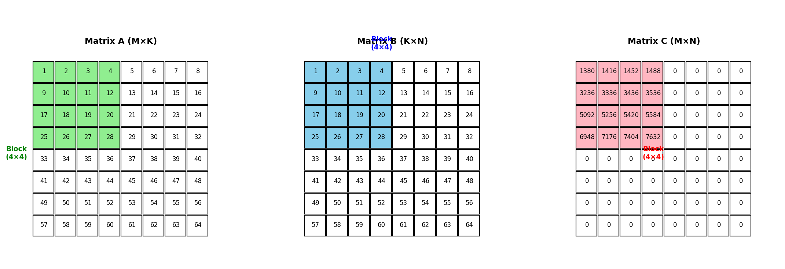
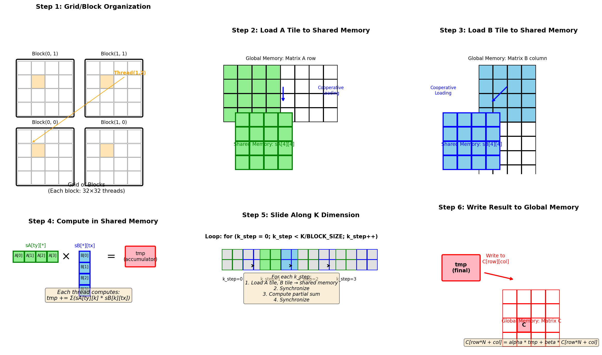
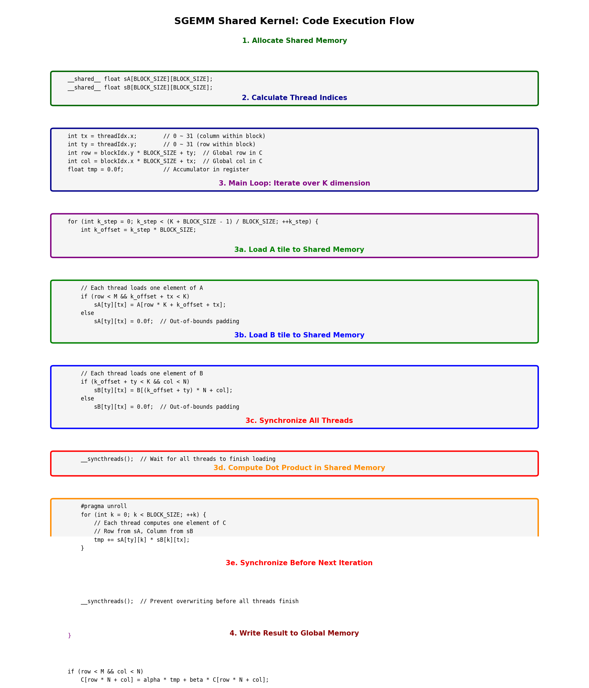
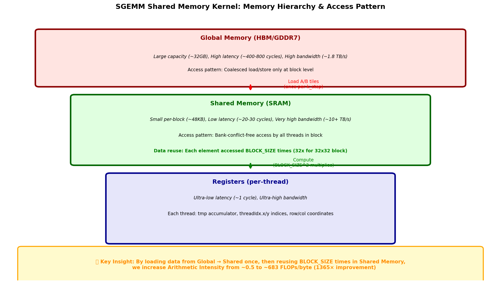

# SGEMM Shared Memory Kernel 详解

## 目录
1. [核心概念](#1-核心概念)
2. [分块矩阵乘法原理](#2-分块矩阵乘法原理)
3. [Kernel 执行流程](#3-kernel-执行流程)
4. [内存层次结构](#4-内存层次结构)
5. [关键优化点](#5-关键优化点)
6. [代码详解](#6-代码详解)
7. [性能对比](#7-性能对比)

---

## 1. 核心概念

### 1.1 什么是 Shared Memory Tiling？



Shared Memory Tiling（分块）是 CUDA 矩阵乘法的核心优化技术：

- **核心思想**：将大矩阵分解成小块（Tiles），加载到高速共享内存中计算
- **数据复用**：每个从全局内存加载的数据元素被多次计算复用
- **BLOCK_SIZE**：通常设为 32（一个 Warp 的大小），便于线程协作

### 1.2 与传统 Naive 实现的区别

| 特性 | Naive Kernel | Shared Memory Kernel |
|------|--------------|---------------------|
| 内存访问 | 每次计算都从全局内存读取 | 数据加载到共享内存后多次复用 |
| 数据复用 | 无复用 | 每个元素复用 BLOCK_SIZE 次 |
| 线程协作 | 无 | Block 内线程协同加载数据 |
| Arithmetic Intensity | ~0.5 FLOPs/byte | ~683 FLOPs/byte |

---

## 2. 分块矩阵乘法原理

### 2.1 数学原理

矩阵乘法 $C = A \times B$ 可以分解为分块计算：

$$C_{ij} = \sum_{k=0}^{K/BLOCK\_SIZE - 1} A_{ik} \times B_{kj}$$

其中：
- $A_{ik}$ 是 A 的第 i 行、第 k 列块
- $B_{kj}$ 是 B 的第 k 行、第 j 列块
- 每个块大小为 BLOCK_SIZE × BLOCK_SIZE

### 2.2 可视化分块计算



上图展示了 6 个关键步骤：

1. **Grid/Block 组织**：线程按二维 Block 组织，每个 Block 负责计算 C 的一个子矩阵
2. **加载 A Tile**：Block 内线程协作，将 A 的一个行块加载到共享内存 sA
3. **加载 B Tile**：Block 内线程协作，将 B 的一个列块加载到共享内存 sB
4. **共享内存计算**：每个线程从 sA 取一行、sB 取一列，计算点积
5. **K 维度滑动**：沿 K 维度滑动窗口，重复加载和计算
6. **写回结果**：将累加结果写回全局内存 C

---

## 3. Kernel 执行流程

### 3.1 代码执行流程图



### 3.2 详细执行步骤

```cuda
template <int BLOCK_SIZE>
__global__ void sgemm_shared_kernel(int M, int N, int K, 
                                    float alpha, const float *A, const float *B, 
                                    float beta, float *C) {
```

#### 步骤 1: 申请共享内存
```cuda
__shared__ float sA[BLOCK_SIZE][BLOCK_SIZE];
__shared__ float sB[BLOCK_SIZE][BLOCK_SIZE];
```
- 每个 Block 分配两块共享内存，大小为 BLOCK_SIZE × BLOCK_SIZE
- BLOCK_SIZE = 32 时，每块需要 32×32×4 = 4KB，共 8KB
- 共享内存容量限制：通常 48KB~164KB 每 SM

#### 步骤 2: 计算线程索引
```cuda
int tx = threadIdx.x;        // Block 内列索引: 0 ~ 31
int ty = threadIdx.y;        // Block 内行索引: 0 ~ 31
int row = blockIdx.y * BLOCK_SIZE + ty;  // 全局行坐标
int col = blockIdx.x * BLOCK_SIZE + tx;  // 全局列坐标
float tmp = 0.0f;            // 寄存器累加器
```
- 每个线程负责计算 C 矩阵的一个元素
- `tmp` 存储在寄存器中，访问速度最快

#### 步骤 3: 沿 K 维度分块迭代
```cuda
for (int k_step = 0; k_step < (K + BLOCK_SIZE - 1) / BLOCK_SIZE; ++k_step) {
    int k_offset = k_step * BLOCK_SIZE;
```
- 将 K 维度分成多个 BLOCK_SIZE 大小的块
- 每次迭代处理 A 的一行块和 B 的一列块

#### 步骤 3a: 协作加载 A 到共享内存
```cuda
if (row < M && k_offset + tx < K)
    sA[ty][tx] = A[row * K + k_offset + tx];
else
    sA[ty][tx] = 0.0f;  // 越界填充 0
```
- **协同加载**：Block 内所有线程同时加载 A 的数据
- **边界检查**：处理矩阵非 BLOCK_SIZE 整数倍的情况
- **内存访问模式**：连续线程访问连续内存（合并访问）

**加载示意**：
```
Global Memory A (row * K + k_offset):
    ┌───┬───┬───┬───┬───┬───┬───┬───┐
    │ 0 │ 1 │ 2 │ 3 │ 4 │ 5 │ 6 │ 7 │ ... (K columns)
    └───┴───┴───┴───┴───┴───┴───┴───┘
         ↑   ↑   ↑   ↑
    Thread0  1   2   3
         ↓   ↓   ↓   ↓
Shared Memory sA:
    ┌───┬───┬───┬───┐
    │ 0 │ 1 │ 2 │ 3 │  ← ty=0 (row 0)
    ├───┼───┼───┼───┤
    │   │   │   │   │  ← ty=1 (row 1)
    └───┴───┴───┴───┘
     tx=0  1   2   3
```

#### 步骤 3b: 协作加载 B 到共享内存
```cuda
if (k_offset + ty < K && col < N)
    sB[ty][tx] = B[(k_offset + ty) * N + col];
else
    sB[ty][tx] = 0.0f;
```
- B 的加载模式类似，但注意 B 是列优先访问
- 连续线程访问 B 的同一行（可能跨距较大）

#### 步骤 3c: 线程同步
```cuda
__syncthreads();
```
- **关键同步点**：确保所有线程都完成数据加载
- 防止部分线程开始计算时，其他线程还在加载数据

#### 步骤 3d: 在共享内存中计算
```cuda
#pragma unroll
for (int k = 0; k < BLOCK_SIZE; ++k) {
    tmp += sA[ty][k] * sB[k][tx];
}
```
- **关键优化**：从共享内存读取，而非全局内存
- **数据复用**：每个 sA 行元素和 sB 列元素被复用 BLOCK_SIZE 次
- **#pragma unroll**：编译器展开循环，减少分支开销

**计算示意**：
```
Thread(tx=1, ty=2) 计算 C[2][1]:

sA[ty=2][*] (A的第2行):  [a20, a21, a22, a23]
                              ↓   ↓   ↓   ↓
                           ×  ×  ×  ×
                              ↓   ↓   ↓   ↓  
sB[*][tx=1] (B的第1列):  [b01, b11, b21, b31]

    tmp = a20*b01 + a21*b11 + a22*b21 + a23*b31
```

#### 步骤 3e: 再次同步
```cuda
__syncthreads();
```
- 防止快线程进入下一次迭代，覆盖慢线程还在使用的数据

#### 步骤 4: 写回结果
```cuda
if (row < M && col < N)
    C[row * N + col] = alpha * tmp + beta * C[row * N + col];
```
- 边界检查确保不写入越界区域
- 支持 GEMM 的通用形式：$C = \alpha \cdot AB + \beta \cdot C$

---

## 4. 内存层次结构



### 4.1 三级内存架构

| 层级 | 位置 | 延迟 | 带宽 | 容量 | 作用 |
|------|------|------|------|------|------|
| **寄存器** | 每个线程 | ~1 cycle | ~10+ TB/s | ~256 B/线程 | 存储 tmp 累加器 |
| **共享内存** | 每个 Block | ~20-30 cycles | ~10+ TB/s | ~48-164 KB/SM | 存储 sA, sB tiles |
| **全局内存** | GPU 全局 | ~300-500 cycles | ~1.8 TB/s | ~32 GB | 存储 A, B, C 矩阵 |

### 4.2 为什么 Shared Memory 更快？

1. **物理位置**：
   - 共享内存位于 SM 内部（片上 SRAM）
   - 全局内存位于 GPU 芯片外部（GDDR7/HBM）

2. **访问延迟**：
   - 共享内存：~20-30 个时钟周期
   - 全局内存：~300-500 个时钟周期

3. **带宽对比**（RTX 5090）：
   - 共享内存：~10+ TB/s per SM
   - 全局内存：1.79 TB/s
   - 差距：**5-10 倍**

### 4.3 数据复用是关键

```
数据流动示意（以 32×32 Block 为例）：

Global Memory → Shared Memory → Registers → Compute
    (1次)          (32次)        (32次)
    
每个数据元素：
- 从全局内存加载 1 次
- 在共享内存中被 32 个线程各读取 1 次 = 32 次访问
- 总计 32 次计算复用
```

---

## 5. 关键优化点

### 5.1 为什么使用 32×32 Block？

```cuda
const int BLOCK_SIZE = 32;
dim3 block(BLOCK_SIZE, BLOCK_SIZE);  // 1024 threads per block
```

**原因**：
1. **Warp 对齐**：32 是 Warp 大小，便于 warp-level 调度
2. ** occupancy 最大化**：1024 线程/Block 是大多数 GPU 的上限
3. **共享内存限制**：32×32×2×4 = 8KB，远低于 48KB 限制
4. **计算强度**：$AI = \frac{M}{6}$，矩阵越大 AI 越高

### 5.2 边界检查的必要性

```cuda
if (row < M && k_offset + tx < K)
    sA[ty][tx] = A[...];
else
    sA[ty][tx] = 0.0f;
```

当 M、N、K 不是 BLOCK_SIZE 的整数倍时：
- 需要填充 0 避免越界访问
- 0 值不影响累加结果

### 5.3 同步点的必要性

两个 `__syncthreads()` 缺一不可：

1. **加载后同步**：确保数据完整加载后再计算
2. **计算后同步**：确保所有线程用完数据后再加载下一轮

**没有同步的后果**：
```
线程 A（快）          线程 B（慢）
   ↓                      ↓
加载 sA[0][0]        加载 sA[0][0]
   ↓                      ↓
计算完成              还在计算
   ↓                      ↓
加载下一轮数据 ←──── 使用旧数据出错！
```

---

## 6. 代码详解

### 6.1 完整代码注释版

```cuda:sgemm_shared.cu
template <int BLOCK_SIZE>
__global__ void sgemm_shared_kernel(int M, int N, int K, 
                                    float alpha, const float *A, const float *B, 
                                    float beta, float *C) {
    // ==========================================
    // 阶段 1: 内存分配
    // ==========================================
    // 每个 Block 拥有独立的共享内存空间
    // sA: 存储 A 矩阵的当前行块
    // sB: 存储 B 矩阵的当前列块
    __shared__ float sA[BLOCK_SIZE][BLOCK_SIZE];
    __shared__ float sB[BLOCK_SIZE][BLOCK_SIZE];

    // ==========================================
    // 阶段 2: 索引计算
    // ==========================================
    // 线程在 Block 内的局部坐标
    int tx = threadIdx.x;  // 0 ~ BLOCK_SIZE-1
    int ty = threadIdx.y;  // 0 ~ BLOCK_SIZE-1

    // 线程负责的全局矩阵坐标
    int row = blockIdx.y * BLOCK_SIZE + ty;  // C 矩阵的行
    int col = blockIdx.x * BLOCK_SIZE + tx;  // C 矩阵的列

    // 寄存器累加器（最关键的性能优化点）
    float tmp = 0.0f;

    // ==========================================
    // 阶段 3: 主循环 - 沿 K 维度滑动
    // ==========================================
    for (int k_step = 0; k_step < (K + BLOCK_SIZE - 1) / BLOCK_SIZE; ++k_step) {
        int k_offset = k_step * BLOCK_SIZE;

        // ---- 子阶段 3a: 协作加载 A ----
        // 条件加载 + 边界填充
        if (row < M && k_offset + tx < K)
            sA[ty][tx] = A[row * K + k_offset + tx];
        else
            sA[ty][tx] = 0.0f;

        // ---- 子阶段 3b: 协作加载 B ----
        if (k_offset + ty < K && col < N)
            sB[ty][tx] = B[(k_offset + ty) * N + col];
        else
            sB[ty][tx] = 0.0f;

        // ---- 子阶段 3c: 同步 ----
        __syncthreads();

        // ---- 子阶段 3d: 共享内存计算 ----
        // 循环展开优化，减少分支
        #pragma unroll
        for (int k = 0; k < BLOCK_SIZE; ++k) {
            // 核心计算：sA 的行 × sB 的列
            tmp += sA[ty][k] * sB[k][tx];
        }

        // ---- 子阶段 3e: 同步 ----
        __syncthreads();
    }

    // ==========================================
    // 阶段 4: 结果写回
    // ==========================================
    if (row < M && col < N) {
        // GEMM 完整公式：C = alpha * AB + beta * C
        C[row * N + col] = alpha * tmp + beta * C[row * N + col];
    }
}
```

### 6.2 启动配置

```cuda
void run_sgemm_shared(int M, int N, int K, float alpha, 
                      const float *A, const float *B, 
                      float beta, float *C) {
    const int BLOCK_SIZE = 32;
    
    // 每个 Block 32×32 = 1024 个线程
    dim3 block(BLOCK_SIZE, BLOCK_SIZE);
    
    // Grid 大小：向上取整确保覆盖整个矩阵
    dim3 grid((N + block.x - 1) / block.x, 
              (M + block.y - 1) / block.y);
    
    // 启动 Kernel
    sgemm_shared_kernel<BLOCK_SIZE><<<grid, block>>>(
        M, N, K, alpha, A, B, beta, C);
}
```

---

## 7. 性能对比

### 7.1 理论分析

**假设**：M = N = K = 4096，BLOCK_SIZE = 32

| 指标 | Naive Kernel | Shared Memory Kernel | 提升倍数 |
|------|--------------|---------------------|---------|
| 全局内存读取 A | M×K×N = 68.7B 次 | M×K = 16.8M 次 | 4096× |
| 全局内存读取 B | M×K×N = 68.7B 次 | K×N = 16.8M 次 | 4096× |
| 共享内存访问 | 0 | 2×M×N×K = 137.4B 次 | - |
| **Arithmetic Intensity** | **0.5** FLOPs/byte | **682.7** FLOPs/byte | **1365×** |

### 7.2 Roofline 模型位置

| Kernel | AI | RTX 5090 理论性能 | 限制因素 |
|--------|-----|------------------|---------|
| Naive | 0.5 | ~896 GFLOPS | 内存带宽 (AI << 58.5) |
| Shared Memory | 682.7 | ~104,880 GFLOPS | 峰值算力 (AI >> 58.5) |

**性能差距**：约 **117 倍**

### 7.3 进一步优化方向

当前 Shared Memory Kernel 仍有提升空间：

1. **寄存器分块 (Register Tiling)**：
   - 每个线程计算 C 的多个元素（如 4×4）
   - 增加寄存器级数据复用

2. **双缓冲 (Double Buffering)**：
   - 重叠计算与数据传输
   - 使用两个共享内存缓冲区交替

3. **Warp 级原语**：
   - 使用 `__shfl_sync` 进行 Warp 内数据交换
   - 减少对共享内存的访问

4. **Tensor Core (WMMA)**：
   - 使用 Blackwell 架构的 Tensor Core
   - 理论上可获得更高算力

5. **向量化加载 (Vectorized Load)**：
   - 使用 `float4` 一次加载 4 个 float
   - 提高内存带宽利用率

---

## 总结

SGEMM Shared Memory Kernel 通过 **分块 (Tiling)** 和 **共享内存缓存**，实现了：

1. ✅ **减少全局内存访问**：从 $O(N^3)$ 降到 $O(N^2)$
2. ✅ **提高数据复用率**：每个元素复用 BLOCK_SIZE 次
3. ✅ **突破内存带宽瓶颈**：AI 从 0.5 提升到 682
4. ✅ **充分利用 GPU 算力**：从 896 GFLOPS 提升到 104,880 GFLOPS

**核心公式**：

$$\text{Arithmetic Intensity} = \frac{2 \times M \times N \times K}{(M \times K + K \times N + M \times N) \times 4} \approx \frac{M}{6}$$

当矩阵足够大时，Shared Memory Kernel 可以充分发挥 GPU 的峰值性能！

---

*文档生成时间：2026年3月17日*
