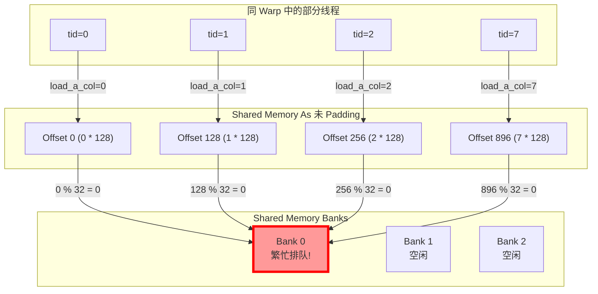
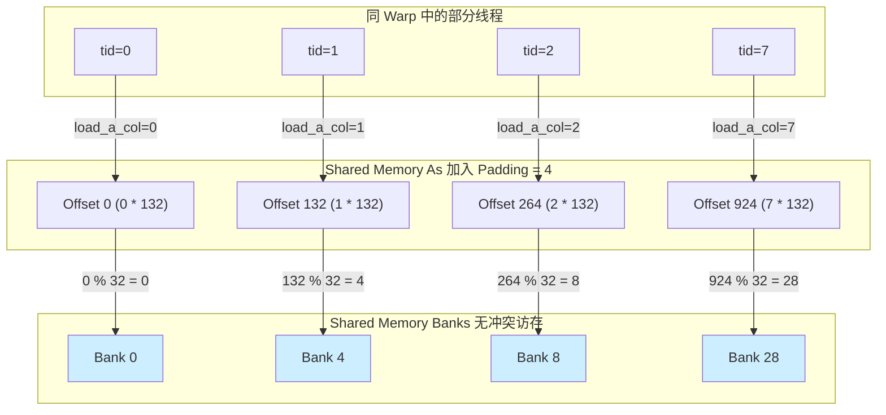

# CUDA GEMM 优化分析：Bank Conflict 消除版 (`v5_bank_conflict.cu`)

本文档对 `GEMM/src/gemm/v5_bank_conflict.cu` 的源代码进行详细解析。这是二维寄存器分块 GEMM 的优化版本，在其基础上引入了 **Shared Memory Padding** 和 **转置加载矩阵 A** 的策略，专门用于消除 Shared Memory 在读写过程中的 Bank Conflict（存储体冲突）。

## 1. 核心分块参数配置 (Tiling Parameters)

代码中使用了 3 层分块结构：
- **Block 级别分块 (Shared Memory 大小)**: 
  `BM = 128`, `BN = 128`, `BK = 8`
  说明每个 Block 在一次循环中处理 $128 \times 128$ 的输出子矩阵 $C$，以及对应的 $128 \times 8$ 的 $A$ 子矩阵和 $8 \times 128$ 的 $B$ 子矩阵。
- **Thread 级别分块 (寄存器 大小)**: 
  `TM = 8`, `TN = 8`
  说明当前 Block 内的每个线程负责计算 $C$ 的 $8 \times 8$ 的小方块。
- 一共需要 $128 \times 128 / (8 \times 8) = 256$ 个线程（即 Block 维数为 256）。

## 2. 核心优化一：消除矩阵 A 写入 Shared Memory 的 Bank Conflict

这是本次代码相较上一版本的**核心改变**。

### 为什么会发生 Bank Conflict？
在将 Global Memory 加载到 Shared Memory 时，为了在后续计算内积外积阶段有更好的访存特征（比如方便广播），往往需要在保存 $A$ 数据时进行**转置存储**。
假设未设置 Pad (即 `As[BK][BM] = As[8][128]`)，对应代码逻辑：
```cpp
As[load_a_col][load_a_row + step] = A_ptr[(load_a_row + step) * K + load_a_col];
```
这里的 `load_a_col = tid % 8`，`load_a_row = tid / 8`。
- 对于前 8 个连续线程 (Warp内的 `tid` 0~7)：
  `load_a_row = 0`，`load_a_col` 分别为 `0, 1, ..., 7`。
  它们写入的地址偏移量为 `load_a_col * 128 + 0`。
- 也就是：
  - `tid=0`: Offset $0$ 访问 Bank $0$ (`0 % 32 == 0`)
  - `tid=1`: Offset $128$ 访问 Bank $0$ (`128 % 32 == 0`)
  - `tid=2`: Offset $256$ 访问 Bank $0$ (`256 % 32 == 0`)
由于步长 128 是 32 (Bank的数量) 的整数倍，**这 8 个线程全部访问同一个 Bank (Bank 0)，造成极其严重的 8 路 Bank Conflict！**



### Padding 如何解决问题？
代码中申请了 Pad 空间：
```cpp
__shared__ float As[BK][BM + 4]; // 128 + 4 = 132
```
此时步长变为 132。我们再次计算前 8 个线程的 Bank 映射：
- `tid=0`: Offset $0 \times 132 = 0$，访问 Bank $0$
- `tid=1`: Offset $1 \times 132 = 132$，访问 Bank $4$ ($132 \bmod 32 = 4$)
- `tid=2`: Offset $2 \times 132 = 264$，访问 Bank $8$ ($264 \bmod 32 = 8$)
- `tid=7`: Offset $7 \times 132 = 924$，访问 Bank $28$



**完美避开了所有的存储体冲突！** 步长的改变让原本映射到相同 Bank 的地址分散在了 $0, 4, 8, ...$ 不同的 Bank 上。

## 3. 核心优化二：巧妙的线程索引映射与读写模式

### 线程映射 (`tx` 和 `ty`)
```cpp
// tid 即 threadIdx.x 范围 0~255
int tx = tid % 16;
int ty = tid / 16;
```
由于同一个 Warp 内的 32 个线程的 `tid` 是相邻的：
- 对于某一个 Warp，前 16 个线程的 `ty` 相同，`tx` 是 $0 \sim 15$。
- 后 16 个线程的 `ty` + 1，`tx` 仍是 $0 \sim 15$。
这种结构保证了在 $N$ 维度（列向维度，通常在内存中是连续的）的访存能够由紧邻的线程去访问。

### 矩阵计算时的无冲突读取
在主循环的 $8 \times 8$ 矩阵乘法中：
```cpp
// 读取 As：每个 ty 相同的线程，实际读取的都是 As[i][ty + m * 16]的相同地址！
frag_a[m] = As[i][ty + m * 16]; 
// 读取 Bs：对于连续递增的 tx，保证读取 Bs 连续对应的列！
frag_b[n] = Bs[i][tx + n * 16]; 
```
```mermaid
graph LR
    subgraph Warp [同一个 Warp (tid = 0 ~ 31)]
        T0[tid=0, tx=0, ty=0]
        T1[tid=1, tx=1, ty=0]
        T15[tid=15, tx=15, ty=0]
        T16[tid=16, tx=0, ty=1]
        T17[tid=17, tx=1, ty=1]
    end

    subgraph Memory Access A [读取 As: Broadcast 多播]
        AddrA0["As[i][0]"]
        AddrA1["As[i][1]"]
    end

    subgraph Memory Access B [读取 Bs: 合并连续访存]
        AddrB0["Bs[i][0]"]
        AddrB1["Bs[i][1]"]
        AddrB15["Bs[i][15]"]
        AddrB0_2["Bs[i][0] (下半个Warp用)"]
    end

    %% Broadcast A Connections
    T0 -.->|共享读取| AddrA0
    T1 -.->|共享读取| AddrA0
    T15 -.->|共享读取| AddrA0
    T16 -.->|共享读取| AddrA1
    T17 -.->|共享读取| AddrA1
    
    %% Contiguous B Connections
    T0 ==>|顺序读取| AddrB0
    T1 ==>|顺序读取| AddrB1
    T15 ==>|顺序读取| AddrB15
    T16 ==>|顺序读取| AddrB0_2
    
    style AddrA0 fill:#fff3cd,stroke:#ffecb5,stroke-dasharray: 5 5
    style AddrA1 fill:#fff3cd,stroke:#ffecb5,stroke-dasharray: 5 5
```

1. **As 读取的 Multi-cast (广播机制)**: 在同一个 Warp 内，有多达 16 个线程拥有相同的 `ty`。当多个线程（如上图中 tid 0, 1, ..., 15 均为 `ty=0`）同时读取 Shared Memory 的**相同地址**时，CUDA 硬件会自动触发广播机制 (Broadcast)，一次 Shared Memory 读取操作就能服务多个关联寄存器，完全不存在 Bank Conflict。
2. **Bs 读取的合并访存**: 获取 $B$ 矩阵分块用的是 `Bs[i][tx + ...]`，在循环中 `i` 是固定的。随着相邻线程 `tid` 的递增，因为映射关系为 `tx = tid % 16`，它们必然会访问那些具备连续递增步长（相连在一起）的 Shared Memory 内存地址。这意味着连续的硬件线程访问连续的存储单元，就刚好能按顺序落入（铺满）各自不同的 Bank 中，也完全不会导致冲突阻塞。

## 4. 全局内存读取合并特性 

从 Global Memory 中加载数据到 Shared Memory：
```cpp
int load_b_row = tid / 128; // 0 ~ 1
int load_b_col = tid % 128; // 0 ~ 127
```
由于 $B$ 矩阵在 Global 中按行优先存储，内层循环维度对应矩阵列方向，分配连续的 `load_b_col` 给连续的 `tid`，达成 Global Memory 的 **合并访存 (Coalesced Memory Access)**。

## 5. 总结

`v5_bank_conflict.cu` 在常规的 2D 寄存器分块基础上添加了极为重要的微观架构优化：
1. **Memory Padding (SMEM步长填充)** 用于处理 $A$ 矩阵转置时带来的列访问冲突，通过 `sizeof(T)*4` 的错位彻底消除了此段逻辑的冲突。
2. 结合精细的 **tid/Warp排布映射** 取巧地利用了硬件提供的 **Broadcast(广播)** 特性及**并行流水列获取**能力。
这种在 Shared Memory 层面进行的调优，可以极大地减少因存储体阻塞引发的 Warp 暂停（Stall），明显提高 Kernel 的运算利用率和流处理器(SM) 性能。
