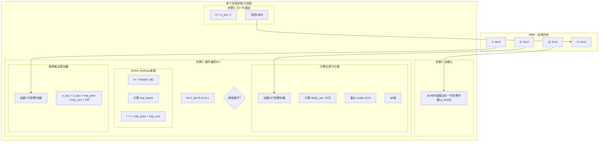
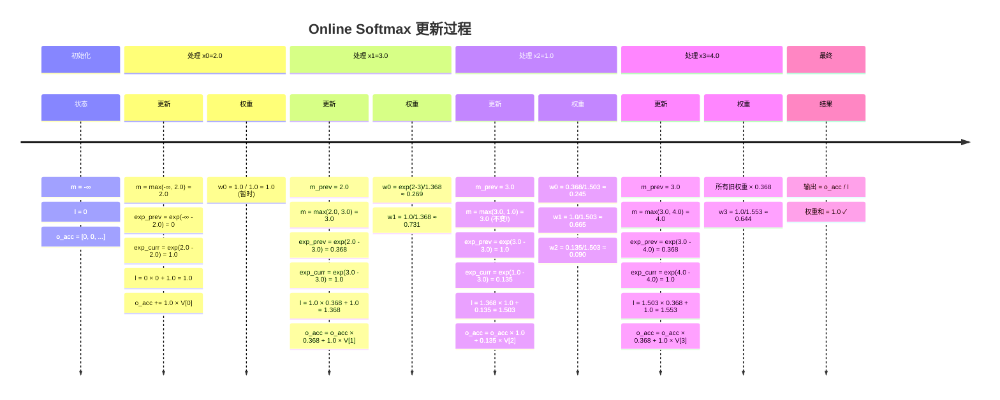
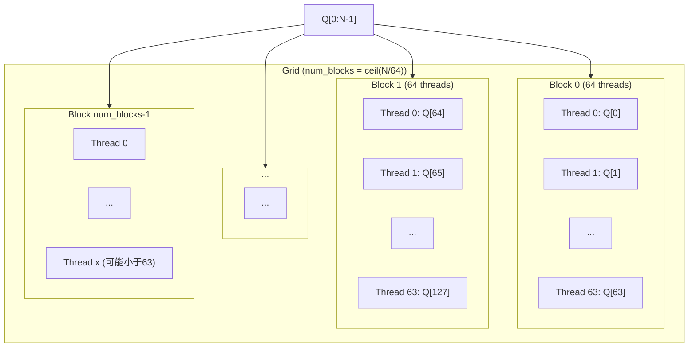
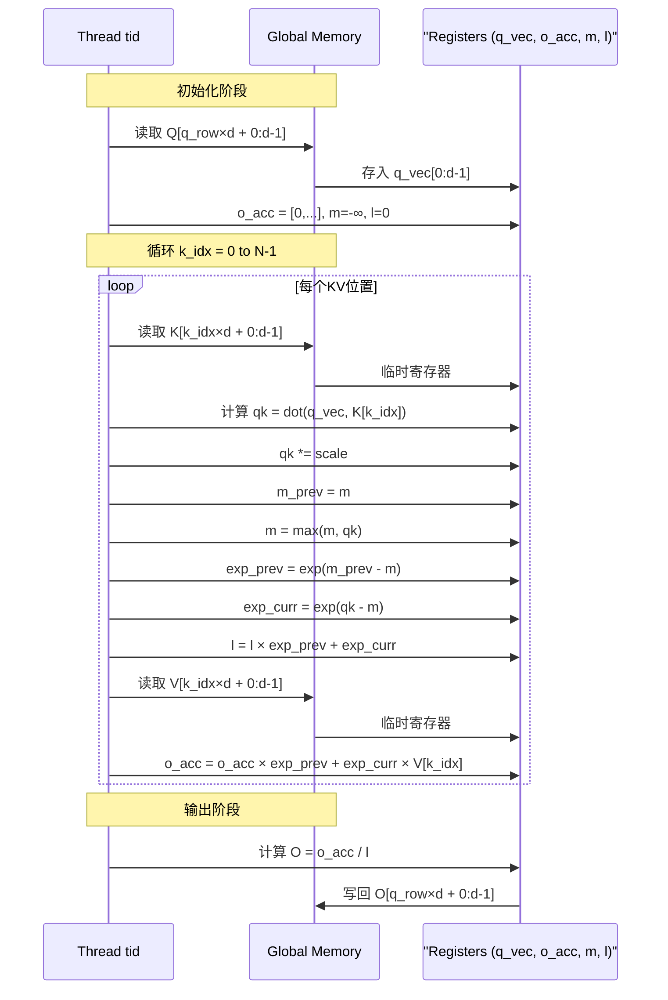
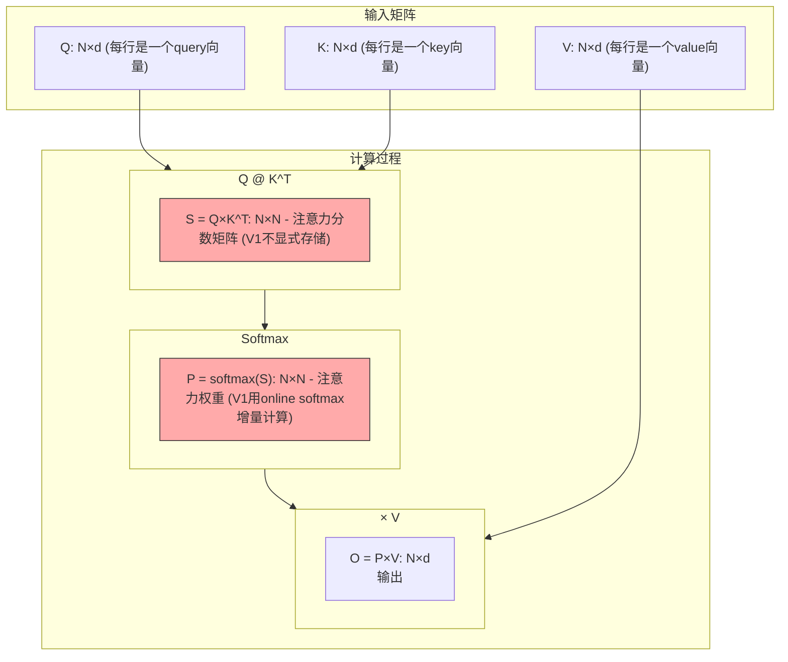
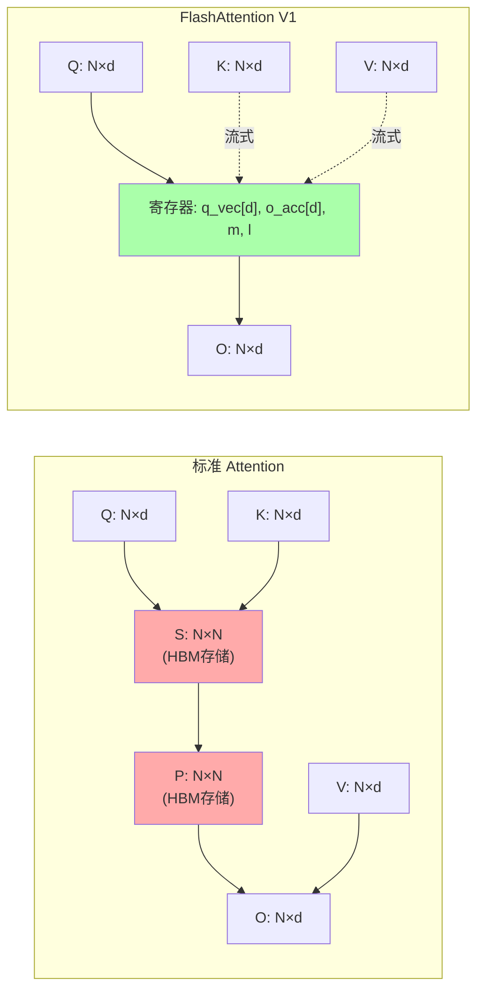

# V1 算法可视化详解

## 1. 数据流动图



---

## 2. Online Softmax 动态演示

### 场景：序列长度 N=4，处理 4 个 KV 值



---

## 3. GPU 线程并行视图

### Grid-Block-Thread 层次



### 单个线程的内存访问模式



---

## 4. 矩阵运算可视化

### Attention 计算分解



**V1的特殊之处**：S 和 P 矩阵**不需要完全存储**，而是通过 online softmax 流式处理！

---

## 5. 内存访问热点图

### 全局内存访问频率（颜色越深访问越频繁）

```
Q矩阵 (每个元素被读取1次):
┌─────────────────────────┐
│ ░░░░░░░░░░░░░░░░░░░░░░░ │  ░ = 1次
│ ░░░░░░░░░░░░░░░░░░░░░░░ │
│ ░░░░░░░░░░░░░░░░░░░░░░░ │
└─────────────────────────┘

K矩阵 (每个元素被读取Br次=64次):
┌─────────────────────────┐
│ ███████████████████████ │  █ = 64次
│ ███████████████████████ │
│ ███████████████████████ │
└─────────────────────────┘

V矩阵 (每个元素被读取Br次=64次):
┌─────────────────────────┐
│ ███████████████████████ │  █ = 64次
│ ███████████████████████ │
│ ███████████████████████ │
└─────────────────────────┘
```

**问题**：K和V被过度重复加载！

---

## 6. Online Softmax 公式推导

### 为什么公式是正确的？

**标准 Softmax**:
```
softmax(x_i) = exp(x_i) / Σ exp(x_j)
```

**数值稳定版本**:
```
softmax(x_i) = exp(x_i - m) / Σ exp(x_j - m)
其中 m = max(x_j)
```

**Online 版本推导**:

假设已经处理了前 k 个值，有：
```
m_k = max(x_0, ..., x_{k-1})
l_k = Σ_{i=0}^{k-1} exp(x_i - m_k)
```

新来一个值 x_k，新的最大值：
```
m_{k+1} = max(m_k, x_k)
```

需要重新计算 l_k（因为 m 变了）：
```
l_k' = Σ_{i=0}^{k-1} exp(x_i - m_{k+1})
     = Σ_{i=0}^{k-1} exp(x_i - m_k + m_k - m_{k+1})
     = Σ_{i=0}^{k-1} exp(x_i - m_k) × exp(m_k - m_{k+1})
     = l_k × exp(m_k - m_{k+1})
```

所以：
```
l_{k+1} = l_k × exp(m_k - m_{k+1}) + exp(x_k - m_{k+1})
```

这就是代码中的更新公式！

---

## 7. 执行时间线

### 单个线程的执行时间线

```mermaid
gantt
    title 单线程执行时间线 (N=1024, d=64)
    dateFormat X
    axisFormat %s

    section 加载Q
    加载Q行(64 floats)           :0, 10

    section 循环1024次
    加载K[0] + 计算qk           :10, 30
    Online Softmax更新          :30, 35
    加载V[0] + 更新o_acc        :35, 55

    加载K[1] + 计算qk           :55, 75
    Online Softmax更新          :75, 80
    加载V[1] + 更新o_acc        :80, 100

    ... (重复1022次)            :100, 20000

    section 写回
    归一化 + 写回O              :20000, 20010
```



**关键观察**：
- 每个 KV 迭代需要约 20 个时间单位
- 总共 1024 × 20 = ~20480 时间单位
- 其中大部分时间花在全局内存加载！

---

## 8. 对比：标准 Attention vs FlashAttention V1

### 内存使用对比



**内存复杂度**：
- 标准 Attention: O(N² + N×d)
- FlashAttention V1: O(N×d) ✓

---

## 9. 关键代码片段索引

| 行号范围 | 内容 | 重要性 |
|---------|------|--------|
| 47-51 | 配置常量 | ⭐⭐ |
| 53-57 | Kernel签名 | ⭐⭐⭐ |
| 59-67 | 线程索引计算 | ⭐⭐⭐⭐ |
| 74-84 | 寄存器分配 | ⭐⭐⭐ |
| 87-91 | Q行加载 | ⭐⭐ |
| 95-134 | 核心KV循环 | ⭐⭐⭐⭐⭐ |
| 98-106 | qk计算 | ⭐⭐⭐⭐ |
| 110-122 | Online Softmax | ⭐⭐⭐⭐⭐ |
| 127-133 | 输出累加 | ⭐⭐⭐⭐ |
| 137-141 | 最终归一化 | ⭐⭐⭐ |
| 144-169 | Host wrapper | ⭐⭐ |

---

*此文档配合 `V1_NAIVE_EXPLAINED.md` 使用，提供视觉化理解*
