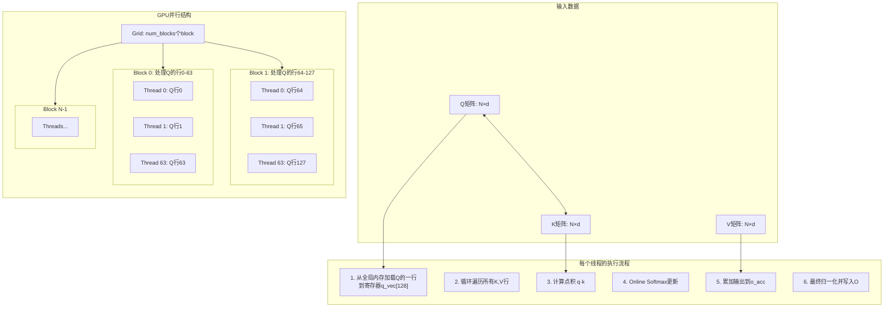
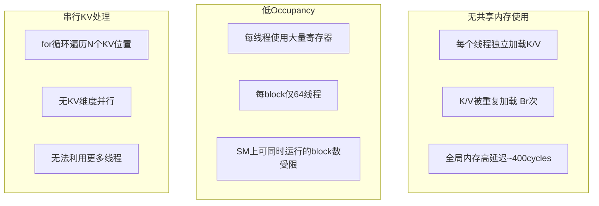
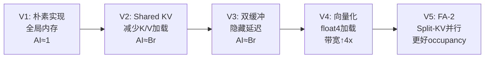

# FlashAttention V1: 朴素实现详细解析

## 概述

`v1_naive.cu` 是 FlashAttention 的最基础实现，核心目的是演示 **Online Softmax** 算法。它**没有任何内存优化**，所有数据都从全局内存加载，因此性能很差，但非常适合理解 FlashAttention 的核心算法。

---

## 1. 整体架构图



---

## 2. 代码逐段解析

### 2.1 头文件和配置

```cuda
#include "kernels.h"

// Kernel configuration for V1
constexpr int V1_Br = 64;  // Rows per block (query block size)
constexpr int V1_Bc = 64;  // Cols for KV iteration (V1中未使用)
```

| 配置参数 | 值 | 说明 |
|---------|-----|------|
| `V1_Br` | 64 | 每个block处理64行Q |
| `V1_Bc` | 64 | 预留的KV分块大小（V1中未使用） |

**线程组织**：
- **Grid**: `(N + 63) / 64` 个 blocks（一维）
- **Block**: 64 个 threads（一维）
- **每个thread**: 处理 Q 的一行（d个元素）

---

### 2.2 Kernel 函数签名

```cuda
__global__ void flash_attention_v1_naive_kernel(
    const float *Q,    // Q矩阵指针 [B, N, d]
    const float *K,    // K矩阵指针 [B, N, d]
    const float *V,    // V矩阵指针 [B, N, d]
    float *O,          // 输出矩阵 [B, N, d]
    int N,             // 序列长度
    int d,             // head维度
    float scale        // 缩放因子 1/sqrt(d)
)
```

**数据布局**（Row-Major）：
```
Q[row][col] = Q[row * d + col]
K[row][col] = K[row * d + col]
V[row][col] = V[row * d + col]
```

---

### 2.3 线程索引计算

```cuda
int block_idx = blockIdx.x;           // Block索引
int tid = threadIdx.x;                // 线程索引
int q_row = block_idx * V1_Br + tid;  // 当前线程处理的Q行号
```

**示例**（N=256, Br=64）：
```
Block 0: threads 0-63  → 处理Q的行 0-63
Block 1: threads 0-63  → 处理Q的行 64-127
Block 2: threads 0-63  → 处理Q的行 128-191
Block 3: threads 0-63  → 处理Q的行 192-255
```

---

### 2.4 寄存器分配

```cuda
float q_vec[128];   // 存储当前Q行的128个元素
float o_acc[128];   // 输出累加器，存储中间结果

// Online softmax状态
float m = -INFINITY;  // 当前最大值（用于数值稳定性）
float l = 0.0f;       // 当前exp和
```

**寄存器使用分析**：
- `q_vec[128]`: 128 floats = 512 bytes
- `o_acc[128]`: 128 floats = 512 bytes
- `m, l, qk`等: ~32 bytes
- **总计**: ~1056 bytes per thread

---

### 2.5 Q行加载

```cuda
if (q_row < N) {
    for (int i = 0; i < d; i++) {
        q_vec[i] = Q[q_row * d + i];  // 全局内存读取
    }
}
```

**内存访问模式**：
```
Thread 0: 读取 Q[0*d+0], Q[0*d+1], ..., Q[0*d+d-1]
Thread 1: 读取 Q[1*d+0], Q[1*d+1], ..., Q[1*d+d-1]
Thread k: 读取 Q[k*d+0], Q[k*d+1], ..., Q[k*d+d-1]
```

✅ **合并访问**：同一warp内的线程访问相邻内存地址，可以合并成一次事务。

---

### 2.6 核心循环：遍历KV

```cuda
for (int k_idx = 0; k_idx < N; k_idx++) {
    // Step 1: 计算 q @ k^T
    float qk = 0.0f;
    for (int i = 0; i < d; i++) {
        float k_val = K[k_idx * d + i];  // 从全局内存加载
        qk += q_vec[i] * k_val;
    }
    qk *= scale;  // 1/sqrt(d)

    // Step 2 & 3: Online Softmax + 更新输出
    // ...
}
```

**关键问题**：
❌ **无共享内存**：每个线程独立从全局内存加载K和V
❌ **重复加载**：如果有64个线程，每个K行被加载64次！

---

### 2.7 Online Softmax 算法（核心）

这是 FlashAttention 最核心的技巧！

#### 标准 Softmax（需要3遍扫描）：
```
输入: [x0, x1, x2, ..., xn-1]

第1遍: m = max(xi)                    → O(N)
第2遍: exp_sum = Σ exp(xi - m)        → O(N)
第3遍: output = exp(xi - m) / exp_sum → O(N)

需要存储所有中间结果！
```

#### Online Softmax（单遍扫描）：
```cuda
float m = -INFINITY;  // 当前最大值
float l = 0.0f;       // 当前指数和

对每个新值 x:
    float m_prev = m;
    m = max(m, x);                    // 更新最大值
    float exp_prev = exp(m_prev - m);  // 旧的指数缩放因子
    float exp_curr = exp(x - m);       // 新的指数值
    l = l * exp_prev + exp_curr;      // 更新指数和
```

**为什么有效？**
```
假设之前处理了 [x0, x1]，当前 m=5, l=exp(2)+exp(1)
新值 x2=8

m_new = max(5, 8) = 8

之前所有值都需要按新max重新计算：
  原来的贡献: exp(x0-5) + exp(x1-5)
  新的贡献: [exp(x0-5)*exp(5-8)] + [exp(x1-5)*exp(5-8)] + exp(8-8)
          = exp(x0-8) + exp(x1-8) + exp(0)

exp_prev = exp(5-8) = exp(-3) 就是重新缩放因子！
```

#### 图示 Online Softmax：

```mermaid
flowchart LR
    subgraph 初始状态
        m0[m = -∞]
        l0[l = 0]
    end

    subgraph "处理x0=3"
        m1[m = 3]
        l1[l = exp(3-3) = 1]
    end

    subgraph "处理x1=5"
        m2[m = 5]
        l2[l = 1*exp(3-5) + exp(5-5) = e^-2 + 1]
    end

    subgraph "处理x2=4"
        m3[m = 5]
        l3[l = (e^-2+1)*exp(5-5) + exp(4-5) = e^-2+1+e^-1]
    end

    m0 --> m1 --> m2 --> m3
```

---

### 2.8 输出累加

```cuda
if (q_row < N) {
    for (int i = 0; i < d; i++) {
        float v_val = V[k_idx * d + i];     // 从全局内存加载V
        // 旧值缩放 + 新值贡献
        o_acc[i] = o_acc[i] * exp_prev + exp_curr * v_val;
    }
}
```

**数学原理**：
```
o_acc[i] 存储的是 Σ (exp(xj - m_current) * V[j][i])

每次更新m时，需要重新缩放之前的累加值：
  新累加值 = 旧累加值 * exp(m_old - m_new) + 新贡献
```

---

### 2.9 最终归一化

```cuda
if (q_row < N) {
    for (int i = 0; i < d; i++) {
        O[q_row * d + i] = o_acc[i] / l;  // 除以softmax分母
    }
}
```

`l` 最终存储的是 `Σ exp(xi - m_final)`，即 softmax 的分母。

---

## 3. Host Wrapper

```cuda
void flash_attention_v1_naive(
    const float *Q, const float *K, const float *V,
    float *O,
    int B, int N, int d)  // B: batch size
{
    float scale = 1.0f / sqrtf((float)d);

    // 逐个batch处理
    for (int b = 0; b < B; b++) {
        // 计算当前batch的指针偏移
        const float *Q_b = Q + b * N * d;
        const float *K_b = K + b * N * d;
        const float *V_b = V + b * N * d;
        float *O_b = O + b * N * d;

        // 启动配置
        int num_blocks = (N + V1_Br - 1) / V1_Br;
        flash_attention_v1_naive_kernel<<<num_blocks, V1_Br>>>(
            Q_b, K_b, V_b, O_b, N, d, scale
        );
    }
}
```

---

## 4. 内存访问分析

### 4.1 全局内存访问次数（单线程，N=1024, d=64）

| 操作 | 次数 | 每次元素数 | 总计 |
|------|------|----------|------|
| 加载Q行 | 1 | d=64 | 64 floats |
| 加载K（循环N次） | N=1024 | d=64 | 65,536 floats |
| 加载V（循环N次） | N=1024 | d=64 | 65,536 floats |
| 写回O | 1 | d=64 | 64 floats |
| **总计** | - | - | **131,200 floats** |

### 4.2 对比：标准Attention

标准 Attention 需要存储完整的 N×N 注意力矩阵：
```
S = Q @ K^T: 需要 N×N 中间结果
P = softmax(S): 需要 N×N 中间结果
O = P @ V: 读取 N×N，输出 N×d

内存复杂度: O(N²)
```

FlashAttention V1：
```
不存储 N×N 矩阵，Online Softmax 增量计算
内存复杂度: O(N)
```

**虽然V1的内存访问次数多，但避免了存储 O(N²) 的中间矩阵！**

---

## 5. 性能瓶颈分析

### 5.1 Roofline 模型分析

```
                    Peak Performance (TFLOP/s)
                          |
                          |        /
                          |       /
    Compute Bound         |      /
    Region                |     /
                          |    /
                          |   /
                          |  /
                          | /
                          |/____________________
                           |                    \\
                           |  Memory Bound       \\\n                           |  Region              \\\
                           |_______________________\\\\\\___ Arithmetic Intensity
                           0.01    0.1    1    10    100

V1的位置: AI ≈ 1 (内存密集区)
```

**Arithmetic Intensity** = FLOPs / Bytes
- V1: O(N×d) 计算 / O(N×d) 内存 = **O(1)**
- 位于内存带宽受限区域

### 5.2 主要性能问题



---

## 6. 正确性验证

### 6.1 Online Softmax 数值示例

```
Q行: [1.0, 2.0]  (d=2)
K行0: [0.5, 0.5] → qk0 = 1.0*0.5 + 2.0*0.5 = 1.5
K行1: [1.0, 0.0] → qk1 = 1.0*1.0 + 2.0*0.0 = 1.0

scale = 1/sqrt(2) ≈ 0.707

处理 k_idx=0, qk=1.5*0.707=1.06:
  m = max(-∞, 1.06) = 1.06
  l = 0*exp(-∞) + exp(0) = 1

处理 k_idx=1, qk=1.0*0.707=0.707:
  m_prev = 1.06, l_prev = 1
  m = max(1.06, 0.707) = 1.06
  exp_prev = exp(1.06-1.06) = 1
  exp_curr = exp(0.707-1.06) = exp(-0.353) ≈ 0.702
  l = 1*1 + 0.702 = 1.702

最终 softmax 权重:
  w0 = exp(1.06-1.06)/1.702 = 1/1.702 ≈ 0.587
  w1 = exp(0.707-1.06)/1.702 = 0.702/1.702 ≈ 0.413
  w0 + w1 = 1.0 ✓
```

---

## 7. 优化路线图



**下一版本(V2)优化点**：
- 使用 Shared Memory 缓存 K/V tiles
- K/V 每个 tile 只加载一次
- 全局内存访问量降低 Br 倍（64倍）

---

## 8. 关键学习点

1. ✅ **Online Softmax**: 单遍扫描计算 softmax，无需存储中间矩阵
2. ✅ **寄存器使用**: 了解寄存器分配对 occupancy 的影响
3. ✅ **合并访问**: Q加载是合并访问，K/V加载不是
4. ❌ **性能陷阱**: 没有共享内存分块导致大量重复加载

---

## 9. 调试技巧

```cuda
// 在kernel中添加调试打印（仅开发时使用）
if (q_row == 0 && k_idx < 5) {
    printf("Thread %d: k_idx=%d, qk=%.4f, m=%.4f, l=%.4f\n",
           tid, k_idx, qk, m, l);
}
```

**常见问题**：
- **NaN输出**: 检查scale是否溢出，初始m值是否正确
- **精度问题**: 对比CPU实现，检查online softmax更新公式
- **性能低**: 使用Nsight Compute检查全局内存带宽利用率

---

*作者：FlashAttention CUDA 教程项目*
*日期：2026年3月*
