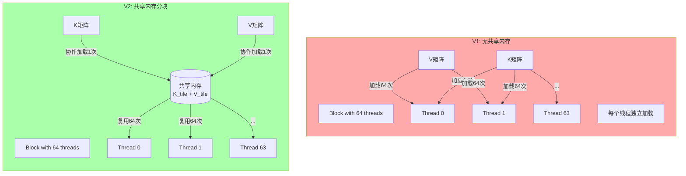
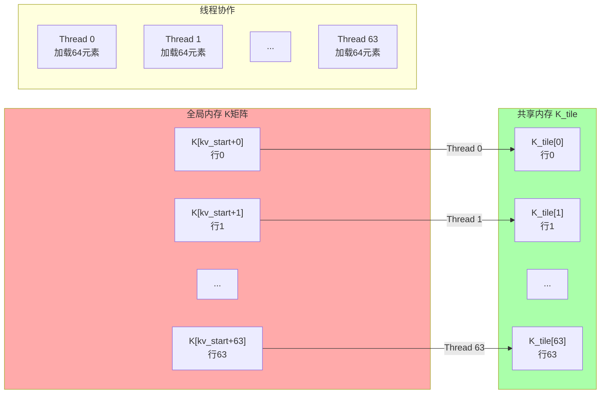
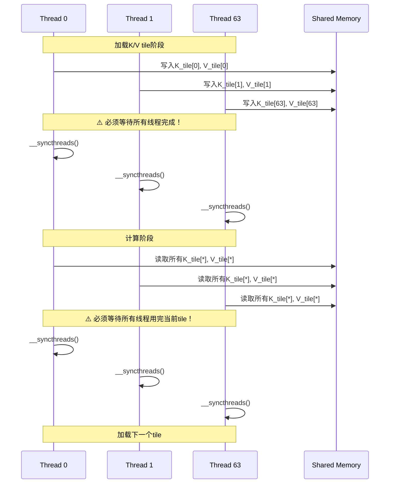
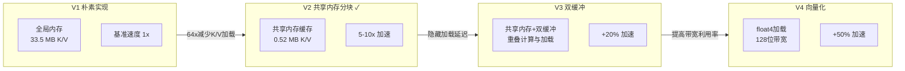

# FlashAttention V2: 共享内存 KV 分块详解

## 概述

`v2_shared_kv.cu` 是 FlashAttention 的**第一个重大优化版本**，通过引入**共享内存（Shared Memory）分块**，将 K/V 的全局内存访问量减少 **Br 倍**（通常为 64 倍）。

---

## 1. 核心思想对比

### V1 vs V2 内存访问模式



### 关键数据对比

| 指标 | V1 | V2 | 改进 |
|------|----|----|------|
| K加载次数 (每block) | 64× | 1× | **64x减少** |
| V加载次数 (每block) | 64× | 1× | **64x减少** |
| 全局内存访问(K/V) | O(N×d×Br) | O(N×d) | **Br倍减少** |
| 共享内存使用 | 0 KB | ~32 KB | 新增 |

---

## 2. 代码逐段解析

### 2.1 配置常量

```cuda
constexpr int V2_Br = 64;   // 每个block处理64行Q
constexpr int V2_Bc = 64;   // 每个KV tile包含64行
constexpr int V2_d = 64;    // Head维度

// 共享内存大小: K tile + V tile = 2 × Bc × d
// = 2 × 64 × 64 × 4 bytes = 32 KB
#define V2_SHARED_SIZE (V2_Bc * V2_d * 2)
```

**共享内存大小计算**：
```
K_tile: Bc × d = 64 × 64 = 4096 floats = 16 KB
V_tile: Bc × d = 64 × 64 = 4096 floats = 16 KB
总计: 32 KB

每SM共享内存: 通常 64-164 KB (A100/H100)
可同时运行: 2-5个block per SM (取决于占用率)
```

---

### 2.2 共享内存布局

```cuda
extern __shared__ float shared_mem[];  // 动态分配
float *K_tile = shared_mem;                          // 起始地址
float *V_tile = shared_mem + V2_Bc * d;              // 偏移Bc×d
```

**内存布局图**：

```
共享内存 32KB 布局:
┌─────────────────────────────────────────────────┐
│                 K_tile (16KB)                    │
│  ┌─────────┬─────────┬─────────┬─────────┐       │
│  │ K[0]   │ K[1]   │ K[2]   │ ...    │  行0   │
│  │ d floats│ d floats│ d floats│        │       │
│  ├─────────┼─────────┼─────────┼─────────┤       │
│  │ K[64]  │ K[65]  │ ...    │        │  行1   │
│  ├─────────┼─────────┼─────────┼─────────┤       │
│  │ ...    │ ...    │ ...    │        │  ...   │
│  ├─────────┼─────────┼─────────┼─────────┤       │
│  │ K[4032]│ ...    │ K[4095]│        │  行63  │
│  └─────────┴─────────┴─────────┴─────────┘       │
│                 64 × 64 = 4096 floats            │
├─────────────────────────────────────────────────┤
│                 V_tile (16KB)                    │
│  ┌─────────┬─────────┬─────────┬─────────┐       │
│  │ V[0]   │ V[1]   │ ...    │        │  行0   │
│  ├─────────┼─────────┼─────────┼─────────┤       │
│  │ ...    │ ...    │ ...    │        │  ...   │
│  └─────────┴─────────┴─────────┴─────────┘       │
│                 64 × 64 = 4096 floats            │
└─────────────────────────────────────────────────┘
```

---

### 2.3 核心算法流程

```mermaid
flowchart TB
    subgraph V2_Flow[V2 执行流程]
        direction TB

        Start[开始]

        subgraph Init[初始化]
            AllocReg[分配寄存器<br/>q_vec[128], o_acc[128]<br/>m=-∞, l=0]
            LoadQ[从全局内存加载Q的一行]
        end

        subgraph LoopTiles[遍历KV Tiles]
            direction TB
            TileLoop{for tile_idx}

            subgraph LoadTile[协作加载Tile]
                LoadK[所有线程协作<br/>加载K_tile到共享内存]
                LoadV[所有线程协作<br/>加载V_tile到共享内存]
                Sync1[__syncthreads]
            end

            subgraph ComputeTile[计算Tile]
                InnerLoop{for b=0 to 63}
                Dot[计算qk = dot(q_vec, K_tile[b])]
                OnlineSoftmax[Online Softmax更新]
                UpdateO[o_acc += softmax_weight × V_tile[b]]
            end

            Sync2[__syncthreads]
        end

        WriteBack[写回O到全局内存]
        End[结束]
    end

    Start --> Init
    Init --> LoopTiles
    LoadTile --> ComputeTile
    ComputeTile --> Sync2
    Sync2 --> TileLoop
    TileLoop -->|所有tiles完成| WriteBack
    WriteBack --> End
```

---

### 2.4 协作加载详解

```cuda
// 每个线程应该加载的元素数
int load_per_thread = (V2_Bc * d + V2_Br - 1) / V2_Br;
// = (64 × 64 + 63) / 64 = 64

// 协作加载K tile
for (int i = 0; i < load_per_thread; i++) {
    int idx = tid * load_per_thread + i;  // 线程tid负责的元素索引
    if (idx < V2_Bc * d) {
        int k_row = idx / d;              // tile内的行号
        int k_col = idx % d;              // tile内的列号
        int global_k_row = kv_start + k_row;  // 全局K矩阵行号

        if (global_k_row < N) {
            K_tile[k_row * d + k_col] = K[global_k_row * d + k_col];
        } else {
            K_tile[k_row * d + k_col] = 0.0f;  // 越界填充0
        }
    }
}
```

**协作加载示例**（Br=64, Bc=64, d=64）：

```
Tile总元素: 64 × 64 = 4096
线程数: 64
每个线程加载: 4096 / 64 = 64 个元素

Thread 0: 加载 idx 0-63
          = K_tile[0][0:63]  (第0行所有列)

Thread 1: 加载 idx 64-127
          = K_tile[1][0:63]  (第1行所有列)

Thread k: 加载 idx k×64 to (k+1)×64-1
          = K_tile[k][0:63]  (第k行所有列)

线程tid加载的是K_tile的第tid行！
```

**可视化**：



---

### 2.5 使用共享内存计算

```cuda
if (q_row < N) {
    for (int b = 0; b < V2_Bc; b++) {
        // 从共享内存读取K_tile的行b
        float qk = 0.0f;
        for (int i = 0; i < d; i++) {
            qk += q_vec[i] * K_tile[b * d + i];  // 共享内存访问!
        }
        qk *= scale;

        // Online softmax更新...

        // 从共享内存读取V_tile的行b
        for (int i = 0; i < d; i++) {
            o_acc[i] = o_acc[i] * exp_factor + exp_qk * V_tile[b * d + i];
        }
    }
}
```

**内存访问对比**：

| 操作 | V1 | V2 | 速度对比 |
|------|----|----|---------|
| 加载K行 | 全局内存 ~400 cycles | 共享内存 ~20 cycles | **20x更快** |
| 加载V行 | 全局内存 ~400 cycles | 共享内存 ~20 cycles | **20x更快** |
| 访问模式 | 非合并（每线程独立） | 广播（多线程复用） | 更高效 |

---

### 2.6 __syncthreads 的作用

```cuda
__syncthreads();  // 第一次：确保K/V tile加载完成

// ... 使用共享内存计算 ...

__syncthreads();  // 第二次：确保当前tile使用完成，准备加载下一个
```

**为什么需要两次同步？**



---

## 3. 完整数据流图

```mermaid
flowchart TB
    subgraph Host[Host内存]
        H_Q[Q: N×d]
        H_K[K: N×d]
        H_V[V: N×d]
        H_O[O: N×d]
    end

    subgraph DeviceGlobal[Device全局内存 HBM]
        D_Q[Q: N×d]
        D_K[K: N×d]
        D_V[V: N×d]
        D_O[O: N×d]
    end

    subgraph GPU[GPU计算]
        subgraph Grid[Grid]
            B0[Block 0]
            B1[Block 1]
            BN[Block N/64-1]
        end

        subgraph Block0Detail[Block 0 详细]
            SM[(共享内存<br/>32KB)]
            Reg0[线程0寄存器<br/>q_vec, o_acc]
            Reg63[线程63寄存器<br/>q_vec, o_acc]

            LoadQ0[加载Q[0]]
            LoadQ63[加载Q[63]]

            Calc0[计算64个qk值<br/>使用K_tile]
            Calc63[计算64个qk值<br/>使用K_tile]
        end
    end

    H_Q -->|cudaMemcpy| D_Q
    H_K -->|cudaMemcpy| D_K
    H_V -->|cudaMemcpy| D_V

    D_Q --> B0
    D_Q --> B1
    D_Q --> BN

    D_K -->|协作加载| B0
    D_V -->|协作加载| B0
    D_K -->|协作加载| B1
    D_V -->|协作加载| B1

    B0 --> SM
    SM --> Reg0
    SM --> Reg63

    D_Q --> LoadQ0
    D_Q --> LoadQ63

    LoadQ0 --> Calc0
    LoadQ63 --> Calc63

    Calc0 --> D_O
    Calc63 --> D_O

    D_O -->|cudaMemcpy| H_O

    style Host fill:#eee
    style DeviceGlobal fill:#fcc
    style SM fill:#cfc
    style Reg0 fill:#ccf
    style Reg63 fill:#ccf
```

---

## 4. 性能分析

### 4.1 Roofline 模型对比

```
                    Peak Performance (TFLOP/s)
                          │
         ┌────────────────┼────────────────┐
         │                │                │
    V1   │       . . . . .│. . . . .       │  内存带宽受限
         │     .          │          .     │  (AI ≈ 1)
         │   .            │            .   │
         │ .              │              . │
    ─────┼────────────────┼────────────────┤
         │                │\               │
    V2   │                │  \             │  更高AI
         │                │    \           │  (AI ≈ Br = 64)
         │                │      \         │
         │                │        \       │
         └────────────────┼────────────────┘
                          │
                         AI
                (Arithmetic Intensity)
```

**算术强度计算**：
- V1: O(N×d) FLOPs / O(N×d) Bytes = **1 FLOP/Byte**
- V2: O(N×d) FLOPs / O(N×d/Br) Bytes = **Br = 64 FLOP/Byte**

---

### 4.2 内存带宽节省计算

```
假设: N=1024, d=64, Br=64, Bc=64

V1 全局内存访问 (K+V):
= N × d × Br (K被加载64次) + N × d × Br (V被加载64次)
= 1024 × 64 × 64 + 1024 × 64 × 64
= 4,194,304 + 4,194,304
= 8,388,608 floats = 33.5 MB

V2 全局内存访问 (K+V):
= N × d × 1 (K被加载1次) + N × d × 1 (V被加载1次)
= 1024 × 64 + 1024 × 64
= 65,536 + 65,536
= 131,072 floats = 0.52 MB

节省: 33.5 / 0.52 = 64x ✓
```

---

## 5. 优化路线图



---

## 6. 常见问题与调试

### 6.1 Bank Conflict 问题

**问题**：默认布局 `K_tile[row * d + col]` 可能有 bank conflict

```
Warp 0 的32个线程访问 K_tile[0][0:31]:
- Thread 0: bank 0
- Thread 1: bank 1
- ...
- Thread 31: bank 31
✅ 无冲突（如果d是32的倍数，Thread 32访问bank 0冲突）

当d=64时:
- Thread 0 访问 K_tile[0][0]: bank 0
- Thread 32 访问 K_tile[0][32]: bank 0 (冲突！)

解决：Padding (V4实现)
```

### 6.2 Shared Memory 容量溢出

```cuda
// 检查共享内存使用
size_t shared_size = V2_Bc * d * 2 * sizeof(float);
// 32 KB per block

// 每SM最大共享内存：64 KB (A100)
// 可同时运行2个block

// 如果增加Bc到128:
// shared_size = 128 × 64 × 2 × 4 = 64 KB
// 每SM只能运行1个block，occupancy降低
```

### 6.3 同步死锁

**错误示例**：
```cuda
if (tid < 32) {
    __syncthreads();  // 只有部分线程调用！
}
// 死锁！其他线程永远等不到同步点
```

**正确做法**：
```cuda
// 所有线程都必须到达__syncthreads
for (...) {
    // 所有线程参与加载
    __syncthreads();  // ✅ 全部64个线程调用

    if (q_row < N) {
        // 条件计算
    }

    __syncthreads();  // ✅ 全部64个线程调用
}
```

---

## 7. 关键学习点

1. ✅ **共享内存分块**：通过复用数据减少全局内存访问
2. ✅ **协作加载**：线程合作加载数据，实现合并访问
3. ✅ **同步点设计**：`__syncthreads` 确保数据一致性
4. ⚠️ **Bank Conflict**：需要考虑共享内存 bank 布局
5. ⚠️ **Occupancy权衡**：共享内存大小 vs 并行度

---

## 8. 扩展思考

### 为什么不对Q分块？

```
Q的特性：
- 每个线程只需要自己的一行Q
- Q不跨线程共享
- Q从全局内存加载一次后就在寄存器中

K/V的特性：
- 所有线程需要访问相同的K/V行
- 天然适合共享内存复用

结论：Q不需要分块，K/V必须分块！
```

### 最优分块大小选择

```
Bc选择考虑因素：
1. 共享内存容量: Bc × d × 2 × 4 < SMEM_PER_SM / BLOCKS_PER_SM
2. 计算强度: 更大的Bc = 更多的复用，但同步开销增加
3. 典型值: Bc = 64 or 128 (经验值)

Br选择考虑因素：
1. Warp大小倍数: Br应该是32的倍数
2. Occupancy: Br × 每个线程寄存器使用 < 可用寄存器
3. 典型值: Br = 64 or 128
```

---

*文档版本: 1.0*
*配合 V2_SHARED_KV_VISUAL.md 查看可视化图表*
