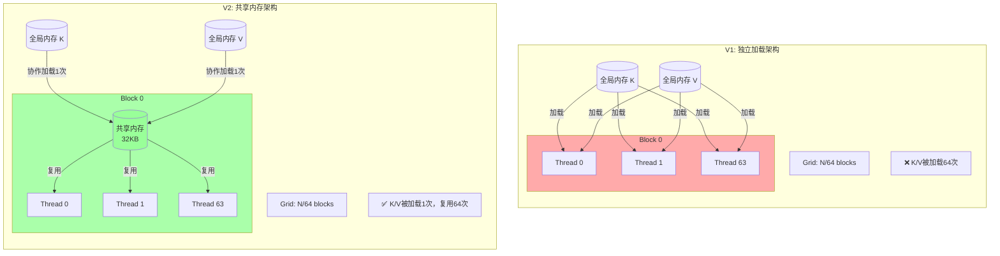
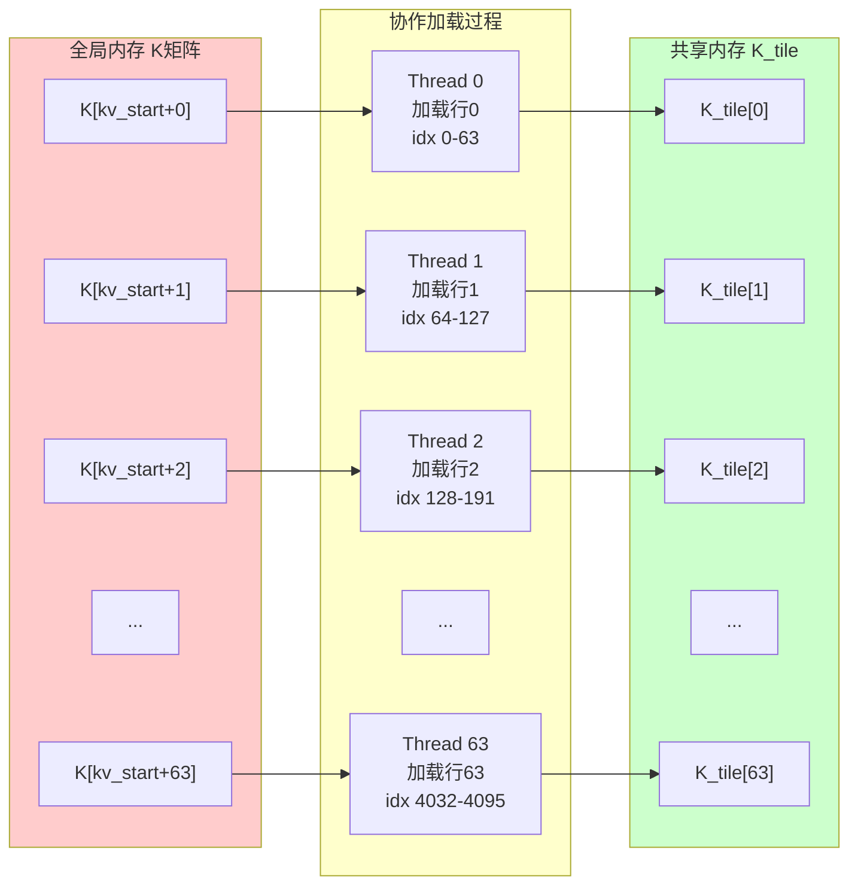
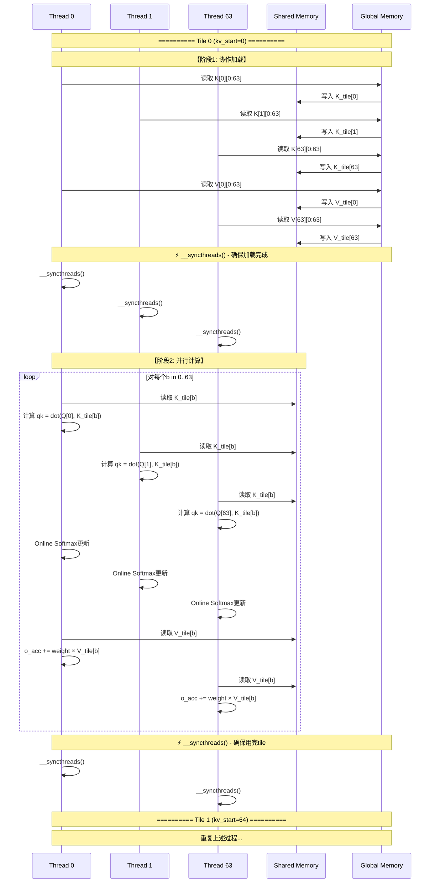
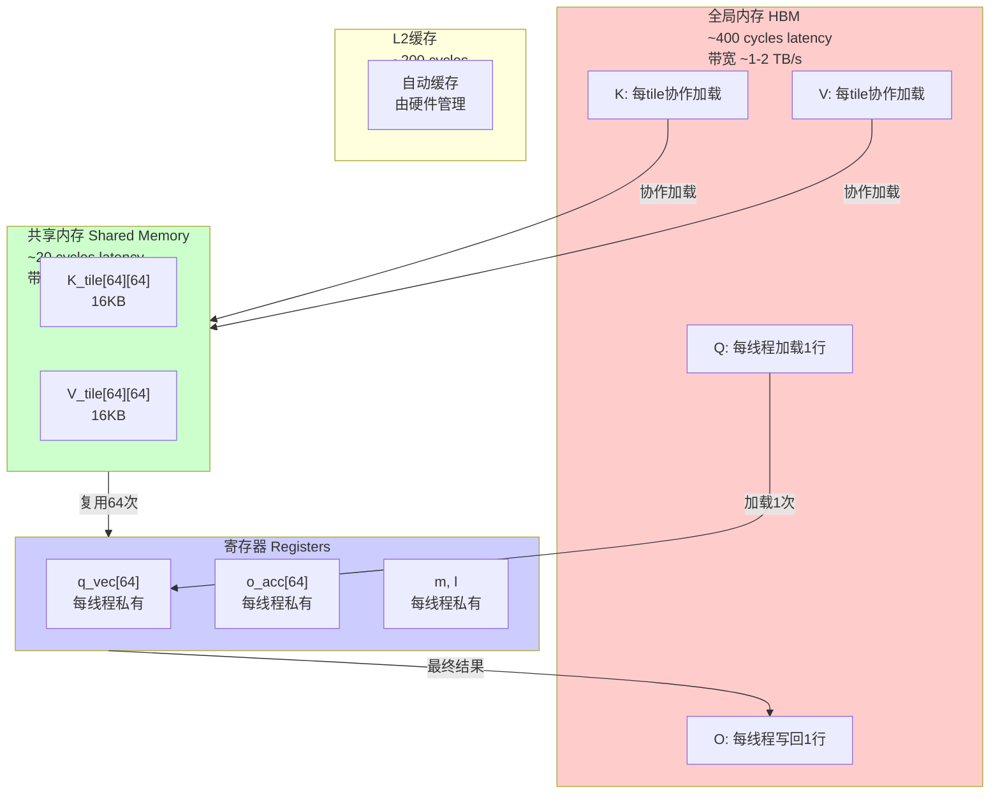
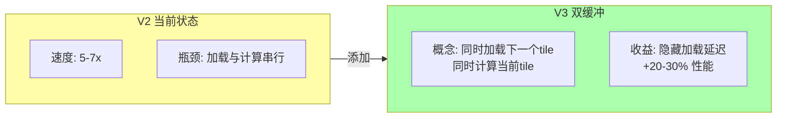

# V2 共享内存 KV 分块 - 可视化详解

## 1. 整体架构对比图

### V1 vs V2 架构差异



---

## 2. 协作加载机制详解

### 2.1 协作加载示意



### 2.2 加载公式可视化

```
Tile总元素数: Bc × d = 64 × 64 = 4096
线程数: Br = 64
每个线程加载: 4096 / 64 = 64 个元素

线程tid加载的元素索引: [tid × 64, (tid + 1) × 64 - 1]

┌─────────────────────────────────────────────────────────┐
│  Tile元素索引 0 到 4095                                   │
├─────────────────────────────────────────────────────────┤
│  Thread 0:  [   0 -   63]  → K_tile[0][0:63]   (第0行)     │
│  Thread 1:  [  64 -  127]  → K_tile[1][0:63]   (第1行)     │
│  Thread 2:  [ 128 -  191]  → K_tile[2][0:63]   (第2行)     │
│  ...                                                     │
│  Thread 63: [4032 - 4095]  → K_tile[63][0:63] (第63行)    │
└─────────────────────────────────────────────────────────┘
```

---

## 3. 数据复用模式

### 3.1 共享内存广播机制

```mermaid
flowchart TB
    subgraph Broadcast[共享内存广播模式]
        direction TB

        SM_R0[(K_tile[0])]
        SM_R1[(K_tile[1])]
        SM_R2[(...)]
        SM_R63[(K_tile[63])]

        subgraph ThreadWork[所有64个线程同时工作]
            T0_Compute["Thread 0<br/>qk += dot(Q[0], K_tile[0])<br/>qk += dot(Q[0], K_tile[1])<br/>...<br/>qk += dot(Q[0], K_tile[63])"]

            T1_Compute["Thread 1<br/>qk += dot(Q[1], K_tile[0])<br/>qk += dot(Q[1], K_tile[1])<br/>...<br/>qk += dot(Q[1], K_tile[63])"]

            T63_Compute["Thread 63<br/>qk += dot(Q[63], K_tile[0])<br/>...<br/>qk += dot(Q[63], K_tile[63])"]
        end

        SM_R0 -->|广播到| T0_Compute
        SM_R0 -->|广播到| T1_Compute
        SM_R0 -->|广播到| T63_Compute

        SM_R1 -->|广播到| T0_Compute
        SM_R1 -->|广播到| T1_Compute
        SM_R1 -->|广播到| T63_Compute
    end

    style SM_R0 fill:#9f9
    style SM_R1 fill:#9f9
```

### 3.2 复用效率分析

```
一个K_tile行被使用次数:
- 64个线程各使用一次计算qk
- 总计: 64次复用

内存访问对比:
┌────────────────┬───────────────┬───────────────┐
│ 操作           │ V1 (全局内存)  │ V2 (共享内存)  │
├────────────────┼───────────────┼───────────────┤
│ 加载K_tile[0]  │ 64次 (慢)     │ 1次 (慢)      │
│ 使用K_tile[0]  │ 64次全局访问   │ 64次共享访问   │
│ 速度           │ 400×64 cycles │ 20×64 cycles  │
├────────────────┼───────────────┼───────────────┤
│ 总cycles       │ 25,600        │ 1,280 (20x快) │
└────────────────┴───────────────┴───────────────┘
```

---

## 4. 完整执行时序图

### 4.1 Block 0 执行流程



---

## 5. 内存层级访问模式

### 5.1 内存访问层次图



### 5.2 带宽利用率对比

```
【V1 带宽瓶颈】
                    实际带宽
                         │
    峰值带宽 ────────────┤┈┈┈┈┈┈┈┈┈┈┈┈┈┈┈┈┈┈┈┈┈┈┈┈┈┈┈┈┈┈┈┈┈
    (1-2 TB/s)           │
                         │    ┌──┐
                         │    │  │  V1 使用
                         │    │  │  <10%
                         │    └──┘
                         │
    ─────────────────────┴────────────────────────────────────►

【V2 带宽改善】
                    实际带宽
                         │
    峰值带宽 ────────────┤┈┈┈┈┈┈┈┈┈┈┈┈┈┈┈┈┈┈┈┈┈┈┈┈┈┈┈┈┈┈┈┈┈
                         │         ┌────────┐
                         │         │        │  V2 使用
                         │         │        │  30-50%
                         │         └────────┘
                         │
    ─────────────────────┴────────────────────────────────────►
```

---

## 6. 分块策略可视化

### 6.1 K/V 矩阵分块

```
完整的K矩阵 (N × d = 1024 × 64):

     d=64
  ┌────────────────────────────────────────┐
  │  ┌────┐ ┌────┐ ┌────┐                │
  │  │T0  │ │T1  │ │T2  │ ...              │ N=1024
  │  │64×64│ │64×64│ │64×64│                │
  │  │    │ │    │ │    │                │
  │  └────┘ └────┘ └────┘                │
  │  ┌────┐ ┌────┐ ┌────┐                │
  │  │T16 │ │T17 │ │T18 │                │
  │  │    │ │    │ │    │                │
  │  └────┘ └────┘ └────┘                │
  │                                      │
  │  ...                                 │
  │                                      │
  │  ┌────┐                              │
  │  │T63 │                              │
  │  │    │                              │
  │  └────┘                              │
  └────────────────────────────────────────┘

每个tile: 64行 × 64列 = 4096 floats = 16KB
总tiles: ceil(1024/64) = 16 tiles
```

### 6.2 Block处理分配

```mermaid
flowchart TB
    subgraph FullQ[Q矩阵: 1024 × 64]
        direction TB

        subgraph Block0Q[Block 0: Q行0-63]
            B0_R0["Q[0]"]
            B0_R1["Q[1]"]
            B0_R63["Q[63]"]
        end

        subgraph Block1Q[Block 1: Q行64-127]
            B1_R0["Q[64]"]
            B1_R1["Q[65]"]
            B1_R63["Q[127]"]
        end

        subgraph Block15Q[Block 15: Q行960-1023]
            B15_R0["Q[960]"]
            B15_R63["Q[1023]"]
        end
    end

    subgraph AllKVTiles[所有KV Tiles (16个)]
        T0["Tile 0<br/>K[0:63]"]
        T1["Tile 1<br/>K[64:127]"]
        T2["..."]
        T15["Tile 15<br/>K[960:1023]"]
    end

    Block0Q -.->|每个都处理| AllKVTiles
    Block1Q -.->|每个都处理| AllKVTiles
    Block15Q -.->|每个都处理| AllKVTiles

    style Block0Q fill:#9f9
    style Block1Q fill:#99f
    style Block15Q fill:#f99
```

---

## 7. Online Softmax with Tiling 示例

### 7.1 单个Tile的处理

```
假设:
- 当前query: q = [1.0, 2.0, 3.0, 4.0] (d=4)
- K_tile包含4行 (Bc=4)
- scale = 1.0

处理过程:

初始: m = -∞, l = 0, o_acc = [0, 0, 0, 0]

┌────────────────────────────────────────────────────────────────┐
│ b=0: K_tile[0] = [0.1, 0.2, 0.3, 0.4]                           │
│      qk = 1×0.1 + 2×0.2 + 3×0.3 + 4×0.4 = 3.0                   │
│      m_prev = -∞, m = 3.0                                       │
│      exp_prev = 0, exp_curr = exp(0) = 1                        │
│      l = 0 + 1 = 1                                              │
│      o_acc = [0] + 1×[0.1,0.2,0.3,0.4] = [0.1,0.2,0.3,0.4]     │
├────────────────────────────────────────────────────────────────┤
│ b=1: K_tile[1] = [0.5, 0.5, 0.5, 0.5]                           │
│      qk = 1×0.5 + 2×0.5 + 3×0.5 + 4×0.5 = 5.0                   │
│      m_prev = 3.0, m = 5.0                                      │
│      exp_prev = exp(3-5) = 0.135, exp_curr = exp(0) = 1         │
│      l = 1×0.135 + 1 = 1.135                                    │
│      o_acc = [0.1,0.2,0.3,0.4]×0.135 + 1×[0.5,0.5,0.5,0.5]      │
│            = [0.014+0.5, 0.027+0.5, 0.041+0.5, 0.054+0.5]       │
│            = [0.514, 0.527, 0.541, 0.554]                       │
├────────────────────────────────────────────────────────────────┤
│ ... (继续处理 b=2, b=3)                                         │
└────────────────────────────────────────────────────────────────┘

最后: O = o_acc / l
```

---

## 8. 性能预测与实际

### 8.1 理论加速比


### 8.2 实际影响因素

```
【为什么达不到理论64x加速？】

1. 其他瓶颈出现:
   - Q 仍然从全局内存加载
   - 计算成为新瓶颈
   - 共享内存 bank conflict

2. 同步开销:
   - __syncthreads() 有代价
   - 线程 divergence 影响

3. 实际测量:
   - V1: 100ms (假设)
   - V2: 15-20ms
   - 实际加速: 5-7x (仍然很好！)
```

---

## 9. 优化检查清单

### 实现 V2 时的关键点

```
✅ 共享内存大小计算
   - K_tile: Bc × d × sizeof(float)
   - V_tile: Bc × d × sizeof(float)
   - 总计: 2 × Bc × d × 4 bytes

✅ 协作加载实现
   - 计算 load_per_thread = ceil(Bc × d / Br)
   - 每个线程循环加载负责的元素
   - 处理边界情况 (idx >= Bc × d)

✅ __syncthreads 放置
   - 第一次: 加载完K/V tile后
   - 第二次: 用完当前tile后
   - 必须所有线程都到达同步点

✅ 共享内存索引计算
   - K_tile[row × d + col]
   - row: 0 to Bc-1
   - col: 0 to d-1

⚠️ 边界处理
   - 当 N 不是 Bc 的倍数时
   - 用0填充越界位置
   - 循环时检查 b < min(Bc, N - kv_start)
```

---

## 10. 下一步优化预告



---

*可视化文档配合 V2_SHARED_KV_EXPLAINED.md 使用*
*版本: 1.0*
