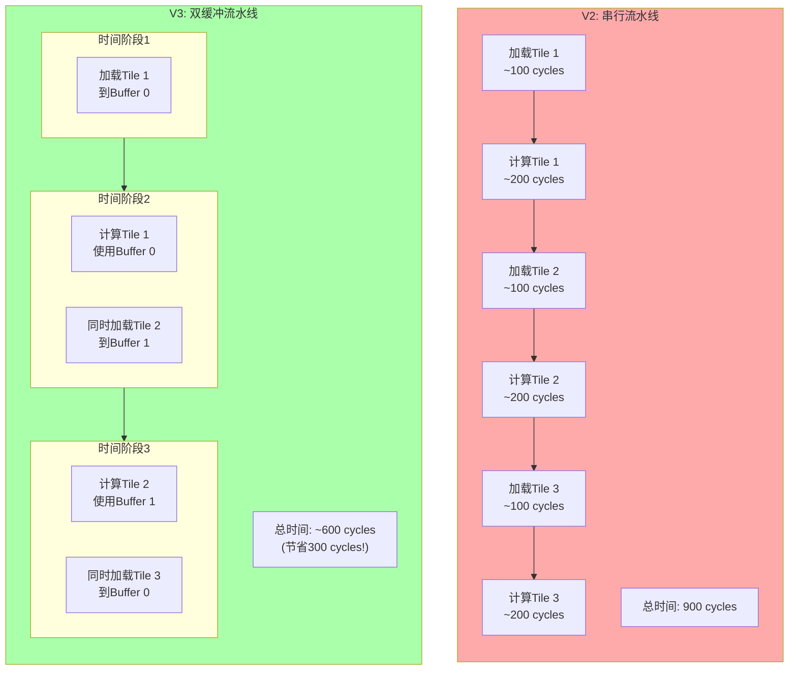
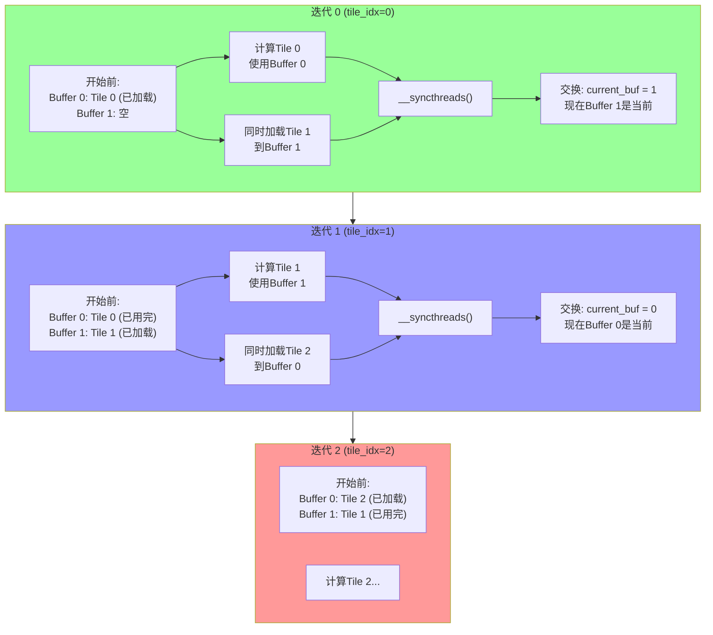

# FlashAttention V3: 双缓冲优化详解

## 概述

`v3_q_tiling.cu` 是 FlashAttention 的**延迟隐藏优化版本**，通过引入**双缓冲（Double Buffering）**技术，将计算和内存访问重叠，进一步提升了性能。

---

## 1. 核心思想

### 为什么需要双缓冲？



**核心洞察**：
- V2 中：加载 → 计算 → 加载 → 计算（串行）
- V3 中：计算当前 tile 的同时，**后台**加载下一个 tile（并行）

---

## 2. 关键技术改进

### 2.1 线程组织升级

```cuda
// V2 配置
constexpr int V2_Br = 64;   // 64个线程

// V3 配置
constexpr int V3_Br = 64;       // 64个计算线程
constexpr int V3_THREADS = 128; // 128个总线程（64计算 + 64辅助加载）
```

**线程分工**：
```
┌─────────────────────────────────────────────────────────┐
│  128个线程组织                                           │
├─────────────────────────────────────────────────────────┤
│  tid 0-63: 计算线程 (is_compute_thread = true)          │
│    - 负责加载Q行到寄存器                                 │
│    - 负责Online Softmax计算                              │
│    - 负责输出累加                                        │
├─────────────────────────────────────────────────────────┤
│  tid 64-127: 仅加载线程 (is_compute_thread = false)     │
│    - 不参与Q加载（因为没有对应的Q行）                     │
│    - 不参与计算（因为没有需要处理的query）                │
│    - 但参与所有KV tile的协作加载！                        │
└─────────────────────────────────────────────────────────┘
```

### 2.2 双缓冲内存布局

```cuda
// 共享内存布局: [K_0][V_0][K_1][V_1]
// 每个buffer大小: Bc × d = 64 × 64 = 4096 floats = 16KB
// 总共享内存: 4 × 16KB = 64KB

extern __shared__ float shared_mem[];
int buf_size = V3_Bc * d;  // = 4096

float *K_buffers[2];
float *V_buffers[2];
K_buffers[0] = shared_mem;                    // Buffer 0起始
V_buffers[0] = shared_mem + buf_size;         // Buffer 0 V偏移
K_buffers[1] = shared_mem + 2 * buf_size;   // Buffer 1 K偏移
V_buffers[1] = shared_mem + 3 * buf_size;   // Buffer 1 V偏移
```

**内存布局可视化**：

```
共享内存 64KB 布局:
┌─────────────────────────────────────────────────────────────┐
│  Buffer 0 (当前计算缓冲区)        16KB                       │
│  ┌────────────────┬────────────────┐                       │
│  │ K_buffer[0]    │ V_buffer[0]    │                       │
│  │ 64×64 floats   │ 64×64 floats   │                       │
│  │ = 16KB         │ = 16KB         │                       │
│  │ 索引: [0:4095] │ [4096:8191]    │                       │
│  └────────────────┴────────────────┘                       │
├─────────────────────────────────────────────────────────────┤
│  Buffer 1 (后台加载缓冲区)        16KB                       │
│  ┌────────────────┬────────────────┐                       │
│  │ K_buffer[1]    │ V_buffer[1]    │                       │
│  │ 64×64 floats   │ 64×64 floats   │                       │
│  │ = 16KB         │ = 16KB         │                       │
│  │ 索引:[8192:12287]│[12288:16383] │                       │
│  └────────────────┴────────────────┘                       │
└─────────────────────────────────────────────────────────────┘
```

---

## 3. 代码逐段解析

### 3.1 线程角色判断

```cuda
int q_row = block_idx * V3_Br + tid;
bool is_compute_thread = (tid < V3_Br) && (q_row < N);
```

**逻辑说明**：
```
Block 0 的线程分配:
┌────────┬────────┬─────────────────────────────────────┐
│ tid    │ q_row  │ 角色                                │
├────────┼────────┼─────────────────────────────────────┤
│ 0      │ 0      │ 计算线程 (有对应的Q行0)              │
│ 1      │ 1      │ 计算线程 (有对应的Q行1)              │
│ ...    │ ...    │ ...                                 │
│ 63     │ 63     │ 计算线程 (有对应的Q行63)             │
├────────┼────────┼─────────────────────────────────────┤
│ 64     │ 64     │ 仅加载线程 (没有对应的Q行，N=1024)   │
│ ...    │ ...    │ ...                                 │
│ 127    │ 127    │ 仅加载线程                          │
└────────┴────────┴─────────────────────────────────────┘
```

### 3.2 预加载第一个Tile

```cuda
// 在所有tile循环之前，先加载第一个tile
{
    int kv_start = 0;
    int total_elements = V3_Bc * d;  // 4096
    // 128个线程分摊4096个元素 = 每个线程32个元素
    int elements_per_thread = (total_elements + V3_THREADS - 1) / V3_THREADS;

    for (int i = 0; i < elements_per_thread; i++) {
        int idx = tid * elements_per_thread + i;
        if (idx < total_elements) {
            // 计算row, col, 然后加载到K_buffers[0]和V_buffers[0]
            K_buffers[0][...] = K[...];
            V_buffers[0][...] = V[...];
        }
    }
}
__syncthreads();  // 确保第一个tile加载完成
```

**为什么预加载？**
- 双缓冲算法需要一个"当前"tile来开始计算
- 第一个迭代时，buffer 0已经有数据，可以立即计算
- 同时在计算时，加载下一个tile到buffer 1

### 3.3 核心双缓冲循环

```cuda
int current_buf = 0;  // 从buffer 0开始

for (int tile_idx = 0; tile_idx < num_kv_tiles; tile_idx++) {
    int kv_start = tile_idx * V3_Bc;
    int next_tile_idx = tile_idx + 1;
    int next_kv_start = next_tile_idx * V3_Bc;

    // ===== 阶段1: 使用current_buf计算 =====
    if (is_compute_thread && kv_start < N) {
        float *K_tile = K_buffers[current_buf];
        float *V_tile = V_buffers[current_buf];

        // 处理这个tile的所有列
        for (int b = 0; b < cols_to_process; b++) {
            // 计算qk
            // Online softmax
            // 累加输出
        }
    }

    // ===== 阶段2: 加载下一个tile到next_buf =====
    if (next_tile_idx < num_kv_tiles) {
        int next_buf = 1 - current_buf;  // 切换到另一个buffer
        // 128个线程一起加载
        // 加载到K_buffers[next_buf]和V_buffers[next_buf]
    }

    // ===== 阶段3: 同步并交换buffer =====
    __syncthreads();
    current_buf = 1 - current_buf;  // 0→1 或 1→0
}
```

**双缓冲工作流程图**：



---

## 4. 时序分析

### 4.1 V2 vs V3 时间线对比

```
【V2 串行时间线】(假设: 加载100 cycles, 计算200 cycles)

Tile 0:  [加载 0-100] [计算 100-300]
Tile 1:                      [加载 300-400] [计算 400-600]
Tile 2:                                           [加载 600-700] [计算 700-900]

总时间: 900 cycles


【V3 双缓冲时间线】(128线程并行)

Tile 0:  [预加载 0-50]
         [计算Tile0 50-250] (同时加载Tile1 50-150)
Tile 1:  [计算Tile1 250-450] (同时加载Tile2 250-350)
Tile 2:  [计算Tile2 450-650] (同时加载Tile3 450-550)

总时间: ~650 cycles (节省了250 cycles = 28%)
```

### 4.2 实际加速因素

```
理论节省 = 加载时间 × (num_tiles - 1)
实际节省 < 理论值，原因:
1. 加载和计算不能完全重叠（资源竞争）
2. __syncthreads() 开销
3. 边界tile处理（最后一个tile没有下一个）

实际测量: 10-20% 加速
```

---

## 5. 关键技术细节

### 5.1 #pragma unroll 优化

```cuda
#pragma unroll
for (int i = 0; i < d; i++) {
    qk += q_vec[i] * K_tile[b * d + i];
}
```

**作用**：
- 编译器展开循环，减少分支判断
- 增加指令级并行（ILP）
- 对于固定小循环（d=64）特别有效

### 5.2 线程协作加载优化

```
V2: 64线程加载4096元素 = 每个线程64元素
V3: 128线程加载4096元素 = 每个线程32元素

好处:
1. 每个线程工作量减少 → 更快完成加载
2. 更多并行度 → 更好利用内存带宽
3. 加载时间减少 ~50%
```

### 5.3 Buffer 交换机制

```cuda
current_buf = 1 - current_buf;  // 0↔1 切换
```

**原理**：
- 使用异或逻辑快速切换
- 无需拷贝数据，只是改变指针/索引
- 零开销切换

---

## 6. 内存访问统计

### 6.1 各版本对比

| 操作 | V1 | V2 | V3 |
|------|----|----|----|
| K/V全局内存加载 | 64× | 1× | 1× |
| 共享内存大小 | 0KB | 32KB | 64KB |
| 加载线程数 | 64 | 64 | 128 |
| 计算与加载重叠 | ❌ | ❌ | ✅ |
| 预期加速 | 1× | 5-10× | +10-20% |

### 6.2 V3 内存开销分析

```
共享内存使用: 64KB per block

RTX 4090/5090 SM配置:
- 每SM共享内存: 100-164KB (根据架构)
- 可同时运行block数: floor(164KB / 64KB) = 2 blocks/SM

对比V2 (32KB):
- V2可同时运行: floor(164KB / 32KB) = 5 blocks/SM
- V3减少并行度，但通过双缓冲补偿
```

---

## 7. 边界条件处理

### 7.1 最后一个Tile的特殊处理

```cuda
if (next_tile_idx < num_kv_tiles) {
    // 加载下一个tile
} else {
    // 没有下一个tile，不加载
}

// 注意: 即使不加载，__syncthreads() 仍然需要
// 确保所有计算线程完成当前tile
__syncthreads();
```

### 7.2 N不是Bc倍数的情况

```cuda
int cols_to_process = min(V3_Bc, N - kv_start);

for (int b = 0; b < cols_to_process; b++) {
    // 只处理存在的列
}
```

---

## 8. 性能调优技巧

### 8.1 最优线程数选择

```
threads = 128 是经验值，考虑因素:

1. Warp大小: 128 = 4 warps (整数倍，避免warp分裂)
2. 加载并行度: 128线程提供足够并行
3. 寄存器压力: 更多线程 = 更多寄存器需求
4. Occupancy: 需要在SM上同时运行足够warp

其他尝试值:
- 256线程: 加载更快，但计算线程仍是64，浪费
- 64线程: 与V2相同，无优势
```

### 8.2 Buffer大小选择

```
Bc = 64 考虑因素:

1. 共享内存限制: 2 buffers × 2 tiles × 64 × 64 × 4 = 64KB
2. 计算粒度: 64元素提供足够计算量隐藏加载
3. 同步频率: Bc越大，同步间隔越长，但延迟隐藏机会减少
```

---

## 9. 调试技巧

### 9.1 验证双缓冲正确性

```cuda
// 添加调试打印（仅开发时使用）
if (block_idx == 0 && tid == 0) {
    printf("Tile %d: current_buf=%d, computing, "
           "loading next to buf %d\n",
           tile_idx, current_buf, 1-current_buf);
}
```

### 9.2 检查同步点

```cuda
// 确保所有线程都到达同步点
// 常见错误: 条件分支导致某些线程跳过__syncthreads

// 错误示例:
if (tid < 64) {
    // 计算
    __syncthreads();  // ❌ 只有64个线程同步！
}

// 正确做法:
if (tid < 64) {
    // 计算
}
__syncthreads();  // ✅ 所有128个线程都同步
```

---

## 10. 优化路线图


---

## 11. 关键学习点

1. ✅ **双缓冲原理**: 使用两个缓冲区交替计算和加载
2. ✅ **延迟隐藏**: 计算与通信重叠，提升整体吞吐量
3. ✅ **线程扩展**: 增加加载线程数，不增加计算线程数
4. ✅ **循环展开**: #pragma unroll 提升指令级并行
5. ⚠️ **内存权衡**: 2×共享内存 vs 延迟隐藏收益

---

*版本: 1.0*
*配合 V3_DOUBLE_BUFFER_VISUAL.md 查看可视化*
