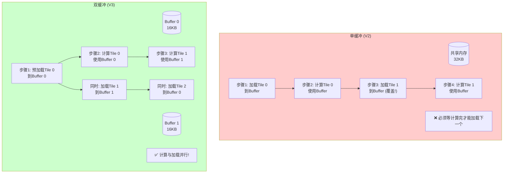
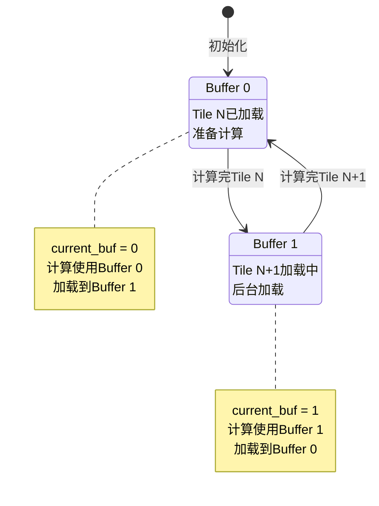
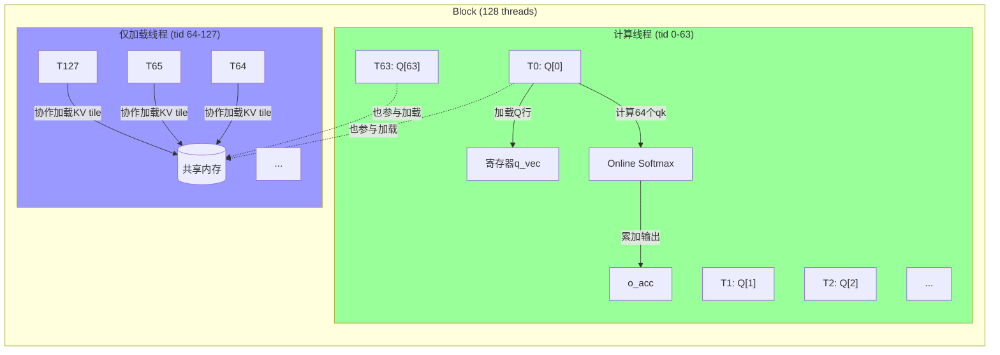
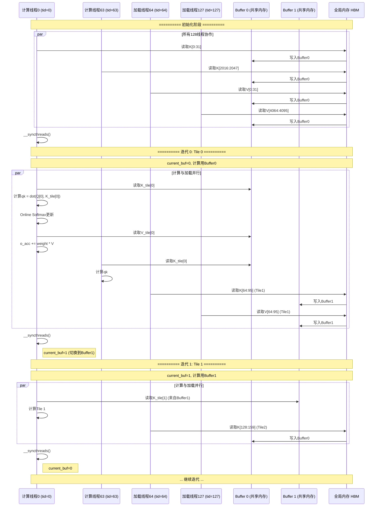
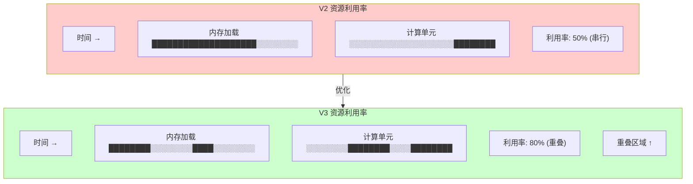

# V3 双缓冲优化 - 可视化详解

## 1. 双缓冲核心概念图

### 1.1 单缓冲 vs 双缓冲对比



### 1.2 时间线对比

```
【单缓冲时间线 - 串行】

时间轴: 0    50   100  150  200  250  300  350  400  450  500
       │     │    │    │    │    │    │    │    │    │    │
Tile 0: [====加载====][========计算========]
Tile 1:                       [====加载====][========计算========]
Tile 2:                                              [====加载====][===

总时间: 500 units
加载时间暴露: 150 units


【双缓冲时间线 - 并行】

时间轴: 0    50   100  150  200  250  300  350  400
       │     │    │    │    │    │    │    │    │
Buffer0: [预加载T0][计算T0]       [加载T2][计算T2]
Buffer1:              [加载T1][计算T1]       [加载T3]
                      ↑
                      重叠区域!

总时间: 350 units (节省30%)
加载被计算隐藏!
```

---

## 2. 内存布局可视化

### 2.1 共享内存布局

```
V3 共享内存 64KB 布局:

地址空间 (float索引):
┌──────────────────────────────────────────────────────────────────────┐
│ Buffer 0 - K (16KB)                                                    │
│ ┌──────────────────────────────────────────────────────────────┐    │
│ │ 行0: [0]    [1]    [2]    ... [63]                             │    │
│ │ 行1: [64]   [65]   [66]   ... [127]                            │    │
│ │ ...                                                            │    │
│ │ 行63: [4032][4033][4034] ... [4095]                            │    │
│ └──────────────────────────────────────────────────────────────┘    │
│ 索引: 0 - 4095                                                       │
├──────────────────────────────────────────────────────────────────────┤
│ Buffer 0 - V (16KB)                                                    │
│ ┌──────────────────────────────────────────────────────────────┐    │
│ │ 行0-63, 64 floats per row                                    │    │
│ └──────────────────────────────────────────────────────────────┘    │
│ 索引: 4096 - 8191                                                    │
├──────────────────────────────────────────────────────────────────────┤
│ Buffer 1 - K (16KB)                                                    │
│ ┌──────────────────────────────────────────────────────────────┐    │
│ │ 行0-63, 64 floats per row                                    │    │
│ └──────────────────────────────────────────────────────────────┘    │
│ 索引: 8192 - 12287                                                   │
├──────────────────────────────────────────────────────────────────────┤
│ Buffer 1 - V (16KB)                                                    │
│ ┌──────────────────────────────────────────────────────────────┐    │
│ │ 行0-63, 64 floats per row                                    │    │
│ └──────────────────────────────────────────────────────────────┘    │
│ 索引: 12288 - 16383                                                  │
└──────────────────────────────────────────────────────────────────────┘
```

### 2.2 Buffer 切换机制



---

## 3. 线程组织可视化

### 3.1 128线程分工图



### 3.2 协作加载示例

```
128线程加载4096元素:

元素分配:
┌────────────────────────────────────────────────────────────────┐
│ tid   │ 负责元素索引    │ 加载到位置                          │
├────────────────────────────────────────────────────────────────┤
│ 0     │ 0-31           │ K_buffer[0][0:31]                   │
│ 1     │ 32-63          │ K_buffer[0][32:63]                  │
│ 2     │ 64-95          │ K_buffer[1][0:31]                   │
│ ...   │ ...            │ ...                                 │
│ 63    │ 2016-2047      │ K_buffer[31][32:63]                 │
├────────────────────────────────────────────────────────────────┤
│ 64    │ 2048-2079      │ V_buffer[0][0:31]                   │
│ 65    │ 2080-2111      │ V_buffer[0][32:63]                  │
│ ...   │ ...            │ ...                                 │
│ 127   │ 4064-4095      │ V_buffer[31][32:63]                 │
└────────────────────────────────────────────────────────────────┘

每个线程加载32个floats = 128 bytes
相比V2的64个floats，加载时间减半！
```

---

## 4. 执行流程时序图

### 4.1 完整迭代流程



### 4.2 迭代状态转换

```
┌──────────────────────────────────────────────────────────────────┐
│ 迭代状态机                                                       │
├──────────────────────────────────────────────────────────────────┤
│                                                                  │
│   ┌──────────┐        ┌──────────┐        ┌──────────┐         │
│   │ 迭代0    │ ─────> │ 迭代1    │ ─────> │ 迭代2    │ ────>   │
│   │ Tile 0   │        │ Tile 1   │        │ Tile 2   │         │
│   └────┬─────┘        └────┬─────┘        └────┬─────┘         │
│        │                   │                   │                │
│   ┌────▼─────┐        ┌────▼─────┐        ┌────▼─────┐         │
│   │Buf0:Tile0│        │Buf0:Tile2│        │Buf0:Tile4│         │
│   │Buf1:空   │        │Buf1:Tile1│        │Buf1:Tile3│         │
│   │当前:Buf0 │        │当前:Buf1 │        │当前:Buf0 │         │
│   └──────────┘        └──────────┘        └──────────┘         │
│                                                                  │
│   操作:             操作:             操作:                     │
│   - 计算Tile0       - 计算Tile1       - 计算Tile2               │
│   - 加载Tile1到Buf1 - 加载Tile2到Buf0 - 加载Tile3到Buf1         │
│                                                                  │
└──────────────────────────────────────────────────────────────────┘
```

---

## 5. 性能分析图

### 5.1 资源利用率对比



### 5.2 瓶颈转移

```
【V2 瓶颈分析】

瓶颈: 全局内存加载
        │
   峰值 │                    ┌────────────┐
  性能  │                    │  V2 实际   │
        │    ┌───────────────┤            │
        │    │  受限于内存   │            │
        │    │  加载速度     │            │
        │    │               │            │
        └────┴───────────────┴────────────┴───────────►
            计算量

问题: 计算单元等待数据加载，空闲时间多


【V3 瓶颈分析】

瓶颈: 计算 + 内存（更平衡）
        │
   峰值 │         ┌─────────┐
  性能  │         │ V3 实际 │
        │    ┌────┤更接近   │
        │    │    │峰值性能 │
        │    │    │         │
        └────┴────┴─────────┴──────────────────────────►
            计算量

改善: 计算与加载重叠，减少空闲时间
```

---

## 6. 实际案例演示

### 6.1 N=256, d=64 执行示例

```
配置:
- N = 256 (序列长度)
- d = 64 (head维度)
- Br = 64 (每block处理64个query)
- Bc = 64 (每个KV tile 64行)
- num_blocks = ceil(256/64) = 4 blocks
- num_kv_tiles = ceil(256/64) = 4 tiles per block

Block 0 执行流程:

时间 0:   预加载Tile 0到Buffer 0
         (128线程协作，~50 cycles)

时间 50:  同步完成，开始迭代

迭代 0 (Tile 0):
  - 计算线程(tid 0-63): 用Buffer 0计算Tile 0
  - 所有线程: 加载Tile 1到Buffer 1
  - 时间: ~200 cycles (重叠)
  - 同步: 等待两者完成

迭代 1 (Tile 1):
  - 计算线程: 用Buffer 1计算Tile 1
  - 所有线程: 加载Tile 2到Buffer 0
  - current_buf 切换: 1 -> 0
  - 时间: ~200 cycles

迭代 2 (Tile 2):
  - 计算线程: 用Buffer 0计算Tile 2
  - 所有线程: 加载Tile 3到Buffer 1
  - current_buf 切换: 0 -> 1

迭代 3 (Tile 3):
  - 计算线程: 用Buffer 1计算Tile 3
  - 所有线程: 无下一个tile，不加载
  - 同步完成

时间 ~750: 写回输出O

总时间: ~800 cycles (vs V2的~1000 cycles，节省20%)
```

---

## 7. 关键代码可视化

### 7.1 双缓冲核心循环结构

```
┌─────────────────────────────────────────────────────────────────┐
│ for (int tile_idx = 0; tile_idx < num_kv_tiles; tile_idx++)    │
│ {                                                               │
│     ┌───────────────────────────────────────────────────────┐ │
│     │ 1. COMPUTE PHASE (current_buf)                         │ │
│     │                                                        │ │
│     │    if (is_compute_thread) {                            │ │
│     │        K_tile = K_buffers[current_buf];                │ │
│     │        V_tile = V_buffers[current_buf];                │ │
│     │                                                        │ │
│     │        for (b = 0; b < Bc; b++) {                      │ │
│     │            qk = dot(q_vec, K_tile[b]);  // 共享内存   │ │
│     │            online_softmax_update();                    │ │
│     │            o_acc += weight * V_tile[b];  // 共享内存  │ │
│     │        }                                               │ │
│     │    }                                                   │ │
│     └───────────────────────────────────────────────────────┘ │
│                              │                                  │
│                              │ 并行执行                          │
│                              ▼                                  │
│     ┌───────────────────────────────────────────────────────┐ │
│     │ 2. LOAD PHASE (1 - current_buf)                        │ │
│     │                                                        │ │
│     │    if (next_tile_idx < num_kv_tiles) {                 │ │
│     │        next_buf = 1 - current_buf;                     │ │
│     │                                                        │ │
│     │        for (i = 0; i < elements_per_thread; i++) {     │ │
│     │            K_buffers[next_buf][...] = K[...];  // HBM  │ │
│     │            V_buffers[next_buf][...] = V[...];  // HBM  │ │
│     │        }                                               │ │
│     │    }                                                   │ │
│     └───────────────────────────────────────────────────────┘ │
│                              │                                  │
│                              ▼                                  │
│     ┌───────────────────────────────────────────────────────┐ │
│     │ 3. SYNC & SWAP                                         │ │
│     │                                                        │ │
│     │    __syncthreads();  // 确保计算和加载都完成          │ │
│     │    current_buf = 1 - current_buf;  // 切换buffer      │ │
│     └───────────────────────────────────────────────────────┘ │
│ }                                                               │
└─────────────────────────────────────────────────────────────────┘
```

### 7.2 线程角色判断逻辑

```
┌────────────────────────────────────────────────────────────────┐
│ 线程tid的角色判断                                               │
├────────────────────────────────────────────────────────────────┤
│                                                                │
│  int q_row = block_idx * 64 + tid;                             │
│  bool is_compute_thread = (tid < 64) && (q_row < N);           │
│                                                                │
│  ┌─────────────────────────────────────────────────────────┐  │
│  │ tid范围    │ q_row范围      │ is_compute │ 职责          │  │
│  ├────────────┼────────────────┼────────────┼───────────────┤  │
│  │ 0-63       │ 0-63 (有效)    │ true       │ 计算+加载     │  │
│  │            │ (若q_row>=N)   │ false      │ 仅加载        │  │
│  ├────────────┼────────────────┼────────────┼───────────────┤  │
│  │ 64-127     │ 64-127         │ false      │ 仅加载        │  │
│  │            │ (超出Q范围)    │            │               │  │
│  └─────────────────────────────────────────────────────────┘  │
│                                                                │
│  注意: 即使is_compute=false，所有线程都参与__syncthreads()    │
│                                                                │
└────────────────────────────────────────────────────────────────┘
```

---

## 8. 常见错误与避免

### 8.1 错误1: 忘记预加载

```cuda
// ❌ 错误: 没有预加载第一个tile
current_buf = 0;
for (int tile_idx = 0; tile_idx < num_kv_tiles; tile_idx++) {
    // 直接计算，但buffer 0可能是空的！
    compute_with_buffer(K_buffers[0]);
    load_next_tile();
    __syncthreads();
}

// ✅ 正确: 先预加载第一个tile
preload_first_tile_to_buffer_0();
__syncthreads();
current_buf = 0;
for (...) { ... }
```

### 8.2 错误2: 条件分支导致死锁

```cuda
// ❌ 错误: 只有部分线程调用__syncthreads
if (is_compute_thread) {
    compute();
    __syncthreads();  // 只有64个线程到达！
}
// 另外64个线程永远到不了这里 → 死锁！

// ✅ 正确: 所有线程都必须调用
if (is_compute_thread) {
    compute();
}
__syncthreads();  // 所有128个线程都到达
```

### 8.3 错误3: Buffer索引越界

```cuda
// ❌ 错误: 忘记检查next_tile_idx
load_next_tile_to_buffer(1 - current_buf);  // 最后一个tile会越界！

// ✅ 正确: 检查是否还有下一个tile
if (next_tile_idx < num_kv_tiles) {
    load_next_tile_to_buffer(1 - current_buf);
}
```

---

## 9. 性能对比总结

```
┌──────────────────────────────────────────────────────────────────┐
│                    V1 → V2 → V3 性能演进                         │
├──────────────────────────────────────────────────────────────────┤
│                                                                  │
│  V1 (朴素):                                                      │
│  ┌────────────────────────────────────────────────────────┐    │
│  │ 内存访问: 64× 重复加载                                   │    │
│  │ 时间: ████████████████████████████████████████████████ │    │
│  │ 加速: 1×                                                │    │
│  └────────────────────────────────────────────────────────┘    │
│                                                                  │
│  V2 (共享内存):                                                  │
│  ┌────────────────────────────────────────────────────────┐    │
│  │ 内存访问: 1× 协作加载 + 64× 复用                         │    │
│  │ 时间: ████████████░░░░░░░░░░░░░░░░░░░░░░░░░░░░░░░░░░░░ │    │
│  │ 加速: 5-10×                                             │    │
│  └────────────────────────────────────────────────────────┘    │
│                                                                  │
│  V3 (双缓冲):                                                    │
│  ┌────────────────────────────────────────────────────────┐    │
│  │ 内存访问: 1× 加载 (与计算重叠)                          │    │
│  │ 时间: ███████████░░░░░░░░░░░░░░░░░░░░░░░░░░░░░░░░░░░░░ │    │
│  │ 加速: +10-20% (在V2基础上)                              │    │
│  └────────────────────────────────────────────────────────┘    │
│                                                                  │
└──────────────────────────────────────────────────────────────────┘
```

---

*可视化文档配合 V3_DOUBLE_BUFFER_EXPLAINED.md 使用*
*版本: 1.0*
