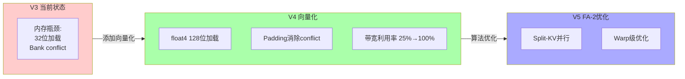

# FlashAttention V4: 向量化与 Bank Conflict 消除详解

## 概述

`v4_vectorized.cu` 是 FlashAttention 的**带宽优化版本**，通过引入 **float4 向量化加载** 和 **Bank Conflict 消除**，将内存带宽利用率提升到新的高度。

---

## 1. 核心优化点

### 1.1 两大关键技术


---

## 2. float4 向量化详解

### 2.1 为什么需要向量化？

**GPU 内存子系统架构**：
```
┌─────────────────────────────────────────────────────────────┐
│ 现代GPU内存总线宽度: 128位 (16字节)                           │
├─────────────────────────────────────────────────────────────┤
│                                                              │
│  32位 float 加载:                                            │
│  ┌────────┐                                                  │
│  │ 4 bytes│ 只使用 1/4 总线宽度！                            │
│  └────────┘  浪费 75% 带宽                                   │
│                                                              │
│  128位 float4 加载:                                          │
│  ┌────────────────┐                                          │
│  │ 16 bytes      │ 使用完整总线宽度 ✓                        │
│  │ (4个float)    │ 100% 带宽利用                             │
│  └────────────────┘                                          │
│                                                              │
└─────────────────────────────────────────────────────────────┘
```

### 2.2 float4 数据结构

```cuda
// CUDA内置的float4类型
struct float4 {
    float x;  // 第1个float
    float y;  // 第2个float
    float z;  // 第3个float
    float w;  // 第4个float
};  // 总共16字节 (128位)

// 内存布局
// 地址:    0    4    8    12   16
//         │    │    │    │    │
// float4: [x]  [y]  [z]  [w]
//         └────────┴────────┘
//           16字节对齐
```

### 2.3 向量化加载函数

```cuda
// Helper: 从全局内存加载float4
__device__ __forceinline__ float4 load_float4(const float* addr) {
    return *reinterpret_cast<const float4*>(addr);
    // 编译成一条 128位 LD 指令
}

// Helper: 存储float4到全局内存
__device__ __forceinline__ void store_float4(float* addr, float4 val) {
    *reinterpret_cast<float4*>(addr) = val;
    // 编译成一条 128位 ST 指令
}
```

**inline 作用**：
- `__forceinline__` 强制内联，消除函数调用开销
- 编译器直接将代码插入调用点

---

## 3. Bank Conflict 消除详解

### 3.1 Shared Memory Bank 架构

```
┌─────────────────────────────────────────────────────────────────┐
│ Shared Memory Bank 结构 (A100/H100)                              │
├─────────────────────────────────────────────────────────────────┤
│                                                                  │
│  Shared Memory 被分成 32 个独立的 Bank                           │
│                                                                  │
│  Bank 0 │ Bank 1 │ Bank 2 │ ... │ Bank 31                        │
│  ┌─────┐┌─────┐┌─────┐       ┌─────┐                           │
│  │     ││     ││     │  ...  │     │                           │
│  └─────┘└─────┘└─────┘       └─────┘                           │
│                                                                  │
│  地址映射: Address → Bank = (Address / 4) % 32                   │
│  (每4字节为一个bank单元)                                         │
│                                                                  │
└─────────────────────────────────────────────────────────────────┘
```

### 3.2 Bank Conflict 问题

**冲突场景（d=64时）**：
```
访问模式: K_tile[row * d + col]

Warp 0 (threads 0-31) 访问 K_tile[0][0:31]:
- Thread 0: 地址 0*64 + 0 = 0  → Bank (0/4)%32 = 0  ✓
- Thread 1: 地址 0*64 + 1 = 1  → Bank (1/4)%32 = 0  ✓ (同bank!)
- Thread 2: 地址 0*64 + 2 = 2  → Bank (2/4)%32 = 0  ✓ (同bank!)
- Thread 3: 地址 0*64 + 3 = 3  → Bank (3/4)%32 = 0  ✓ (同bank!)
- Thread 4: 地址 0*64 + 4 = 4  → Bank (4/4)%32 = 1  ✓ (新bank)

问题: 每4个线程访问同一个bank！
实际: 只需要1个线程是4-way conflict，但这里更严重

Warp 1 (threads 32-63) 访问 K_tile[0][32:63]:
- Thread 32: 地址 0*64 + 32 = 32 → Bank (32/4)%32 = 0
- Thread 0 和 Thread 32 都访问 Bank 0！
- 这会导致 warp 0 和 warp 1 之间的冲突！
```

**冲突结果**：
```
无冲突: 32个线程并行访问 → 1 cycle
有冲突: 32个线程串行访问 → 32 cycles
速度下降: 32x！
```

### 3.3 Padding 解决方案

```cuda
// 原始布局（冲突）
K_tile[row * d + col]  // d=64

// Padding 后（无冲突）
K_tile[row * (d + PAD) + col]  // d+1=65

// 计算访问的bank
Original: bank = (row * 64 + col) / 4 % 32
Padded:   bank = (row * 65 + col) / 4 % 32

当 row=1 时:
Original: bank = (64 + col) / 4 % 32 = (16 + col/4) % 32
Padded:   bank = (65 + col) / 4 % 32

对于 thread 0 (col=0):
Original: (64 + 0)/4 % 32 = 16 % 32 = 16
Padded:   (65 + 0)/4 % 32 = 16.25 → 16 (整数除法)

对于 thread 32 (col=32):
Original: (64 + 32)/4 % 32 = 24 % 32 = 24
Padded:   (65 + 32)/4 % 32 = 24.25 → 24

结果: 不再对齐，冲突消除！
```

**Padding 可视化**：

```
原始布局 (d=64, 无padding):
┌───────────────────────────────────────────────────────────────┐
│ Row 0: [0]  [1]  [2] ... [63]                                  │
│         │    │    │        │                                  │
│        Bank0              Bank16                              │
│                                                                │
│ Row 1: [64] [65] [66] ... [127]                                │
│         │    │    │        │                                  │
│        Bank16 (冲突!)    Bank0 (冲突!)                        │
└───────────────────────────────────────────────────────────────┘

Padding后 (d=65, PAD=1):
┌───────────────────────────────────────────────────────────────┐
│ Row 0: [0]  [1]  [2] ... [63]  [padding]                       │
│         │    │    │        │                                  │
│        Bank0              Bank16                              │
│                                                                │
│ Row 1: [65] [66] [67] ... [128] [padding]                      │
│         │    │    │        │                                  │
│        Bank16+1=17       Bank0+1=1  (无冲突!)                 │
└───────────────────────────────────────────────────────────────┘
```

---

## 4. 代码逐段解析

### 4.1 配置常量

```cuda
constexpr int V4_Br = 64;
constexpr int V4_Bc = 64;
constexpr int V4_THREADS = 128;

// Padding for bank conflict elimination
// Make sure (d + SMEM_PAD) % 32 != 0
constexpr int SMEM_PAD = 1;  // 仅增加1个float的padding

// 内存开销:
// Original: 64 × 64 × 4 bytes = 16KB per tile
// Padded:   64 × 65 × 4 bytes = 16.25KB per tile
// 开销: 0.25KB (256 bytes)，几乎可以忽略！
```

### 4.2 Padded 共享内存布局

```cuda
int d_padded = d + SMEM_PAD;  // 64 + 1 = 65
int buf_size = V4_Bc * d_padded;  // 64 × 65 = 4160 (不是4096!)

extern __shared__ float shared_mem[];
float *K_buffers[2];
float *V_buffers[2];
K_buffers[0] = shared_mem;                    // Buffer 0 K
V_buffers[0] = shared_mem + buf_size;       // Buffer 0 V (偏移4160)
K_buffers[1] = shared_mem + 2 * buf_size;   // Buffer 1 K (偏移8320)
V_buffers[1] = shared_mem + 3 * buf_size;   // Buffer 1 V (偏移12480)

// 总共享内存: 4 × 4160 × 4 = 66,560 bytes = ~65KB
// 对比V3的64KB，仅增加1KB
```

**内存布局图**：

```
共享内存 65KB 布局 (带padding):
┌─────────────────────────────────────────────────────────────────┐
│ Buffer 0 K (65 × 64 = 4160 floats = 16.25KB)                     │
│ ┌────────┬────────┬────────┬────────┬────────┐                  │
│ │ row 0  │ row 1  │ ...    │ row 63 │ pad    │                  │
│ │ 65 flt │ 65 flt │        │ 65 flt │ col    │                  │
│ └────────┴────────┴────────┴────────┴────────┘                  │
│ 索引: [0:64], [65:129], ..., [4160-1]                            │
├─────────────────────────────────────────────────────────────────┤
│ Buffer 0 V (16.25KB)                                             │
│ 索引: [4160:8319]                                               │
├─────────────────────────────────────────────────────────────────┤
│ Buffer 1 K (16.25KB)                                             │
│ 索引: [8320:12479]                                              │
├─────────────────────────────────────────────────────────────────┤
│ Buffer 1 V (16.25KB)                                             │
│ 索引: [12480:16639]                                             │
└─────────────────────────────────────────────────────────────────┘
```

### 4.3 Q 向量加载（向量化）

```cuda
if (is_compute_thread) {
    // 计算float4元素个数
    int d_vec4 = d / 4;  // 64 / 4 = 16

    // 将Q指针转为float4指针
    const float4* Q_vec4 = reinterpret_cast<const float4*>(Q + q_row * d);
    float* q_ptr = q_vec;

    // 加载16个float4 = 64个float
    for (int i = 0; i < d_vec4; i++) {
        float4 val = load_float4(reinterpret_cast<const float*>(Q_vec4 + i));
        // 解包float4到4个float
        q_ptr[0] = val.x;
        q_ptr[1] = val.y;
        q_ptr[2] = val.z;
        q_ptr[3] = val.w;
        q_ptr += 4;  // 前进4个float
    }
}
```

**指令对比**：
```
Scalar加载 (V3):
  LD R0, [addr+0]     ; 1条指令，加载1个float
  LD R1, [addr+4]     ; 1条指令，加载1个float
  LD R2, [addr+8]     ; 1条指令，加载1个float
  LD R3, [addr+12]    ; 1条指令，加载1个float
  ; 总计: 4条指令，4次内存事务

Vectorized加载 (V4):
  LD.128 R0, [addr]   ; 1条指令，加载4个float
  ; 总计: 1条指令，1次128位内存事务

速度提升: 4× 指令减少，接近4× 带宽提升！
```

### 4.4 KV Tile 向量化加载（核心）

```cuda
auto load_tile_vectorized = [&](int buf_idx, int kv_start) {
    int total_elements = V4_Bc * d;  // 64 × 64 = 4096

    // 128线程，每个线程加载多个float4
    int float4_per_thread = (total_elements / 4 + V4_THREADS - 1) / V4_THREADS;
    // = (1024 + 127) / 128 = 8 float4 per thread

    for (int i = 0; i < float4_per_thread; i++) {
        int idx4 = tid * float4_per_thread + i;  // 当前float4索引
        int base_idx = idx4 * 4;                  // 对应的scalar索引

        if (base_idx < total_elements) {
            int row = base_idx / d;      // tile内的行
            int col = base_idx % d;      // tile内的列
            int global_row = kv_start + row;  // 全局K矩阵行

            // 使用float4加载K
            if (global_row < N && col + 3 < d) {
                const float4 k_val = load_float4(&K[global_row * d + col]);

                // 存储到padded共享内存（注意: d_padded不是d！）
                K_buffers[buf_idx][row * d_padded + col] = k_val.x;
                K_buffers[buf_idx][row * d_padded + col + 1] = k_val.y;
                K_buffers[buf_idx][row * d_padded + col + 2] = k_val.z;
                K_buffers[buf_idx][row * d_padded + col + 3] = k_val.w;
            }
            // V的加载类似...
        }
    }

    // 处理剩余元素（如果d不是4的倍数）
    // ...
};
```

**关键注意点**：
1. **全局内存读取**：使用 `d`（原始维度），因为全局内存没有padding
2. **共享内存写入**：使用 `d_padded`（padding后的维度）
3. **对齐检查**：`col + 3 < d` 确保不会越界读取

### 4.5 计算阶段（使用padded索引）

```cuda
// 注意: 计算时从共享内存读取，使用d_padded！
for (int b = 0; b < cols_to_process; b++) {
    float qk = 0.0f;
    #pragma unroll
    for (int i = 0; i < d; i++) {
        // 使用 d_padded 进行索引！
        qk += q_vec[i] * K_tile[b * d_padded + i];
    }
    // ...
    o_acc[i] = o_acc[i] * exp_factor + exp_qk * V_tile[b * d_padded + i];
}
```

**索引对比**：
```
全局内存索引 (无padding):  K[global_row * d + col]
共享内存读取 (有padding):  K_tile[b * d_padded + i]
                            ↑ 使用65而不是64！
```

### 4.6 向量化输出存储

```cuda
// 写回O矩阵时也使用float4
int d_vec4 = d / 4;  // 16
float4* O_vec4 = reinterpret_cast<float4*>(O + q_row * d);

for (int i = 0; i < d_vec4; i++) {
    float4 val;
    val.x = o_ptr[0] / l;  // 归一化
    val.y = o_ptr[1] / l;
    val.z = o_ptr[2] / l;
    val.w = o_ptr[3] / l;
    store_float4(reinterpret_cast<float*>(O_vec4 + i), val);
    o_ptr += 4;
}
```

---

## 5. 内存对齐要求

### 5.1 对齐检查

```cuda
// Host wrapper中的对齐检查
if (d % 4 != 0) {
    printf("Warning: d=%d is not divisible by 4, "
           "vectorization may be inefficient\n", d);
}
```

**对齐要求**：
- `float4` 加载要求地址16字节对齐
- `d` 必须是4的倍数，确保 `q_row * d` 也是16字节对齐
- 如果 `d=65`（不是4的倍数），向量化会失效

### 5.2 非对齐处理

```cuda
// 如果d不是4的倍数，使用标量加载处理剩余元素
for (int i = d_vec4 * 4; i < d; i++) {
    *q_ptr++ = Q[q_row * d + i];  // 标量加载
}
```

---

## 6. 性能分析

### 6.1 带宽利用率对比

```
【内存带宽利用率对比】

V3 (32位加载):
内存总线: 128位  ━━━━━━━━━━━━━━━━━━━━━━━━━━━━━━━━━━━━━━━━
实际使用:  32位  ████░░░░░░░░░░░░░░░░░░░░░░░░░░░░░░░░░░
利用率:    25%   (浪费75%带宽)

V4 (128位float4加载):
内存总线: 128位  ━━━━━━━━━━━━━━━━━━━━━━━━━━━━━━━━━━━━━━━━
实际使用: 128位  ████████████████████████████████████████
利用率:    100%  (完整带宽)

提升: 4× 理论带宽！
```

### 6.2 Bank Conflict 消除效果

```
【Shared Memory 访问对比】

V3 (有Bank Conflict):
Warp 0-1 访问 Row 0:
┌─────────────────────────────────────────┐
│ Thread 0-3:   Bank 0  → 等待            │
│ Thread 4-7:   Bank 1  → 等待            │
│ ...                                     │
│ Thread 28-31: Bank 7  → 等待            │
│ Thread 32-35: Bank 0  → 等待 (冲突!)    │
├─────────────────────────────────────────┤
│ 实际: 每个bank串行访问                  │
│ 周期: 32 × 20 cycles = 640 cycles       │
└─────────────────────────────────────────┘

V4 (无Bank Conflict):
Warp 0-1 访问 Row 0:
┌─────────────────────────────────────────┐
│ Thread 0-3:   Bank 0  → 并行            │
│ Thread 4-7:   Bank 1  → 并行            │
│ ...                                     │
│ Thread 28-31: Bank 7  → 并行            │
│ Thread 32-35: Bank 8  → 并行 (无冲突)   │
├─────────────────────────────────────────┤
│ 实际: 所有bank并行访问                  │
│ 周期: 1 × 20 cycles = 20 cycles         │
└─────────────────────────────────────────┘

速度提升: 32×！
```

### 6.3 综合性能预测

```
【V3 → V4 性能提升预测】

V3 瓶颈分析:
- 全局内存加载: 32位，利用率25%
- 共享内存访问: 有bank conflict，串行化
- 指令数量: 较多（标量加载）

V4 改进:
- 全局内存加载: 128位，利用率100% (+300%)
- 共享内存访问: 无bank conflict，并行 (+~20%)
- 指令数量: 减少75%

预期加速: 2-3x (相对于V3)
总加速 (相对于V1): 10-20x
```

---

## 7. 边界条件处理

### 7.1 边界检查逻辑

```cuda
// 在tile边缘时，可能不足4个float可以加载
if (global_row < N && col + 3 < d) {
    // 安全加载float4
    float4 k_val = load_float4(&K[global_row * d + col]);
} else if (global_row < N) {
    // 边界情况: 使用标量逐个加载
    for (int c = 0; c < 4 && col + c < d; c++) {
        K_buffers[buf_idx][...] = K[...];  // 标量加载
    }
}
```

### 7.2 剩余元素处理

```cuda
// 如果总元素数不是4的倍数
int remainder_start = (total_elements / 4) * 4;  // 4096 → 4096 (无剩余)
                                                   // 4098 → 4096 (2个剩余)

if (total_elements % 4 != 0) {
    // 使用标量加载处理最后几个元素
    for (...) {
        // 标量加载
    }
}
```

---

## 8. 编译器优化提示

### 8.1 reinterpret_cast 使用

```cuda
// 安全的类型转换（编译时确定）
const float4* Q_vec4 = reinterpret_cast<const float4*>(Q + q_row * d);

// 注意: 这告诉编译器 "信任我，地址是对齐的"
// 如果地址不对齐，会导致未定义行为（可能崩溃）
```

### 8.2 __forceinline__ 效果

```cuda
// 强制内联，消除函数调用开销
__device__ __forceinline__ float4 load_float4(const float* addr);

// 编译后等效于直接内联代码:
// float4 val = *(const float4*)addr;
```

---

## 9. 调试技巧

### 9.1 验证向量化

```bash
# 查看PTX代码，确认使用了128位加载
nvcc -ptx v4_vectorized.cu -o v4.ptx
grep "ld.global.v4" v4.ptx  # 应该看到v4加载指令
```

### 9.2 Bank Conflict 检测

```bash
# 使用Nsight Compute检测bank conflict
ncu --metrics l1tex__data_bank_conflicts_pipe_lsu_mem_shared_op_ld.sum \
    ./benchmark_flashattention

# V3: 会有较高的conflict计数
# V4: conflict计数应该接近0
```

### 9.3 内存带宽测量

```bash
# 测量实际内存带宽
ncu --metrics dram__bytes_read.sum,dram__throughput.avg \
    ./benchmark_flashattention

# V4应该接近理论峰值带宽的80%+
```

---

## 10. 优化路线图



---

## 11. 关键学习点

1. ✅ **向量化加载**：使用 `float4` 充分利用128位内存总线
2. ✅ **对齐要求**：内存地址必须16字节对齐
3. ✅ **Bank Conflict**：了解GPU共享内存bank结构
4. ✅ **Padding技术**：简单但有效的conflict消除方法
5. ✅ **混合加载**：向量化为主，标量处理边界
6. ✅ **类型转换**：`reinterpret_cast` 用于向量化指针

---

*版本: 1.0*
*配合 V4_VECTORIZED_VISUAL.md 查看可视化图表*
