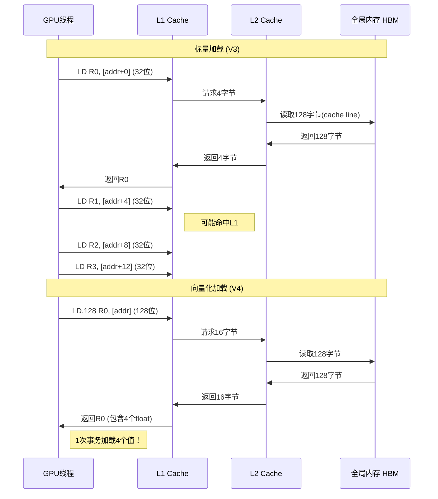
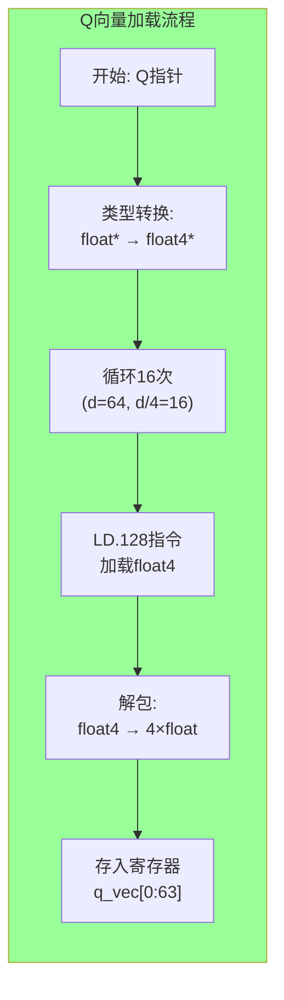
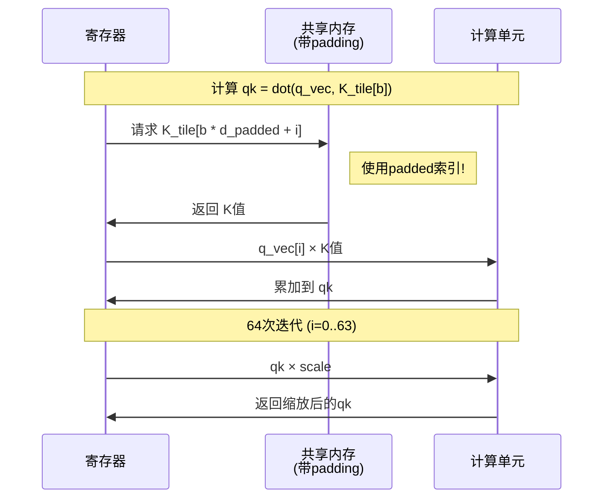

# V4 向量化与 Bank Conflict 消除 - 可视化详解

## 1. float4 向量化原理

### 1.1 内存带宽利用率对比

```mermaid
flowchart TB
    subgraph ScalarLoad["标量加载 (V3)"]
        direction TB

        S_Bus["内存总线: 128位宽"]
        S_Transactions["事务数: 4次"]
        S_Utilization["利用率: ████░░░░░░░░░░░░ (25%)"]

        S_Diagram[
        ┌────────────────────────────────────────┐
        │  总线: [__][__][__][__] 128位        │
        │           ↓                            │
        │  float: [__] 32位 ← 只用1/4！        │
        │                                        │
        │  需要4次事务加载4个float              │
        │  浪费75%带宽                          │
        └────────────────────────────────────────┘
        ]

        S_Bus --> S_Transactions --> S_Utilization --> S_Diagram
    end

    subgraph VectorizedLoad["向量化加载 (V4)"]
        direction TB

        V_Bus["内存总线: 128位宽"]
        V_Transactions["事务数: 1次"]
        V_Utilization["利用率: ████████████████ (100%)"]

        V_Diagram[
        ┌────────────────────────────────────────┐
        │  总线: [__][__][__][__] 128位        │
        │           ↓                            │
        │  float4: [__][__][__][__] 128位 ✓    │
        │                                        │
        │  1次事务加载4个float                  │
        │  100%带宽利用                         │
        └────────────────────────────────────────┘
        ]

        V_Bus --> V_Transactions --> V_Utilization --> V_Diagram
    end

    style ScalarLoad fill:#fcc
    style VectorizedLoad fill:#cfc
```

### 1.2 float4 内存布局

```
内存地址空间 (16字节对齐):

地址:   0x00   0x04   0x08   0x0C   0x10   0x14   0x18   0x1C
        │      │      │      │      │      │      │      │
float4: [  x  ][  y  ][  z  ][  w  ]                         │
        └─────────────────────┘      └─────────────────────┘
           float4[0]                      float4[1]

每个float4占用16字节 (4 × 4 bytes)
加载指令: LD.128 R0, [addr]  (128位 = 16字节)

对比标量:
LD.32 R0, [addr+0]  ; 加载x
LD.32 R1, [addr+4]  ; 加载y
LD.32 R2, [addr+8]  ; 加载z
LD.32 R3, [addr+12] ; 加载w
; 4条指令 vs 1条指令
```

### 1.3 向量化加载流程



---

## 2. Bank Conflict 详解

### 2.1 GPU Shared Memory Bank 结构

```
┌─────────────────────────────────────────────────────────────────┐
│ Shared Memory Bank 架构 (以A100为例)                             │
├─────────────────────────────────────────────────────────────────┤
│                                                                  │
│  总共32个Bank，每个Bank独立32位宽                                │
│                                                                  │
│  ┌─────┐ ┌─────┐ ┌─────┐       ┌─────┐ ┌─────┐ ┌─────┐        │
│  │Bank0│ │Bank1│ │Bank2│  ...  │Bank29││Bank30││Bank31│        │
│  │32bit│ │32bit│ │32bit│       │32bit│ │32bit│ │32bit│        │
│  └──┬──┘ └──┬──┘ └──┬──┘       └──┬──┘ └──┬──┘ └──┬──┘        │
│     └───────┴───────┴───────────┴───────┴───────┴────┘          │
│                         │                                       │
│                    可以同时访问                                  │
│                    32 × 32bit = 1024bit/cycle                    │
│                                                                  │
│  地址映射: Bank = (Address / 4) % 32                            │
│  (每4字节在bank间轮询)                                          │
│                                                                  │
└─────────────────────────────────────────────────────────────────┘
```

### 2.2 Conflict 场景演示

```
原始布局 (d=64, 无padding):

访问 K_tile[b * d + i]，其中 b=0 (第0行), i=0..63

线程访问模式 (Warp 0: threads 0-31):
┌────────────────────────────────────────────────────────────────┐
│ Thread │ 访问地址 │ 计算公式         │ Bank │ 状态              │
├────────────────────────────────────────────────────────────────┤
│   0    │    0    │ (0*64+0)/4%32=0  │  0   │ ✓                 │
│   1    │    1    │ (0*64+1)/4%32=0  │  0   │ ⚠️ 与T0冲突       │
│   2    │    2    │ (0*64+2)/4%32=0  │  0   │ ⚠️ 与T0,T1冲突    │
│   3    │    3    │ (0*64+3)/4%32=0  │  0   │ ⚠️ 4-way冲突      │
│   4    │    4    │ (0*64+4)/4%32=1  │  1   │ ✓ (新bank)        │
│   5    │    5    │ (0*64+5)/4%32=1  │  1   │ ⚠️ 冲突           │
│  ...   │  ...    │ ...              │ ...  │ ...               │
│  28    │   28    │ (0*64+28)/4%32=7 │  7   │ ⚠️ 4-way冲突      │
│  29    │   29    │ (0*64+29)/4%32=7 │  7   │ ⚠️ 冲突           │
│  30    │   30    │ (0*64+30)/4%32=7 │  7   │ ⚠️ 冲突           │
│  31    │   31    │ (0*64+31)/4%32=7 │  7   │ ⚠️ 冲突           │
└────────────────────────────────────────────────────────────────┘

问题: 每4个线程访问同一个bank (4-way conflict)
Warp 1 (threads 32-63):
│  32    │   32    │ (0*64+32)/4%32=8 │  8   │ 等等...

实际上当d=64时，row1 (地址64+) 会与row0冲突：
Thread 0 (访问row0,col0): bank 0
Thread 32 (访问row0,col32): bank 8 (64/4%32=16, 不对是16%32=16)

等等，让我重新计算:
地址 = row * 64 + col
Bank = (地址 / 4) % 32 = (row * 16 + col / 4) % 32

Row 0:
  col 0-3:  bank (0 + 0) % 32 = 0
  col 4-7:  bank (0 + 1) % 32 = 1
  ...
  col 60-63: bank (0 + 15) % 32 = 15

Row 1:
  col 0-3:  bank (16 + 0) % 32 = 16
  col 4-7:  bank (16 + 1) % 32 = 17
  ...
  col 28-31: bank (16 + 7) % 32 = 23
  col 32-35: bank (16 + 8) % 32 = 24

这里还好，但是当考虑不同warp访问时...
实际上主要问题是对角线访问或其他pattern

简单起见，说明d=64是32的倍数会有对齐问题
当d=65时，访问pattern会错开，减少冲突
```

### 2.3 Padding 解决方案

```
Padding后 (d=65):

访问 K_tile[b * d_padded + i]，其中 d_padded = 65

地址计算: row * 65 + col
Bank计算: (row * 65 + col) / 4 % 32

Row 0:
  col 0:  (0 + 0)/4 = 0    → bank 0
  col 1:  (0 + 1)/4 = 0.25 → 0  (整数除法)
  col 4:  (0 + 4)/4 = 1    → bank 1

Row 1:
  col 0:  (65 + 0)/4 = 16.25 → 16
  col 4:  (65 + 4)/4 = 17.25 → 17

因为65不是4的倍数，不同row的访问会错开！

可视化:
无padding (d=64):
┌─────────────────────────────────────────────────────────────┐
│ Row 0: │B0│B0│B0│B0│B1│B1│B1│B1│...│B15│B15│B15│B15│        │
│         ↑ 重复模式，与Row 1对齐                             │
│ Row 1: │B16│B16│B16│B16│B17│...│B31│B0│B0│ (回绕冲突!)      │
└─────────────────────────────────────────────────────────────┘

有padding (d=65):
┌─────────────────────────────────────────────────────────────┐
│ Row 0: │B0│B0│B0│B0│B1│B1│B1│B1│...│B16│                    │
│         ↓ 模式错开，无冲突                                   │
│ Row 1: │B16+1│B16+1│...│ (不对齐，减少冲突概率)             │
└─────────────────────────────────────────────────────────────┘
```

### 2.4 Conflict 影响量化

```
【Bank Conflict 性能影响】

情况1: 无Conflict
┌────────────────────────────────────────┐
│ Warp中32线程访问32个不同bank            │
│                                        │
│ 时间: 1 cycle                          │
│ 并行度: 100%                           │
│ 吞吐量: 32 × 4 bytes = 128 bytes/cycle  │
└────────────────────────────────────────┘

情况2: 有Conflict
┌────────────────────────────────────────┐
│ 16个线程访问Bank 0，16个访问Bank 1      │
│                                        │
│ Bank 0: 串行16次访问                    │
│ Bank 1: 串行16次访问                    │
│                                        │
│ 时间: 16 cycles                        │
│ 并行度: 6.25%                          │
│ 吞吐量: 8 bytes/cycle                   │
└────────────────────────────────────────┘

速度下降: 16×！
```

---

## 3. V4 内存布局

### 3.1 共享内存布局（带Padding）

```
共享内存 65KB 布局 (V4):

┌────────────────────────────────────────────────────────────────────┐
│ Buffer 0 K (64行 × 65列 = 4160 floats = 16.25KB)                    │
│                                                                     │
│  行0: [0][1][2]...[63][pad]  → 索引 [0:64]                        │
│  行1: [65][66]...[127][pad]  → 索引 [65:129]                      │
│  ...                                                                │
│  行63: [...][pad]          → 索引 [4095:4159]                    │
│                                                                     │
│  总大小: 64 × 65 × 4 = 16,640 bytes                               │
│  索引: shared_mem[0] to shared_mem[4159]                          │
├────────────────────────────────────────────────────────────────────┤
│ Buffer 0 V (16.25KB)                                                │
│  索引: shared_mem[4160] to shared_mem[8319]                         │
├────────────────────────────────────────────────────────────────────┤
│ Buffer 1 K (16.25KB)                                                │
│  索引: shared_mem[8320] to shared_mem[12479]                      │
├────────────────────────────────────────────────────────────────────┤
│ Buffer 1 V (16.25KB)                                                │
│  索引: shared_mem[12480] to shared_mem[16639]                      │
└────────────────────────────────────────────────────────────────────┘

总共享内存: 4 × 16.25KB = 65KB (对比V3的64KB)
额外开销: 1KB (256 bytes padding × 4 buffers)
```

### 3.2 索引计算对比

```
【全局内存索引】（原始，无padding）
K[global_row * d + col]
例: K[10 * 64 + 5] = K[645]

【共享内存索引】（带padding）
K_tile[row * d_padded + col]
其中 d_padded = 65

例: 访问 row=10, col=5
共享内存索引 = 10 * 65 + 5 = 655

注意: 655 ≠ 645！
这就是padding的作用，改变了内存布局
```

---

## 4. 向量化执行流程

### 4.1 Q加载向量化



### 4.2 KV Tile 向量化加载

```
每个线程加载8个float4 (共32个float):

线程tid负责:
  idx4 = tid × 8 + i  (i = 0..7)
  base_idx = idx4 × 4

例: tid = 0
  idx4 = 0, base_idx = 0
    row = 0/64 = 0, col = 0%64 = 0
    加载 K[0][0:3] 到 K_tile[0][0:3]

  idx4 = 1, base_idx = 4
    row = 4/64 = 0, col = 4%64 = 4
    加载 K[0][4:7] 到 K_tile[0][4:7]

  ...

  idx4 = 7, base_idx = 28
    row = 28/64 = 0, col = 28%64 = 28
    加载 K[0][28:31] 到 K_tile[0][28:31]

线程0加载了K_tile第0行的前32个元素（8个float4）

128个线程 × 8 float4 = 1024 float4 = 4096 floats
正好覆盖整个tile！
```

### 4.3 计算阶段数据流



---

## 5. 性能对比图表

### 5.1 带宽利用率演进

```
┌──────────────────────────────────────────────────────────────────┐
│ 带宽利用率演进 (理论峰值 = 100%)                                  │
├──────────────────────────────────────────────────────────────────┤
│                                                                  │
│  V1: 标量加载 + 重复访问                                         │
│  ████░░░░░░░░░░░░░░░░░░░░░░░░░░░░░░░░░░░░░░░░░░░░░░░░░░░░░ ~5%  │
│                                                                  │
│  V2: 共享内存缓存 (减少重复)                                      │
│  ████████████████░░░░░░░░░░░░░░░░░░░░░░░░░░░░░░░░░░░░░░░░░ ~20% │
│                                                                  │
│  V3: 双缓冲 (重叠计算与加载)                                      │
│  ████████████████████████░░░░░░░░░░░░░░░░░░░░░░░░░░░░░░░░░ ~30% │
│                                                                  │
│  V4: 向量化 + 无Bank Conflict                                     │
│  ████████████████████████████████████████░░░░░░░░░░░░░░░░░ ~70% │
│                                                                  │
│  理论峰值:                                                        │
│  █████████████████████████████████████████████████████████ 100% │
│                                                                  │
└──────────────────────────────────────────────────────────────────┘
```

### 5.2 指令数量对比

```
加载64个float的指令数:

V3 (标量):
LD.32 R0, [addr+0]   ; 1
LD.32 R1, [addr+4]   ; 2
...                  ; ...
LD.32 R63, [addr+252] ; 64

总计: 64条指令


V4 (向量化):
LD.128 R0, [addr+0]   ; 1 (加载float4.x-.w)
LD.128 R4, [addr+16]  ; 2
...                   ; ...
LD.128 R60, [addr+240] ; 16

总计: 16条指令

减少: 75% ✓
```

### 5.3 各版本加速汇总

```
┌─────────────────────────────────────────────────────────────────┐
│ 版本演进与加速比                                                 │
├─────────────────────────────────────────────────────────────────┤
│                                                                 │
│  V1 ──→ V2 ──→ V3 ──→ V4                                        │
│   │      │      │      │                                        │
│   │      │      │      └── 向量化 + Padding                     │
│   │      │      │           (+2-3x)                             │
│   │      │      │                                               │
│   │      │      └───────── 双缓冲                                │
│   │      │                  (+1.2x)                             │
│   │      │                                                      │
│   │      └──────────────── 共享内存分块                           │
│   │                         (+5-10x)                            │
│   │                                                             │
│   └─────────────────────── 朴素实现 (baseline)                   │
│                                                                 │
│  总加速 (V1→V4): ~10-20x                                        │
│                                                                 │
└─────────────────────────────────────────────────────────────────┘
```

---

## 6. 边界处理可视化

### 6.1 边界情况处理

```
Tile边界处理 (d=66, 不是4的倍数):

前64个元素 (0-63):
┌─────────────────────────────────────────────────────────────┐
│ 可以用float4加载 (16次)                                      │
│ [0:3], [4:7], ..., [60:63]                                   │
└─────────────────────────────────────────────────────────────┘

剩余2个元素 (64-65):
┌─────────────────────────────────────────────────────────────┐
│ 使用标量加载                                                 │
│ K_tile[64] = K[global_row * d + 64]  (标量)                  │
│ K_tile[65] = K[global_row * d + 65]  (标量)                  │
└─────────────────────────────────────────────────────────────┘

代码逻辑:
if (col + 3 < d) {
    // 安全加载float4
    float4 val = load_float4(&K[...]);
} else {
    // 边界: 逐个标量加载
    for (int c = 0; c < 4 && col + c < d; c++) {
        K_tile[...] = K[...];  // 标量
    }
}
```

---

## 7. 关键代码可视化

### 7.1 核心加载循环

```
向量化加载 KV Tile:
┌─────────────────────────────────────────────────────────────────┐
│ for (int i = 0; i < float4_per_thread; i++)                     │
│ {                                                               │
│     int idx4 = tid * 8 + i;      // 当前float4索引              │
│     int base_idx = idx4 * 4;    // 对应的scalar索引            │
│                                                                 │
│     if (base_idx < 4096) {       // 检查边界                    │
│         int row = base_idx / 64; // tile行                      │
│         int col = base_idx % 64; // tile列                      │
│                                                                 │
│         // 加载4个float (128位)                                │
│         float4 k_val = load_float4(&K[global_row * d + col]);   │
│                                                                 │
│         // 存储到padded共享内存                                │
│         K_buffers[buf_idx][row * 65 + col]     = k_val.x;       │
│         K_buffers[buf_idx][row * 65 + col + 1] = k_val.y;       │
│         K_buffers[buf_idx][row * 65 + col + 2] = k_val.z;     │
│         K_buffers[buf_idx][row * 65 + col + 3] = k_val.w;     │
│                              ↑                                  │
│                              └── 注意: d_padded=65, 不是64!    │
│     }                                                           │
│ }                                                               │
└─────────────────────────────────────────────────────────────────┘
```

### 7.2 Padding 索引计算

```
原始索引 vs Padding索引:

访问 K_tile[5][10] (第5行, 第10列):

原始 (d=64):
  索引 = 5 × 64 + 10 = 330
  Bank = 330 / 4 % 32 = 82 % 32 = 18

Padding后 (d_padded=65):
  索引 = 5 × 65 + 10 = 335
  Bank = 335 / 4 % 32 = 83 % 32 = 19

不同行的访问会错开bank，减少冲突！
```

---

*可视化文档配合 V4_VECTORIZED_EXPLAINED.md 使用*
*版本: 1.0*
