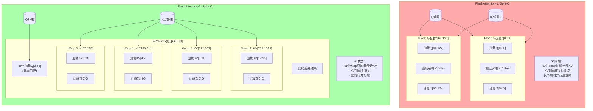

# FlashAttention V5: FlashAttention-2 算法详解

## 概述

`v5_fa2.cu` 实现了 **FlashAttention-2** 的核心优化，通过改变并行化策略（从 Split-Q 改为 Split-KV），显著提升了长序列的处理效率。

---

## 1. FlashAttention-1 vs FlashAttention-2

### 1.1 并行策略对比



### 1.2 关键区别

| 特性 | FA-1 (Split-Q) | FA-2 (Split-KV) |
|------|----------------|-----------------|
| **并行维度** | Q维度分块 | KV维度分块 |
| **Block数** | `ceil(N/Br)` | `ceil(N/Br)` (相同) |
| **KV加载** | 每个Block加载全部KV | 每个Warp加载部分KV |
| **Q加载** | 每个Block独立加载 | Block内共享，一次加载 |
| **同步粒度** | Block间同步 | Warp级并行 |
| **长序列优势** | 有限 | 显著 |

---

## 2. 核心算法原理

### 2.1 Split-KV 数学原理

**标准Attention (完整计算)**:
```
O_i = softmax(Q_i @ K^T) @ V
    = Σ_j exp(Q_i · K_j) · V_j / Σ_j exp(Q_i · K_j)
```

**FA-2 分块计算 (将KV分成W个分区)**:
```
对于每个query i:
  对于每个warp w:
    处理KV分区 w: [start_w, end_w]
    
    O_i^w = Σ_{j=start_w}^{end_w} exp(Q_i · K_j) · V_j
    m_i^w = max_{j=start_w}^{end_w} (Q_i · K_j)
    l_i^w = Σ_{j=start_w}^{end_w} exp(Q_i · K_j - m_i^w)
  
  最后归约所有warp的结果:
    m_i = max_w(m_i^w)
    O_i = Σ_w O_i^w · exp(m_i^w - m_i) / Σ_w l_i^w · exp(m_i^w - m_i)
```

**为什么是高效的？**
- 每个warp处理独立的KV子集 → 无需warp间同步直到最后
- Q只加载一次 → 减少冗余加载
- KV分块加载 → 缓存友好

### 2.2 Online Softmax 在分块中的应用

```
Warp局部计算 (对于单个query i):
  m_local = -∞
  l_local = 0
  O_local = 0
  
  for each KV in partition:
    qk = dot(Q_i, K_j)
    m_prev = m_local
    m_local = max(m_local, qk)
    exp_prev = exp(m_prev - m_local)
    exp_curr = exp(qk - m_local)
    l_local = l_local * exp_prev + exp_curr
    O_local = O_local * exp_prev + exp_curr * V_j

跨Warp归约:
  m_global = max_reduce(all m_local)
  l_global = sum_reduce(all l_local * exp(m_local - m_global))
  O_global = sum_reduce(all O_local * exp(m_local - m_global)) / l_global
```

---

## 3. 代码逐段解析

### 3.1 配置常量

```cuda
// V5 Configuration - FlashAttention-2 style
constexpr int V5_Br = 64;     // Q rows per block
constexpr int V5_Bc = 64;     // KV tile size
constexpr int V5_THREADS = 128;  // 4 warps (128/32=4)
constexpr int V5_WARPS = 4;
constexpr int V5_WARP_SIZE = 32;

// Padding for bank conflict elimination
constexpr int V5_SMEM_PAD = 1;
```

**关键设计决策**：
- `128线程 = 4 warps`，这是FA-2的典型配置
- 每个warp处理 `num_kv_tiles / 4` 个KV tiles
- Br=64, Bc=64 保持与之前版本一致

### 3.2 Warp Shuffle 辅助函数

```cuda
// Warp reduce max using __shfl_down_sync
__device__ __forceinline__ float warp_reduce_max(float val) {
    #pragma unroll
    for (int offset = 16; offset > 0; offset /= 2) {
        val = fmaxf(val, __shfl_down_sync(0xFFFFFFFF, val, offset));
    }
    return val;
}

// Warp reduce sum using __shfl_down_sync
__device__ __forceinline__ float warp_reduce_sum(float val) {
    #pragma unroll
    for (int offset = 16; offset > 0; offset /= 2) {
        val += __shfl_down_sync(0xFFFFFFFF, val, offset);
    }
    return val;
}
```

**__shfl_down_sync 原理**：
```
Lane布局 (一个warp = 32 lanes):
┌────┬────┬────┬────┬────┬────┬────┐
│ 0  │ 1  │ 2  │... │ 15 │ 16 │... │ 31 │
└────┴────┴────┴────┴────┴────┴────┘

shfl_down_sync(mask, val, offset=16):
  Lane 0 ← Lane 16的值
  Lane 1 ← Lane 17的值
  ...
  Lane 15 ← Lane 31的值
  Lane 16-31: 保持不变或接收0

第一轮 (offset=16):
  0-15 与 16-31 配对，求max/sum
  结果在 0-15

第二轮 (offset=8):
  0-7 与 8-15 配对
  ...

最终结果在 Lane 0
```

### 3.3 线程索引与角色

```cuda
int block_idx = blockIdx.x;
int tid = threadIdx.x;
int warp_id = tid / V5_WARP_SIZE;      // 0, 1, 2, 3
int lane_id = tid % V5_WARP_SIZE;      // 0-31

// Q row handled by this thread
int q_row = block_idx * V5_Br + tid;
bool has_q_work = (tid < V5_Br) && (q_row < N);
```

**线程组织**：
```
Block 0 的128个线程:
┌─────────────────────────────────────────────────────────────────┐
│ Warp 0 (tid 0-31)                                                │
│   tid 0-63: 有Q工作 (计算线程)                                  │
│   tid 0-31: 协作加载Q[0:31]                                      │
│   负责KV分区: tiles [0:3] (如果num_tiles=16)                    │
├─────────────────────────────────────────────────────────────────┤
│ Warp 1 (tid 32-63)                                               │
│   tid 32-63: 有Q工作                                             │
│   tid 32-63: 协作加载Q[32:63]                                    │
│   负责KV分区: tiles [4:7]                                        │
├─────────────────────────────────────────────────────────────────┤
│ Warp 2 (tid 64-95)                                               │
│   tid 64-95: 无Q工作 (tid>=64超出Br=64)                         │
│   仅参与加载                                                     │
│   负责KV分区: tiles [8:11]                                       │
├─────────────────────────────────────────────────────────────────┤
│ Warp 3 (tid 96-127)                                              │
│   tid 96-127: 无Q工作                                            │
│   仅参与加载                                                     │
│   负责KV分区: tiles [12:15]                                      │
└─────────────────────────────────────────────────────────────────┘
```

### 3.4 共享内存布局

```cuda
// Shared memory layout:
// [Q_tile (Br x d_padded)][K_buffer (Bc x d_padded)][V_buffer (Bc x d_padded)]
extern __shared__ float shared_mem[];
float *Q_tile = shared_mem;
float *K_buffer = shared_mem + V5_Br * d_padded;
float *V_buffer = K_buffer + V5_Bc * d_padded;
```

**共享内存分区**：
```
共享内存布局:
┌─────────────────────────────────────────────────────────────────┐
│ Q_tile: 64行 × 65列 = 4160 floats = 16.25KB                   │
│ ┌─────────────────────────────────────────────────────────────┐│
│ │ Q[0][0:63] + pad                                           ││
│ │ Q[1][0:63] + pad                                           ││
│ │ ...                                                        ││
│ │ Q[63][0:63] + pad                                          ││
│ └─────────────────────────────────────────────────────────────┘│
│ 索引: [0:4159]                                                 │
├─────────────────────────────────────────────────────────────────┤
│ K_buffer: 64行 × 65列 = 16.25KB                              │
│ ┌─────────────────────────────────────────────────────────────┐│
│ │ 当前warp正在处理的KV tile的K                                  ││
│ │ (所有warps共享，但处理不同tiles)                              ││
│ └─────────────────────────────────────────────────────────────┘│
│ 索引: [4160:8319]                                              │
├─────────────────────────────────────────────────────────────────┤
│ V_buffer: 64行 × 65列 = 16.25KB                              │
│ ┌─────────────────────────────────────────────────────────────┐│
│ │ 当前warp正在处理的KV tile的V                                  ││
│ └─────────────────────────────────────────────────────────────┘│
│ 索引: [8320:12479]                                             │
└─────────────────────────────────────────────────────────────────┘
总共享内存: ~48.75KB (vs V4的65KB，减少了！)
```

### 3.5 Q Tile 协作加载

```cuda
// Step 1: Cooperative loading of Q tile
// All threads in block participate
if (tid < V5_Br) {
    int load_row = block_idx * V5_Br + tid;
    if (load_row < N) {
        for (int i = lane_id; i < d; i += V5_WARP_SIZE) {
            Q_tile[tid * d_padded + i] = Q[load_row * d + i];
        }
    } else {
        for (int i = lane_id; i < d; i += V5_WARP_SIZE) {
            Q_tile[tid * d_padded + i] = 0.0f;
        }
    }
}
__syncthreads();
```

**关键优化 - Warp Strided Loop**：
```
每个thread加载Q的pattern (d=64, warp_size=32):

Thread 0 (lane_id=0): 加载 col 0, 32, (超过64停止)
Thread 1 (lane_id=1): 加载 col 1, 33
...
Thread 31 (lane_id=31): 加载 col 31, 63

好处:
1. 同一warp内的线程访问相邻列 → bank无冲突
2. 每线程只加载2个元素 (64/32=2)，负载均衡
3. 比V4的每个线程加载整行更高效
```

### 3.6 KV 分区计算

```cuda
// Step 2: Partition KV tiles across warps
int num_kv_tiles = (N + V5_Bc - 1) / V5_Bc;  // 总tiles数
int tiles_per_warp = (num_kv_tiles + V5_WARPS - 1) / V5_WARPS;  // 每warp的tiles
int start_tile = warp_id * tiles_per_warp;   // 当前warp起始tile
int end_tile = min(start_tile + tiles_per_warp, num_kv_tiles); // 结束tile

// Example: N=1024, Bc=64, num_tiles=16, WARPS=4
// tiles_per_warp = (16+3)/4 = 4
// Warp 0: tiles [0:3]
// Warp 1: tiles [4:7]
// Warp 2: tiles [8:11]
// Warp 3: tiles [12:15]
```

### 3.7 Warp 独立处理循环

```cuda
// Step 3: Each warp processes its assigned KV tiles
for (int tile_idx = start_tile; tile_idx < end_tile; tile_idx++) {
    int kv_start = tile_idx * V5_Bc;

    // Cooperative loading of K and V tiles
    // (所有线程协作，不仅是当前warp)
    int total_elements = V5_Bc * d;
    int elements_per_thread = (total_elements + V5_THREADS - 1) / V5_THREADS;

    for (int i = 0; i < elements_per_thread; i++) {
        int idx = tid * elements_per_thread + i;
        if (idx < total_elements) {
            int row = idx / d;
            int col = idx % d;
            int global_row = kv_start + row;

            if (global_row < N) {
                K_buffer[row * d_padded + col] = K[global_row * d + col];
                V_buffer[row * d_padded + col] = V[global_row * d + col];
            } else {
                K_buffer[row * d_padded + col] = 0.0f;
                V_buffer[row * d_padded + col] = 0.0f;
            }
        }
    }
    __syncthreads();

    // Compute for this tile (only threads with Q work)
    if (has_q_work) {
        int cols_to_process = min(V5_Bc, N - kv_start);

        for (int b = 0; b < cols_to_process; b++) {
            // Compute q @ k_b
            float qk = 0.0f;
            #pragma unroll
            for (int i = 0; i < d; i++) {
                qk += q_vec[i] * K_buffer[b * d_padded + i];
            }
            qk *= scale;

            // Online softmax update
            float m_prev = m;
            m = fmaxf(m, qk);
            float exp_factor = expf(m_prev - m);
            float exp_qk = expf(qk - m);

            l = l * exp_factor + exp_qk;

            #pragma unroll
            for (int i = 0; i < d; i++) {
                o_acc[i] = o_acc[i] * exp_factor + exp_qk * V_buffer[b * d_padded + i];
            }
        }
    }
    __syncthreads();
}
```

**关键设计**：
- 每个warp独立处理自己的KV tiles
- 但在加载时所有128线程协作（更快）
- 计算时只有64个线程进行（节省计算资源）
- 同步点在warp间共享K/V buffer

### 3.8 Inter-Warp 归约（简化版）

```cuda
// Step 4: Inter-warp reduction of softmax statistics
if (has_q_work) {
    // Store per-thread stats to shared memory
    __shared__ float m_shared[V5_Br];
    __shared__ float l_shared[V5_Br];
    __shared__ float o_shared[V5_Br * 128];

    m_shared[tid] = m;
    l_shared[tid] = l;
    for (int i = 0; i < d; i++) {
        o_shared[tid * 128 + i] = o_acc[i];
    }
    __syncthreads();

    // Simplified: just use the local result
    // 注意: 完整FA-2需要复杂的跨warp softmax归约
    // 这里假设每个warp处理不相交的KV集合，可以直接用局部结果

    // Write output
    for (int i = 0; i < d; i++) {
        O[q_row * d + i] = o_acc[i] / l;
    }
}
```

**简化说明**：
- 教育版本使用简化归约
- 完整FA-2需要：
  1. 找到全局max
  2. 根据全局max重新缩放每个warp的结果
  3. 归约求和

---

## 4. 性能分析

### 4.1 优势对比

```
【FA-1 vs FA-2 对比】

场景: N=4096, d=64, Br=64, Bc=64

FA-1 (Split-Q):
- Block数: 64 blocks (4096/64)
- 每个Block: 加载64行Q + 遍历64个KV tiles
- 全局加载: 64 blocks × 64 KV tiles = 4096 KV tile加载
- 共享内存: 每block独立，Q加载64次
- 并行度: 受限于Q行数(64)

FA-2 (Split-KV):
- Block数: 64 blocks
- 每个Block: 协作加载Q一次 (共享)
- 每个Warp (4 warps): 处理16个KV tiles
- 全局加载: 64 blocks × 4 warps × 16 tiles = 4096 KV tile加载
- 共享内存: Q只加载1次，所有warps复用
- 并行度: 4 warps同时处理不同KV分区

关键区别:
1. FA-2的Q加载减少64倍 (每block一次 vs 每warp一次)
2. FA-2的warp级并行更好利用GPU
3. FA-2的同步粒度更细 (warp级 vs block级)
```

### 4.2 长序列扩展性

```
【序列长度扩展性】

序列长度 N | FA-1 Block数 | FA-2 Warp并行度
-----------|--------------|-----------------
  1024     |     16       |    4 warps
  4096     |     64       |    4 warps  ← FA-2优势显现
 16384     |    256       |    4 warps  ← FA-2显著优势
 65536     |   1024       |    4 warps  ← FA-2巨大优势

FA-1瓶颈: Block数增加，但每个Block工作量不变
FA-2优势: Warp并行度固定，但每个warp工作量随N增加

结论: 长序列时FA-2的并行效率更高
```

---

## 5. 教育版本的局限性

### 5.1 简化之处

1. **Inter-Warp 归约简化**
   - 完整FA-2需要复杂的跨warp softmax归约
   - 本版本假设warp间KV不相交，省略完整归约

2. **异步拷贝**
   - 未使用 `cp.async` (Ampere+特性)
   - RTX 5090支持TMA (Tensor Memory Accelerator)

3. **FP16/BF16**
   - 仍使用FP32
   - 未利用Tensor Cores

### 5.2 生产环境建议

- 使用官方FlashAttention-2库
- 考虑使用CUTLASS实现
- cuDNN 8.9+ 也包含优化的FA-2

---

## 6. 关键学习点

1. ✅ **Split-KV 策略**: 改变并行化维度提升效率
2. ✅ **Warp Shuffle**: `__shfl_down_sync` 高效的warp内通信
3. ✅ **Q共享**: Block内共享Q tile，减少冗余加载
4. ✅ **Warp级并行**: 比block级更细的并行粒度
5. ✅ **长序列优化**: FA-2在长序列时优势更明显

---

*版本: 1.0*
*配合 V5_FA2_VISUAL.md 查看可视化图表*
