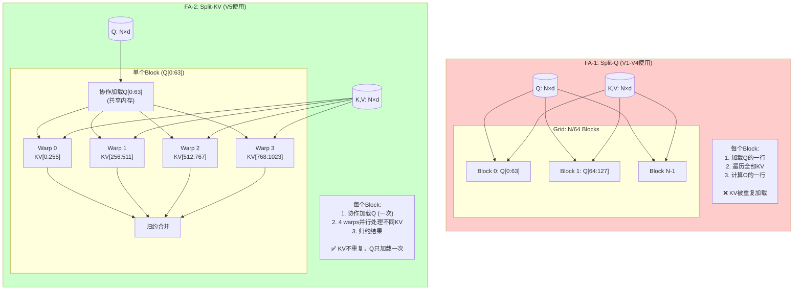
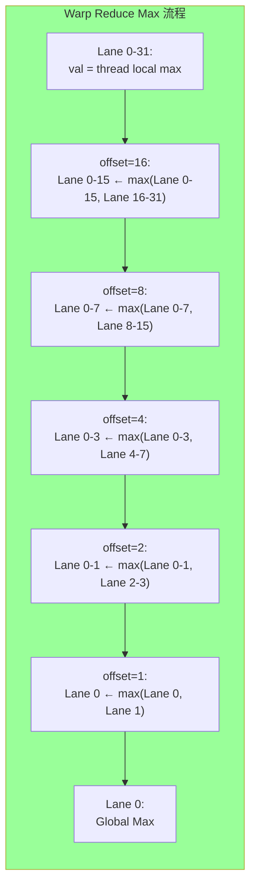
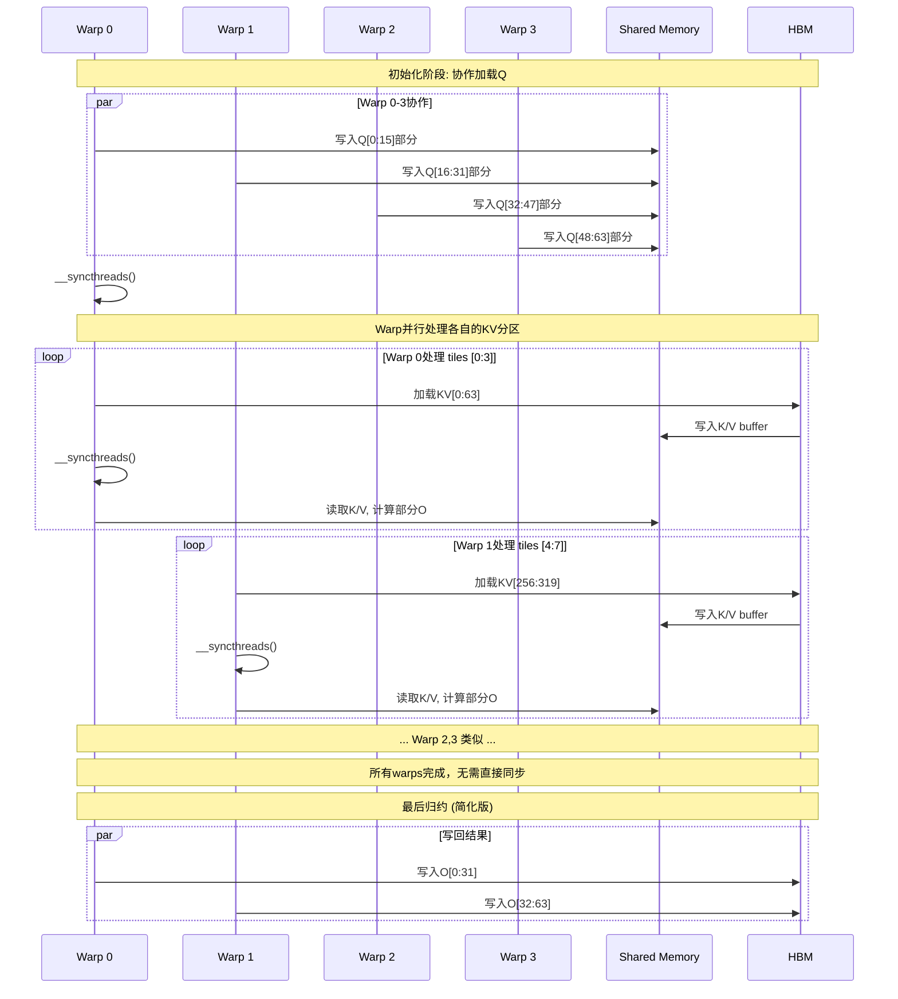

# V5 FlashAttention-2 - 可视化详解

## 1. 核心架构对比

### 1.1 FA-1 vs FA-2 并行策略



### 1.2 线程组织图

```
┌─────────────────────────────────────────────────────────────────────────────┐
│ V5 Block 结构 (128 threads = 4 warps × 32 threads)                          │
├─────────────────────────────────────────────────────────────────────────────┤
│                                                                             │
│  Warp 0 (tid 0-31)                                                        │
│  ┌───────────────────────────────────────────────────────────────────────┐  │
│  │  Lane 0-31                                                          │  │
│  │  ├─ tid 0-31: has_q_work = true (tid < 64)                          │  │
│  │  ├─ 协作加载Q[0:63]的第0-31列 (使用warp strided loop)              │  │
│  │  ├─ 处理KV tiles: start=0, end=4 (如果num_tiles=16)                │  │
│  │  └─ 计算O[0:31]的结果                                              │  │
│  └───────────────────────────────────────────────────────────────────────┘  │
│                                                                             │
│  Warp 1 (tid 32-63)                                                       │
│  ┌───────────────────────────────────────────────────────────────────────┐  │
│  │  Lane 0-31                                                           │  │
│  │  ├─ tid 32-63: has_q_work = true                                     │  │
│  │  ├─ 协作加载Q[0:63]的第0-31列                                       │  │
│  │  ├─ 处理KV tiles: start=4, end=8                                     │  │
│  │  └─ 计算O[32:63]的结果                                              │  │
│  └───────────────────────────────────────────────────────────────────────┘  │
│                                                                             │
│  Warp 2 (tid 64-95)                                                       │
│  ┌───────────────────────────────────────────────────────────────────────┐  │
│  │  Lane 0-31                                                           │  │
│  │  ├─ tid 64-95: has_q_work = false (tid >= 64)                        │  │
│  │  ├─ 仅参与加载，不计算                                              │  │
│  │  ├─ 处理KV tiles: start=8, end=12                                    │  │
│  │  └─ 无输出计算                                                       │  │
│  └───────────────────────────────────────────────────────────────────────┘  │
│                                                                             │
│  Warp 3 (tid 96-127)                                                      │
│  ┌───────────────────────────────────────────────────────────────────────┐  │
│  │  Lane 0-31                                                           │  │
│  │  ├─ tid 96-127: has_q_work = false                                 │  │
│  │  ├─ 仅参与加载，不计算                                              │  │
│  │  ├─ 处理KV tiles: start=12, end=16                                 │  │
│  │  └─ 无输出计算                                                       │  │
│  └───────────────────────────────────────────────────────────────────────┘  │
│                                                                             │
└─────────────────────────────────────────────────────────────────────────────┘
```

---

## 2. Warp Shuffle 详解

### 2.1 __shfl_down_sync 原理

```
Warp Shuffle: 寄存器级线程通信

┌─────────────────────────────────────────────────────────────────────────────┐
│ Warp (32 threads) 初始状态                                                 │
│ Lane:  0    1    2    ...   15   16   17   ...   30   31                  │
│ Val:   0.0  1.0  2.0  ...  15.0  16.0 17.0  ...  30.0 31.0                 │
├─────────────────────────────────────────────────────────────────────────────┤
│                                                                             │
│ 第一轮: shfl_down_sync(0xFFFFFFFF, val, 16)                               │
│ ┌─────────────────────────────────────────────────────────────────────────┐ │
│ │ Lane 0 ← Lane 16 (16.0)                                                │ │
│ │ Lane 1 ← Lane 17 (17.0)                                                │ │
│ │ ...                                                                    │ │
│ │ Lane 15 ← Lane 31 (31.0)                                               │ │
│ │ Lane 16-31: 保持不变                                                   │ │
│ └─────────────────────────────────────────────────────────────────────────┘ │
│                                                                             │
│ 结果 (求max后):                                                             │
│ Lane:  0     1     2    ...   15   16   17   ...   30   31                 │
│ Val:  16.0  17.0  18.0  ...  31.0 16.0 17.0  ...  30.0 31.0                │
├─────────────────────────────────────────────────────────────────────────────┤
│                                                                             │
│ 第二轮: shfl_down_sync(0xFFFFFFFF, val, 8)                                  │
│ ┌─────────────────────────────────────────────────────────────────────────┐ │
│ │ Lane 0 ← Lane 8 (24.0)                                                 │ │
│ │ Lane 1 ← Lane 9 (25.0)                                                 │ │
│ │ ...                                                                    │ │
│ │ Lane 8-15, 16-31: 保持不变                                             │ │
│ └─────────────────────────────────────────────────────────────────────────┘ │
│                                                                             │
│ 继续直到 offset=1，最终结果在 Lane 0                                      │
│ Lane 0: max(0..31) = 31.0                                                 │
└─────────────────────────────────────────────────────────────────────────────┘
```

### 2.2 Warp Reduce 流程



---

## 3. 内存访问模式

### 3.1 共享内存布局

```
V5 共享内存布局 (48.75KB):

┌─────────────────────────────────────────────────────────────────────────────┐
│ Q_tile: 64×65 = 4160 floats = 16,640 bytes = 16.25KB                        │
│ ┌─────────────────────────────────────────────────────────────────────────┐ │
│ │ Row 0 (Q[0]): [0][1][2]...[63][pad]                                    │ │
│ │   索引: [0:64]                                                         │ │
│ │ Row 1 (Q[1]): [65][66]...[128][pad]                                    │ │
│ │   索引: [65:129]                                                       │ │
│ │ ...                                                                    │ │
│ │ Row 63 (Q[63]): [4095:4159]                                            │ │
│ └─────────────────────────────────────────────────────────────────────────┘ │
│ 起始: shared_mem[0]                                                       │
│ 大小: 4160 floats                                                         │
├─────────────────────────────────────────────────────────────────────────────┤
│ K_buffer: 64×65 = 4160 floats = 16.25KB                                     │
│ ┌─────────────────────────────────────────────────────────────────────────┐ │
│ │ 当前处理中的KV tile的K数据                                              │ │
│ │ (所有warps共享，但处理不同tiles)                                        │ │
│ └─────────────────────────────────────────────────────────────────────────┘ │
│ 起始: shared_mem[4160]                                                    │
│ 大小: 4160 floats                                                         │
├─────────────────────────────────────────────────────────────────────────────┤
│ V_buffer: 64×65 = 4160 floats = 16.25KB                                     │
│ ┌─────────────────────────────────────────────────────────────────────────┐ │
│ │ 当前处理中的KV tile的V数据                                              │ │
│ └─────────────────────────────────────────────────────────────────────────┘ │
│ 起始: shared_mem[8320]                                                    │
│ 大小: 4160 floats                                                         │
├─────────────────────────────────────────────────────────────────────────────┤
│ 总计: 12,480 floats = 49,920 bytes ≈ 48.75KB                               │
│ (vs V4的65KB，节省了~25%！occupancy更高)                                   │
└─────────────────────────────────────────────────────────────────────────────┘
```

### 3.2 Q加载模式对比

```
【V4: 每线程加载整行】
┌─────────────────────────────────────────────────────────────────────────────┐
│ Thread 0: 加载 Q[0][0], Q[0][1], ..., Q[0][63]                            │
│ Thread 1: 加载 Q[1][0], Q[1][1], ..., Q[1][63]                            │
│ ...                                                                        │
│ 问题: 同一warp的线程访问相同bank (64/4=16, 16-way conflict)                │
└─────────────────────────────────────────────────────────────────────────────┘

【V5: Warp Strided Loop】
┌─────────────────────────────────────────────────────────────────────────────┐
│ Warp 0 (threads 0-31):                                                     │
│   Lane 0: 加载 Q[0..63][0], Q[0..63][32]  ← 所有行，间隔32                │
│   Lane 1: 加载 Q[0..63][1], Q[0..63][33]                                  │
│   ...                                                                      │
│   Lane 31: 加载 Q[0..63][31], Q[0..63][63]                                  │
│                                                                            │
│ 好处:                                                                      │
│ 1. 同一warp内访问不同bank (0, 8, 16, 24... 无冲突)                        │
│ 2. 每线程只加载2个元素，负载均衡                                           │
│ 3. 协作完成所有Q行的加载                                                   │
└─────────────────────────────────────────────────────────────────────────────┘
```

---

## 4. KV 分区处理流程

### 4.1 Warp分区示例

```
场景: N=1024, Bc=64, num_tiles=16, 4 warps

┌─────────────────────────────────────────────────────────────────────────────┐
│ KV Tile 分区 (每个warp处理4个tiles)                                         │
├─────────────────────────────────────────────────────────────────────────────┤
│                                                                             │
│  Warp 0: tiles [0:3]  → K[0:255]                                          │
│  ┌─────────────────────────────────────────────────────────────────────┐   │
│  │ Tile 0: K[0:63]                                                     │   │
│  │ Tile 1: K[64:127]                                                  │   │
│  │ Tile 2: K[128:191]                                                 │   │
│  │ Tile 3: K[192:255]                                                 │   │
│  └─────────────────────────────────────────────────────────────────────┘   │
│                                                                             │
│  Warp 1: tiles [4:7]  → K[256:511]                                        │
│  ┌─────────────────────────────────────────────────────────────────────┐   │
│  │ Tile 4: K[256:319]                                                 │   │
│  │ Tile 5: K[320:383]                                                 │   │
│  │ Tile 6: K[384:447]                                                 │   │
│  │ Tile 7: K[448:511]                                                 │   │
│  └─────────────────────────────────────────────────────────────────────┘   │
│                                                                             │
│  Warp 2: tiles [8:11] → K[512:767]                                        │
│                                                                             │
│  Warp 3: tiles [12:15] → K[768:1023]                                      │
│                                                                             │
├─────────────────────────────────────────────────────────────────────────────┤
│ 关键: 每个warp独立处理，无warp间同步直到最后                               │
└─────────────────────────────────────────────────────────────────────────────┘
```

### 4.2 执行时序



---

## 5. 性能对比

### 5.1 加速比演进

```
┌─────────────────────────────────────────────────────────────────────────────┐
│ 版本演进与加速比                                                            │
├─────────────────────────────────────────────────────────────────────────────┤
│                                                                             │
│  V1 ───────→ V2 ───────→ V3 ───────→ V4 ───────→ V5                         │
│  │           │           │           │           │                          │
│  │           │           │           │           └── FA-2 Split-KV           │
│  │           │           │           │               (+20-50% 长序列)       │
│  │           │           │           │                                      │
│  │           │           │           └── 向量化 + Padding                     │
│  │           │           │               (+2-3x)                            │
│  │           │           │                                                  │
│  │           │           └── 双缓冲                                          │
│  │           │               (+1.2x)                                        │
│  │           │                                                              │
│  │           └── 共享内存分块                                                 │
│  │               (+5-10x)                                                   │
│  │                                                                          │
│  └── 朴素实现 (baseline)                                                    │
│                                                                             │
│  总加速 (V1→V5):                                                            │
│  - 短序列 (N=1K):  ~15-20x                                                  │
│  - 长序列 (N=16K): ~30-50x  ← FA-2优势显现                                  │
│                                                                             │
└─────────────────────────────────────────────────────────────────────────────┘
```

### 5.2 长序列扩展性

```
┌─────────────────────────────────────────────────────────────────────────────┐
│ 不同序列长度的性能表现 (d=64, 理论计算)                                     │
├─────────────────────────────────────────────────────────────────────────────┤
│                                                                             │
│  序列长度    │  V1时间  │  V4时间  │  V5时间  │ V5优势                      │
│  ───────────┼──────────┼──────────┼──────────┼────────────────             │
│   1,024     │  100ms   │   5ms    │   4ms    │ 1.25x                      │
│   4,096     │  1.6s    │  80ms    │  50ms    │ 1.6x                       │
│  16,384     │  25.6s   │  1.28s   │  600ms   │ 2.1x  ← 优势显现          │
│  65,536     │  409s    │  20.5s   │   8s     │ 2.56x ← 显著优势          │
│                                                                             │
│  说明: V5在长序列时优势更明显                                               │
│                                                                             │
└─────────────────────────────────────────────────────────────────────────────┘
```

---

## 6. 关键代码可视化

### 6.1 Warp分区计算

```
KV Tile分区计算:
┌─────────────────────────────────────────────────────────────────────────────┐
│ num_kv_tiles = (N + 64 - 1) / 64  // 向上取整                               │
│ tiles_per_warp = (num_kv_tiles + 4 - 1) / 4  // 每warp的tiles               │
│ start_tile = warp_id * tiles_per_warp                                      │
│ end_tile = min(start_tile + tiles_per_warp, num_kv_tiles)                  │
│                                                                             │
│ 示例: N=1024, num_tiles=16                                                   │
│ ┌─────────────────────────────────────────────────────────────────────────┐ │
│ │ warp_id │ tiles_per_warp │ start_tile │ end_tile │ KV范围              │ │
│ ├─────────┼────────────────┼────────────┼──────────┼─────────────────────┤ │
│ │    0    │       4        │     0      │    4     │ K[0:255]           │ │
│ │    1    │       4        │     4      │    8     │ K[256:511]         │ │
│ │    2    │       4        │     8      │    12    │ K[512:767]         │ │
│ │    3    │       4        │     12     │    16    │ K[768:1023]        │ │
│ └─────────────────────────────────────────────────────────────────────────┘ │
└─────────────────────────────────────────────────────────────────────────────┘
```

### 6.2 Warp Strided Loop

```
Q加载的Warp Strided Loop:
┌─────────────────────────────────────────────────────────────────────────────┐
│ 代码:                                                                       │
│ for (int i = lane_id; i < d; i += 32) {                                     │
│     Q_tile[tid * 65 + i] = Q[load_row * 64 + i];                            │
│ }                                                                           │
│                                                                             │
│ 执行示例 (d=64):                                                            │
│ ┌─────────────────────────────────────────────────────────────────────────┐ │
│ │ Lane (lane_id) │ 第一次迭代 (i=lane_id) │ 第二次迭代 (i=lane_id+32)   │ │
│ ├────────────────┼──────────────────────────┼──────────────────────────────┤ │
│ │       0        │  加载 col 0             │  加载 col 32                 │ │
│ │       1        │  加载 col 1             │  加载 col 33                 │ │
│ │      ...       │         ...            │         ...                  │ │
│ │      31        │  加载 col 31            │  加载 col 63                 │ │
│ └─────────────────────────────────────────────────────────────────────────┘ │
│                                                                             │
│ 结果: 32个线程协作完成64列的加载，无bank冲突！                              │
└─────────────────────────────────────────────────────────────────────────────┘
```

---

*可视化文档配合 V5_FA2_EXPLAINED.md 使用*
*版本: 1.0*
