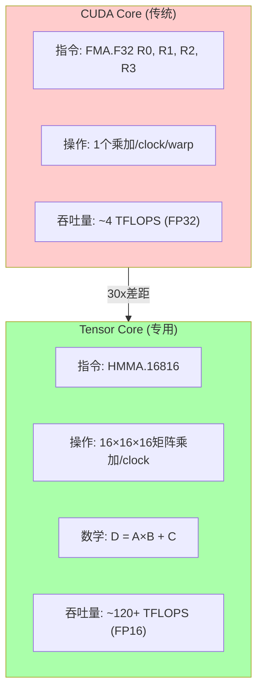
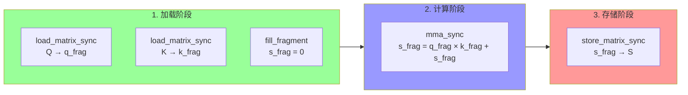
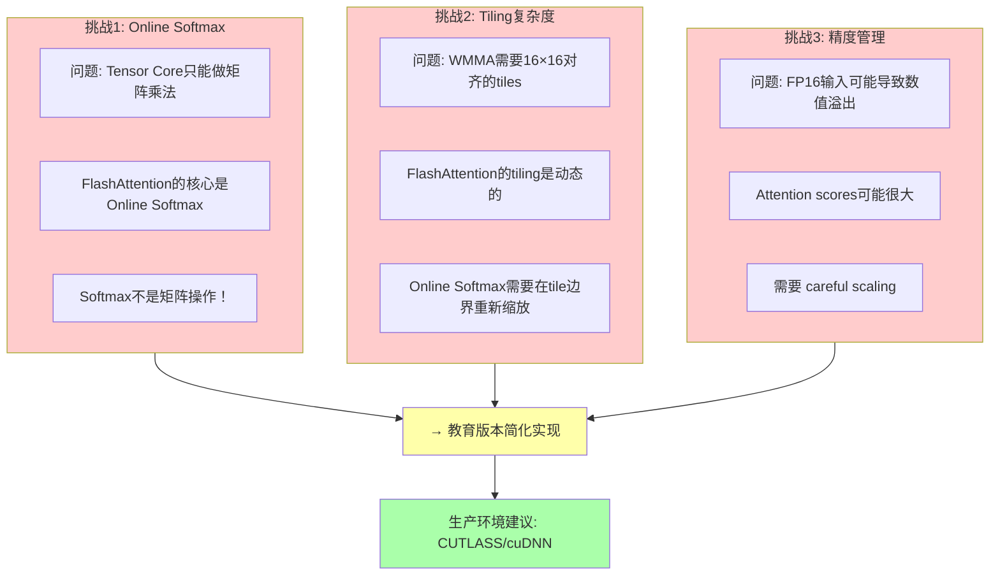
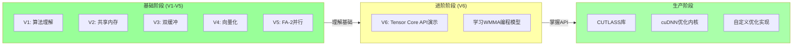

# FlashAttention V6: Tensor Core (WMMA) 详解

## 概述

`v6_tensor_core.cu` 是 **教育演示版本**，展示如何使用 NVIDIA Tensor Cores 和 WMMA API 进行矩阵运算。与 V1-V5 不同，这是一个**简化实现**，主要用于演示 Tensor Core 编程模型。

**⚠️ 重要提示**：完整生产级的 Tensor Core FlashAttention 需要极其复杂的tiling策略，建议使用 **CUTLASS** 或 **cuDNN** 的官方实现。

---

## 1. Tensor Core 基础

### 1.1 什么是 Tensor Core？



### 1.2 Tensor Core 执行模式

```
┌─────────────────────────────────────────────────────────────────────────────┐
│ Tensor Core 矩阵乘法 (D = A × B + C)                                        │
├─────────────────────────────────────────────────────────────────────────────┤
│                                                                              │
│   输入矩阵:                    输出矩阵:                                    │
│                                                                              │
│   A (M×K)     B (K×N)         C/D (M×N)                                  │
│   ┌─────┐    ┌─────┐          ┌─────┐                                     │
│   │     │    │     │          │     │                                     │
│   │ 16× │ ×  │ 16× │  =       │ 16× │                                     │
│   │ 16  │    │ 16  │          │ 16  │                                     │
│   └─────┘    └─────┘          └─────┘                                     │
│                                                                              │
│   每个 Tensor Core 操作同时处理 16×16×16 = 4096 个乘加                    │
│   对比 CUDA Core: 1个乘加需要1条指令                                       │
│   效率提升: 4096×                                                          │
│                                                                              │
└─────────────────────────────────────────────────────────────────────────────┘
```

### 1.3 精度支持 (RTX 4090/5090)

| 精度格式 | 位宽 | Tensor Core支持 | 吞吐量 |
|---------|------|----------------|--------|
| FP32 | 32位 | 有限 | 基准 |
| FP16 | 16位 | ✅ 完整 | **2×** |
| BF16 | 16位 | ✅ 完整 | **2×** |
| FP8 | 8位 | ✅ Blackwell+ | **4×** |
| INT8 | 8位 | ✅ | **4×** |

---

## 2. WMMA API 详解

### 2.1 WMMA 基础概念

```cuda
#include <mma.h>  // WMMA头文件
using namespace nvcuda::wmma;  // 命名空间

// 定义 Fragment (矩阵片段)
fragment<matrix_a, 16, 16, 16, __half, row_major> q_frag;
fragment<matrix_b, 16, 16, 16, __half, col_major> k_frag;
fragment<accumulator, 16, 16, 16, float> s_frag;
```

**Fragment 类型**：
```
┌─────────────────────────────────────────────────────────────────────────────┐
│ WMMA Fragment 类型                                                          │
├─────────────────────────────────────────────────────────────────────────────┤
│                                                                              │
│  matrix_a: 矩阵A的fragment (通常是Q)                                        │
│    - 布局: row_major 或 col_major                                          │
│    - 类型: __half (FP16)                                                    │
│    - 大小: 16×16 或 8×16                                                    │
│                                                                              │
│  matrix_b: 矩阵B的fragment (通常是K)                                        │
│    - 布局: 与A相匹配                                                       │
│    - 类型: __half (FP16)                                                    │
│                                                                              │
│  accumulator: 累加器fragment (结果S)                                        │
│    - 必须是FP32 (数值稳定性)                                                │
│    - 存储中间结果                                                           │
│                                                                              │
└─────────────────────────────────────────────────────────────────────────────┘
```

### 2.2 WMMA 操作流程



### 2.3 核心 API 函数

```cuda
// 1. 加载矩阵到fragment
void load_matrix_sync(fragment<...>& frag,
                     const T* mem,
                     unsigned ldm);
// ldm: leading dimension (行stride)

// 2. 执行矩阵乘加 (核心！)
void mma_sync(fragment<accumulator, ...>& d,
              const fragment<matrix_a, ...>& a,
              const fragment<matrix_b, ...>& b,
              const fragment<accumulator, ...>& c);
// d = a × b + c

// 3. 初始化fragment
void fill_fragment(fragment<...>& frag, T value);
// 通常用于初始化累加器为0

// 4. 存储结果到内存
void store_matrix_sync(T* mem,
                      const fragment<accumulator, ...>& frag,
                      unsigned ldm,
                      layout_t layout);
```

---

## 3. FlashAttention + Tensor Core 的挑战

### 3.1 为什么复杂？



### 3.2 理想的 Tensor Core FA vs 现实

```
【理想中的Tensor Core FlashAttention】

Q (FP16)    K (FP16)     V (FP16)
  │            │            │
  │            │            │
  ▼            ▼            ▼
┌──────┐    ┌──────┐    ┌──────┐
│WMMA  │    │WMMA  │    │WMMA  │
│Load  │    │Load  │    │Load  │
└──┬───┘    └──┬───┘    └──┬───┘
   │             │            │
   │    ┌────────┘            │
   │    │                     │
   ▼    ▼                     ▼
┌──────┐                   ┌──────┐
│MMA   │  S = Q@K^T        │MMA   │
│Q@K^T │──────────────────→│O=S@V │
└──┬───┘                   └──┬───┘
   │                          │
   ▼                          ▼
┌──────┐                   ┌──────┐
│Softmax│                  │Output│
│(FP32) │                  │(FP16)│
└──────┘                   └──────┘


【现实中的复杂度】

1. Q@K^T产生S矩阵，但S太大无法全存
   → 需要分块计算S的片段
   
2. Softmax需要知道所有值才能归一化
   → Online Softmax必须跨tile重新缩放
   
3. S的每个元素需要单独softmax
   → 不是矩阵操作，Tensor Core帮不上忙
   
4. 需要多次加载Q/K/V fragments
   → Memory带宽可能成为瓶颈
   
5. FP16精度问题
   → Attention scores可能溢出
```

---

## 4. 代码逐段解析

### 4.1 配置常量

```cuda
// V6 Configuration
constexpr int V6_Br = 64;
constexpr int V6_Bc = 64;
constexpr int V6_THREADS = 128;

// WMMA configuration - 固定16×16×16
constexpr int WMMA_M = 16;  // Fragment高度
constexpr int WMMA_N = 16;  // Fragment宽度
constexpr int WMMA_K = 16;  // 累加维度

// Padding for bank conflict
constexpr int V6_SMEM_PAD = 1;
```

### 4.2 Fragment 声明

```cuda
// Fragments for WMMA
// Q fragment: A矩阵，row-major布局
fragment<matrix_a, WMMA_M, WMMA_N, WMMA_K, __half, row_major> q_frag;

// K fragment: B矩阵，col-major布局
fragment<matrix_b, WMMA_M, WMMA_N, WMMA_K, __half, col_major> k_frag;

// S fragment: 累加器，FP32布局
fragment<accumulator, WMMA_M, WMMA_N, WMMA_K, float> s_frag;
```

**布局说明**：
```
Row-major (行优先):
  内存: [0][1][2]...[15]
        [16][17]...[31]
        ...
  访问: row * 16 + col

Col-major (列优先):
  内存: [0][16][32]...
        [1][17][33]...
        ...
  访问: col * 16 + row
```

### 4.3 共享内存布局 (FP16)

```cuda
// Shared memory for tiles (FP16)
extern __shared__ float shared_mem[];
__half *Q_tile = reinterpret_cast<__half*>(shared_mem);
__half *K_tile = Q_tile + V6_Br * d_padded;
__half *V_tile = K_tile + V6_Bc * d_padded;
```

**注意**：使用 `__half` (FP16) 而不是 `float`，节省一半共享内存！

### 4.4 Q Tile 协作加载

```cuda
// 协作加载Q tile到共享内存
int q_load_per_thread = (V6_Br * d + V6_THREADS - 1) / V6_THREADS;
// 128线程加载 64×64 = 4096 个__half
// 每个线程加载 4096/128 = 32 个__half

for (int i = 0; i < q_load_per_thread; i++) {
    int idx = tid * q_load_per_thread + i;
    if (idx < V6_Br * d) {
        int row = idx / d;
        int col = idx % d;
        int global_row = q_row_base + row;

        if (global_row < N) {
            // FP16存储
            Q_tile[row * d_padded + col] = Q[global_row * d + col];
        } else {
            Q_tile[row * d_padded + col] = __float2half(0.0f);
        }
    }
}
__syncthreads();
```

### 4.5 WMMA 计算流程 (简化版)

```cuda
// Initialize accumulator to 0
fill_fragment(s_frag, 0.0f);

// 将d维度分成16的倍数
int num_d_tiles = (d + WMMA_K - 1) / WMMA_K;
// d=64 → num_d_tiles = 4

for (int d_tile = 0; d_tile < num_d_tiles; d_tile++) {
    int d_start = d_tile * WMMA_K;  // 0, 16, 32, 48

    // Load K tile into shared memory...
    // (省略，实际应该加载到fragment)
}

// Educational demo: just load Q fragment
if (q_frag_row < V6_Br && tid < 32) {
    load_matrix_sync(q_frag, Q_tile + q_frag_row * d_padded, d_padded);
}
```

**问题**：这里的实现是简化的，完整的实现需要：
1. 加载Q fragment (16×16)
2. 加载K fragment (16×16)
3. 执行mma_sync
4. 累加多个K tiles
5. 处理online softmax

---

## 5. 教育版本 vs 生产版本

### 5.1 教育版本 (V6)

```
目的: 展示WMMA API用法，理解Tensor Core编程模型

实现:
- 简化的fragment加载
- 演示mma_sync API
- 不包含完整Online Softmax
- 不包含完整tiling策略

适合: 学习Tensor Core编程概念
```

### 5.2 生产版本 (CUTLASS/cuDNN)

```
特点:
- 完整的FP16/BF16支持
- 优化的tiling策略
- 完整的Online Softmax
- 支持多种序列长度
- 支持多种head维度

推荐使用:
- CUTLASS FlashAttention
- cuDNN MultiHeadAttention
- FlashAttention-2官方实现
```

### 5.3 复杂度对比

| 组件 | 教育版 (V6) | 生产版 (CUTLASS) |
|------|------------|------------------|
| 代码行数 | ~300 | ~3000+ |
| Tiling策略 | 简化 | 多层复杂tiling |
| Softmax处理 | 部分 | 完整Online Softmax |
| 精度支持 | FP16 | FP16/BF16/FP8 |
| 性能优化 | 基础 | 极致优化 |
| 适用场景 | 学习 | 生产环境 |

---

## 6. RTX 5090 (Blackwell) 特性

### 6.1 新一代 Tensor Core

```
RTX 5090 (Blackwell架构) 新特性:

1. 5th Gen Tensor Cores
   - FP8支持 (E4M3, E5M2)
   - 更高吞吐量

2. TMA (Tensor Memory Accelerator)
   - 异步内存拷贝
   - cp.async的进化版
   - 自动处理tensor layout转换

3. 更大共享内存
   - 228KB per SM (vs 100KB on Ampere)
   - 支持更大tiles

4. 新指令集
   - wgmma (Warp Group MMA)
   - 支持多个warps协作
```

### 6.2 FP8 示例

```cuda
// Blackwell支持FP8 (需要CUDA 12.4+)
#include <cuda_fp8.h>

// FP8 E4M3: 4位指数, 3位尾数
// 范围: ~0.0019 to 448
// 精度: ~0.0625 (比FP16低)

// 使用场景:
// - 训练时使用FP16/BF16
// - 推理时可以使用FP8加速
```

---

## 7. 学习路径总结



---

## 8. 关键要点

1. ✅ **Tensor Core用途**: 专门加速矩阵乘加运算
2. ✅ **WMMA API**: fragment抽象简化编程
3. ✅ **混合精度**: FP16输入 + FP32累加
4. ✅ **FlashAttention挑战**: Online Softmax与Tensor Core不兼容
5. ⚠️ **生产建议**: 使用CUTLASS/cuDNN，不要自己实现
6. ✅ **学习价值**: 理解GPU体系结构和优化方向

---

*版本: 1.0*
*配合 V6_TENSOR_CORE_VISUAL.md 查看可视化图表*
*重要: 这是教育演示版本，生产环境请使用CUTLASS/cuDNN*
