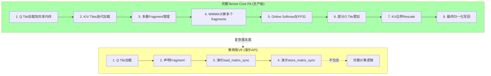
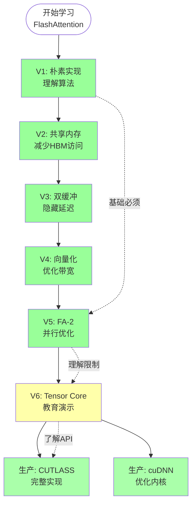

# FlashAttention V6: Tensor Core 算法可视化

## 1. Tensor Core 架构概览

### 1.1 GPU 执行单元对比

```
┌─────────────────────────────────────────────────────────────────────────────┐
│                          GPU 执行单元架构                                    │
├─────────────────────────────────────────────────────────────────────────────┤
│                                                                              │
│  Streaming Multiprocessor (SM)                                             │
│  ┌─────────────────────────────────────────────────────────────────────┐   │
│  │                                                                     │   │
│  │   ┌─────────────┐  ┌─────────────┐  ┌─────────────┐  ┌─────────────┐│   │
│  │   │  CUDA Core  │  │  CUDA Core  │  │  CUDA Core  │  │  CUDA Core  ││   │
│  │   │    Warp 0   │  │    Warp 1   │  │    Warp 2   │  │    Warp 3   ││   │
│  │   │  ┌─┬─┬─┬─┐  │  │  ┌─┬─┬─┬─┐  │  │  ┌─┬─┬─┬─┐  │  │  ┌─┬─┬─┬─┐  ││   │
│  │   │  │T│T│T│T│  │  │  │T│T│T│T│  │  │  │T│T│T│T│  │  │  │T│T│T│T│  ││   │
│  │   │  │0│1│2│3│  │  │  │0│1│2│3│  │  │  │0│1│2│3│  │  │  │0│1│2│3│  ││   │
│  │   │  └─┴─┴─┴─┘  │  │  └─┴─┴─┴─┘  │  │  └─┴─┴─┴─┘  │  │  └─┴─┴─┴─┘  ││   │
│  │   │  ┌─┬─┬─┬─┐  │  │  ┌─┬─┬─┬─┐  │  │  ┌─┬─┬─┬─┐  │  │  ┌─┬─┬─┬─┐  ││   │
│  │   │  │T│T│T│T│  │  │  │T│T│T│T│  │  │  │T│T│T│T│  │  │  │T│T│T│T│  ││   │
│  │   │  │4│5│6│7│  │  │  │4│5│6│7│  │  │  │4│5│6│7│  │  │  │4│5│6│7│  ││   │
│  │   │  └─┴─┴─┴─┘  │  │  └─┴─┴─┴─┘  │  │  └─┴─┴─┴─┘  │  │  └─┴─┴─┴─┘  ││   │
│  │   │  ┌─┬─┬─┬─┐  │  │  ┌─┬─┬─┬─┐  │  │  ┌─┬─┬─┬─┐  │  │  ┌─┬─┬─┬─┐  ││   │
│  │   │  │T│T│T│T│  │  │  │T│T│T│T│  │  │  │T│T│T│T│  │  │  │T│T│T│T│  ││   │
│  │   │  │ │ │ │ │  │  │  │ │ │ │ │  │  │  │ │ │ │ │  │  │  │ │ │ │ │  ││   │
│  │   │  └─┴─┴─┴─┘  │  │  └─┴─┴─┴─┘  │  │  └─┴─┴─┴─┘  │  │  └─┴─┴─┴─┘  ││   │
│  │   │   32 Threads │  │   32 Threads │  │   32 Threads │  │   32 Threads ││   │
│  │   └─────────────┘  └─────────────┘  └─────────────┘  └─────────────┘│   │
│  │        │                 │                 │                 │        │   │
│  │        └─────────────────┴─────────────────┴─────────────────┘        │   │
│  │                            │                                          │   │
│  │                    ┌───────┴───────┐                                 │   │
│  │                    │  Tensor Core   │ ← 每SM有多个Tensor Core         │   │
│  │                    │                │                                 │   │
│  │                    │  16×16×16 MMA  │  4096个乘加/clock              │   │
│  │                    │   per warp     │                                 │   │
│  │                    └────────────────┘                                 │   │
│  │                                                                     │   │
│  └─────────────────────────────────────────────────────────────────────┘   │
│                                                                              │
│  Thread: 执行单条指令                                                       │
│  Warp: 32线程SIMT执行                                                       │
│  CUDA Core: 通用计算单元                                                    │
│  Tensor Core: 专用矩阵运算单元                                              │
│                                                                              │
└─────────────────────────────────────────────────────────────────────────────┘
```

### 1.2 Tensor Core vs CUDA Core 对比

```
┌─────────────────────────────────────────────────────────────────────────────┐
│                        单次运算对比                                         │
├─────────────────────────────────────────────────────────────────────────────┤
│                                                                              │
│  CUDA Core (传统方式)                                                       │
│  ═══════════════════════                                                    │
│                                                                              │
│  每个线程执行:                                                                │
│  ┌────────────────────────────────────────────────────────────────────────┐  │
│  │  指令1: FMA.F32 R0, R1, R2, R3    // R0 = R1 * R2 + R3                 │  │
│  │  时钟: 1 cycle                                                          │  │
│  │  结果: 1 个乘加                                                         │  │
│  └────────────────────────────────────────────────────────────────────────┘  │
│                                                                              │
│  Warp 32线程 (1个SM): 32 个乘加/clock                                       │
│                                                                              │
│  ─────────────────────────────────────────────────────────────────────────  │
│                                                                              │
│  Tensor Core (专用方式)                                                       │
│  ═══════════════════════                                                    │
│                                                                              │
│  Warp 32线程执行 (1条HMMA指令):                                              │
│  ┌────────────────────────────────────────────────────────────────────────┐  │
│  │  指令: HMMA.16816 A, B, C, D                                           │  │
│  │  时钟: 1-4 cycles (取决于代数)                                         │  │
│  │  结果: 16×16×16 = 4096 个乘加                                          │  │
│  └────────────────────────────────────────────────────────────────────────┘  │
│                                                                              │
│  Warp 32线程: 4096 个乘加/cycle                                            │
│                                                                              │
│  加速比: 4096 / 32 = 128×                                                  │
│          (理论值，实际受限于memory bandwidth)                               │
│                                                                              │
└─────────────────────────────────────────────────────────────────────────────┘
```

---

## 2. WMMA 编程模型

### 2.1 Fragment 内存布局

```
┌─────────────────────────────────────────────────────────────────────────────┐
│                     WMMA Fragment 内存布局                                    │
├─────────────────────────────────────────────────────────────────────────────┤
│                                                                              │
│  Fragment A (16×16, row_major):                                             │
│  ┌─────────────────────────────────────────────────────────────────────────┐│
│  │                                                                         ││
│  │  线程0持有: ┌─────┐   线程1持有: ┌─────┐   线程2持有: ┌─────┐           ││
│  │            │A[0] │              │A[1] │              │A[2] │           ││
│  │            │A[4] │              │A[5] │              │A[6] │           ││
│  │            │A[8] │              │A[9] │              │A[10]│           ││
│  │            │A[12]│              │A[13]│              │A[14]│           ││
│  │            └─────┘              └─────┘              └─────┘           ││
│  │  每个线程持有2×2=4个元素                                                ││
│  │                                                                         ││
│  │  布局模式 (由硬件决定，不透明):                                          ││
│  │  ┌───────┬───────┬───────┬───────┐                                     ││
│  │  │T0 T1 │T2 T3 │T4 T5 │T6 T7 │ ...  (每个线程2个连续元素)             ││
│  │  │T8 T9 │...    │       │       │                                     ││
│  │  └───────┴───────┴───────┴───────┘                                     ││
│  │                                                                         ││
│  └─────────────────────────────────────────────────────────────────────────┘│
│                                                                              │
│  Accumulator Fragment (16×16, FP32):                                       │
│  ┌─────────────────────────────────────────────────────────────────────────┐│
│  │  线程0持有: 4个FP32值   (8个寄存器，因为FP32占4字节)                      ││
│  │  线程16持有: 4个FP32值  (Warp的另一半)                                   ││
│  │  共32线程 × 4 = 128个值 = 16×8 或 8×16 (取决于布局)                     ││
│  └─────────────────────────────────────────────────────────────────────────┘│
│                                                                              │
└─────────────────────────────────────────────────────────────────────────────┘
```

### 2.2 WMMA 执行流程

```
┌─────────────────────────────────────────────────────────────────────────────┐
│                     WMMA 完整执行流程                                       │
├─────────────────────────────────────────────────────────────────────────────┤
│                                                                              │
│  Step 1: 加载 Q Fragment (从Global Memory)                                  │
│  ══════════════════════════════════════════                                 │
│                                                                              │
│  Global Memory (row-major)                →     Fragment A                  │
│  ┌─────────────────────────────────┐                                             │
│  │ ┌─────┐ ┌─────┐ ┌─────┐ ┌─────┐ │                                             │
│  │ │Row0 │ │Row1 │ │Row2 │ │Row3 │ │ ← 16 rows                                  │
│  │ └─────┘ └─────┘ └─────┘ └─────┘ │   (64×16 bytes for FP16)                 │
│  └─────────────────────────────────┘                                             │
│          ↓                                                                          │
│  load_matrix_sync(q_frag, Q_ptr, ldm)  // 协作加载                              │
│          ↓                                                                          │
│  ┌─────────────────────────────────┐                                             │
│  │        q_frag (16×16)           │   ← 硬件自动分发到warp线程                 │
│  │  ┌───┬───┬───┬───┬───┐         │                                             │
│  │  │T0 │T0 │T1 │T1 │...│         │   ← 每个线程8字节 (__half × 4)             │
│  │  ├───┼───┼───┼───┼───┤         │                                             │
│  │  │T0 │T0 │T1 │T1 │...│         │                                             │
│  │  └───┴───┴───┴───┴───┘         │                                             │
│  └─────────────────────────────────┘                                             │
│                                                                              │
│  ─────────────────────────────────────────────────────────────────────────  │
│                                                                              │
│  Step 2: 加载 K Fragment                                                      │
│  ═══════════════════════                                                    │
│                                                                              │
│  类似Step 1，但布局是col_major                                               │
│                                                                              │
│  load_matrix_sync(k_frag, K_ptr, ldm, col_major)                              │
│                                                                              │
│  ─────────────────────────────────────────────────────────────────────────  │
│                                                                              │
│  Step 3: 执行 MMA 运算                                                        │
│  ═══════════════════════                                                    │
│                                                                              │
│  ┌────────────────────────────────────────────────────────────────────────┐  │
│  │                                                                       │  │
│  │   q_frag (16×16)    k_frag (16×16)      s_frag (16×16)               │  │
│  │   ┌────────────┐    ┌────────────┐       ┌────────────┐               │  │
│  │   │  Q block   │ ×  │  K block   │  =    │  S block   │               │  │
│  │   │  16×16     │    │  16×16     │       │  16×16     │               │  │
│  │   └────────────┘    └────────────┘       └────────────┘               │  │
│  │        ↓                  ↓                   ↑                         │  │
│  │        └──────────────────┴──────────────────┘                         │  │
│  │                     mma_sync(s_frag, q_frag, k_frag, s_frag)           │  │
│  │                                                                       │  │
│  │   公式: s_frag = q_frag × k_frag + s_frag (累加)                     │  │
│  │                                                                       │  │
│  └────────────────────────────────────────────────────────────────────────┘  │
│                                                                              │
│  ─────────────────────────────────────────────────────────────────────────  │
│                                                                              │
│  Step 4: 存储结果                                                             │
│  ═══════════════════════                                                    │
│                                                                              │
│  store_matrix_sync(S_ptr, s_frag, ldm, mem_row_major)                         │
│                                                                              │
│  ┌─────────────────────────────────┐                                             │
│  │ ┌─────┐ ┌─────┐ ┌─────┐ ┌─────┐ │                                             │
│  │ │Row0 │ │Row1 │ │Row2 │ │Row3 │ │ → Global Memory                            │
│  │ └─────┘ └─────┘ └─────┘ └─────┘ │   (FP32 values)                            │
│  └─────────────────────────────────┘                                             │
│                                                                              │
└─────────────────────────────────────────────────────────────────────────────┘
```

---

## 3. FlashAttention + Tensor Core 的复杂度

### 3.1 理想情况 vs 现实

```
┌─────────────────────────────────────────────────────────────────────────────┐
│                  FlashAttention 使用 Tensor Core                            │
├─────────────────────────────────────────────────────────────────────────────┤
│                                                                              │
│  【理想化视图】 (不现实的假设)                                                │
│  ═════════════════════════════════                                           │
│                                                                              │
│       Q (M×d)        K^T (d×N)         V (N×d)                              │
│         │                │                │                                 │
│         │                │                │                                 │
│         ▼                ▼                ▼                                 │
│    ┌─────────┐     ┌─────────┐       ┌─────────┐                            │
│    │Tensor   │     │Tensor   │       │Tensor   │                            │
│    │Core     │ ×   │Core     │  →    │Core     │                            │
│    └────┬────┘     └────┬────┘       └────┬────┘                            │
│         │                │                │                                 │
│         │                │                │                                 │
│         ▼                ▼                ▼                                 │
│    ┌─────────┐     ┌─────────┐       ┌─────────┐                            │
│    │   S     │ ──→ │ Softmax │  ──→  │   O     │                            │
│    │ (M×N)   │     │         │       │ (M×d)   │                            │
│    └─────────┘     └─────────┘       └─────────┘                            │
│                                                                              │
│  问题: S = M×N 可能太大 (如 4096×4096 = 16M 元素)                          │
│        无法一次性计算和存储                                                 │
│                                                                              │
│  ─────────────────────────────────────────────────────────────────────────  │
│                                                                              │
│  【现实情况】 (需要复杂tiling)                                                │
│  ═════════════════════════════════                                           │
│                                                                              │
│  Q tile (Br×d)  通过 K tiles 迭代  部分S (Br×Bc)                           │
│  ┌─────────┐    ┌─────┬─────┬─────┐    ┌─────────┐                          │
│  │         │ ×  │ K0  │ K1  │ K2  │  = │ S tile  │  Online Softmax          │
│  │   Q     │    │(Bc×d)│    │     │    │(Br×Bc)  │ ──────→ 更新 m, l       │
│  │(Br×d)   │    └─────┴─────┴─────┘    └────┬────┘                          │
│  └─────────┘           ↑                    │                                 │
│       │                │                    │                                 │
│       │                │    ┌─────────┐   │                                 │
│       │                └───→│  V0,V1  │───┘                                 │
│       │                     │  tiles  │                                     │
│       │                     └────┬────┘                                     │
│       │                          │                                          │
│       └──────────────────────────┴───────────────────────────────────→ O tile │
│                                                                              │
│  复杂度:                                                                     │
│  1. 需要多次加载K/V fragments                                               │
│  2. S tile的softmax需要知道所有tiles的值                                    │
│  3. Online softmax需要在tile边界重新缩放                                    │
│  4. 多个warp需要协调fragment使用                                              │
│                                                                              │
└─────────────────────────────────────────────────────────────────────────────┘
```

### 3.2 分块计算示例

```
┌─────────────────────────────────────────────────────────────────────────────┐
│                分块计算 S = Q @ K^T                                         │
├─────────────────────────────────────────────────────────────────────────────┤
│                                                                              │
│  全局配置: N=128, d=64, Br=Bc=64                                            │
│                                                                              │
│  Q Block (64×64)                    K Blocks (2个tiles)                     │
│  ┌─────────────────────┐            ┌─────────────────────┐                  │
│  │                     │            │                     │                  │
│  │      Q Tile         │            │      K0 Tile        │ K tile 0-63    │
│  │    (64 × d)         │            │    (64 × d)         │                  │
│  │                     │            │                     │                  │
│  │   Row 0-63          │            │   Col 0-63          │                  │
│  └─────────────────────┘            └─────────────────────┘                  │
│                                     ┌─────────────────────┐                  │
│                                     │                     │                  │
│                                     │      K1 Tile        │ K tile 64-127  │
│                                     │    (64 × d)         │                  │
│                                     │   Col 64-127        │                  │
│                                     └─────────────────────┘                  │
│                                                                              │
│  计算过程 (num_kv_tiles = N/Bc = 2):                                          │
│                                                                              │
│  ┌─────────────────────────────────────────────────────────────────────────┐│
│  │                                                                         ││
│  │  Tile 0:                                                               ││
│  │  ┌─────────────┐    ┌─────────────┐    ┌─────────────┐                 ││
│  │  │ Q (64×64)   │ ×  │ K0^T (64×64)│ =  │ S0 (64×64)  │                 ││
│  │  │             │    │             │    │             │                 ││
│  │  │ q_vec[64]   │    │ k_vec[64]   │    │ qk = dot(q,k)│                ││
│  │  │ per thread  │    │ shared      │    │ online softmax│               ││
│  │  └─────────────┘    └─────────────┘    └──────┬──────┘                 ││
│  │        │                                       │                        ││
│  │        │         ┌─────────────┐              │                        ││
│  │        └────────→│  V0 (64×64) │──────────────┘                        ││
│  │                  │  (FP16)     │  更新 o_acc                            ││
│  │                  └─────────────┘                                       ││
│  │                                                                         ││
│  │  Tile 1: (需要rescale O, m, l)                                          ││
│  │  ┌─────────────┐    ┌─────────────┐    ┌─────────────┐                 ││
│  │  │ Q (64×64)   │ ×  │ K1^T (64×64)│ =  │ S1 (64×64)  │                 ││
│  │  │             │    │             │    │             │                 ││
│  │  │             │    │             │    │ 更新 softmax │                ││
│  │  └─────────────┘    └─────────────┘    │  rescale O   │                ││
│  │        │                               └──────┬──────┘                 ││
│  │        │         ┌─────────────┐              │                        ││
│  │        └────────→│  V1 (64×64) │──────────────┘                        ││
│  │                  │  (FP16)     │                                       ││
│  │                  └─────────────┘                                       ││
│  │                                                                         ││
│  │  最终: 归一化并写回O                                                    ││
│  │                                                                         ││
│  └─────────────────────────────────────────────────────────────────────────┘│
│                                                                              │
│  注意: 实际Tensor Core版本需要更复杂的fragment管理                            │
│                                                                              │
└─────────────────────────────────────────────────────────────────────────────┘
```

---

## 4. 代码结构可视化

### 4.1 V6 简化版流程

```
┌─────────────────────────────────────────────────────────────────────────────┐
│                    V6 教育版执行流程                                        │
├─────────────────────────────────────────────────────────────────────────────┤
│                                                                              │
│  Kernel Entry                                                               │
│       │                                                                      │
│       ▼                                                                      │
│  ┌─────────────────────────┐                                                │
│  │ 1. 计算索引             │                                                │
│  │    block_idx = blockIdx │                                                │
│  │    tid, warp_id, lane_id  │                                                │
│  └───────────┬─────────────┘                                                │
│              │                                                               │
│              ▼                                                               │
│  ┌─────────────────────────┐                                                │
│  │ 2. 协作加载Q Tile       │                                                │
│  │    128线程加载64×64     │                                                │
│  │    每线程32个__half     │                                                │
│  │    存入共享内存 (FP16)  │                                                │
│  └───────────┬─────────────┘                                                │
│              │                                                               │
│              ▼                                                               │
│  ┌─────────────────────────┐                                                │
│  │ 3. 声明WMMA Fragments   │                                                │
│  │    q_frag (matrix_a)    │                                                │
│  │    k_frag (matrix_b)    │                                                │
│  │    s_frag (accumulator) │                                                │
│  └───────────┬─────────────┘                                                │
│              │                                                               │
│              ▼                                                               │
│  ┌─────────────────────────┐                                                │
│  │ 4. 初始化累加器         │                                                │
│  │    fill_fragment(s_frag,│                                                │
│  │              0.0f)      │                                                │
│  └───────────┬─────────────┘                                                │
│              │                                                               │
│              ▼                                                               │
│  ┌─────────────────────────┐                                                │
│  │ 5. 【简化】演示WMMA加载 │                                                │
│  │    load_matrix_sync     │                                                │
│  │    (仅演示，不执行MMA)  │                                                │
│  └───────────┬─────────────┘                                                │
│              │                                                               │
│              ▼                                                               │
│  ┌─────────────────────────┐                                                │
│  │ 6. 【简化】存储演示     │                                                │
│  │    store_matrix_sync    │                                                │
│  │    (仅演示)              │                                                │
│  └─────────────────────────┘                                                │
│                                                                              │
│  ⚠️ 注意: 这是教育演示版本，不包含完整计算                                    │
│                                                                              │
└─────────────────────────────────────────────────────────────────────────────┘
```

### 4.2 完整版 vs 教育版对比



---

## 5. 精度与性能考量

### 5.1 混合精度计算

```
┌─────────────────────────────────────────────────────────────────────────────┐
│                     混合精度计算流程                                        │
├─────────────────────────────────────────────────────────────────────────────┤
│                                                                              │
│  输入 (FP16/BF16)                   计算 (FP32)                  输出       │
│  ═══════════════════════════════════════════════════════════════════════   │
│                                                                              │
│  Q: __half                     ┌─────────────────┐                O: __half  │
│  ┌─────────────────┐          │                 │               ┌────────┐  │
│  │   Q[i][j]       │────────→│  FP32 Accum   │─────────────→│O[i][j] │  │
│  │   16-bit        │  转FP32 │  32-bit         │   转FP16    │16-bit  │  │
│  └─────────────────┘          │                 │               └────────┘  │
│                                └─────────────────┘                           │
│  K: __half                          ↑                                        │
│  ┌─────────────────┐                │                                        │
│  │   K[i][j]       │───────────────┘                                        │
│  │   16-bit        │  Tensor Core内部FP32累加                               │
│  └─────────────────┘                                                          │
│                                                                              │
│  精度说明:                                                                   │
│  ─────────────────                                                           │
│  • FP16: 范围小，精度中等 (~3e-5 to 6e4)                                    │
│  • BF16: 范围大，精度低 (~3e-38 to 3e38)                                    │
│  • FP32: 范围大，精度高 (用于累加，防止溢出)                                 │
│                                                                              │
│  公式:                                                                      │
│  ┌─────────────────────────────────────────────────────────────────────────┐│
│  │  S[i][j] = Σ(Q[i][k] × K[j][k])  (k=0..d-1)                           ││
│  │                                                                         ││
│  │  Q, K: FP16输入 → 乘法后转FP32 → 累加在FP32 → 存储前转FP16           ││
│  │                                                                         ││
│  │  为什么用FP32累加？                                                    ││
│  │  - 避免精度损失                                                         ││
│  │  - Attention分数可能很大                                                ││
│  │  - 累加多个值时FP16会溢出                                              ││
│  └─────────────────────────────────────────────────────────────────────────┘│
│                                                                              │
└─────────────────────────────────────────────────────────────────────────────┘
```

### 5.2 性能瓶颈分析

```
┌─────────────────────────────────────────────────────────────────────────────┐
│                   Tensor Core FlashAttention 性能分析                       │
├─────────────────────────────────────────────────────────────────────────────┤
│                                                                              │
│  理论性能上限 (A100, FP16)                                                   │
│  ═════════════════════════                                                   │
│                                                                              │
│  A100 Tensor Core FP16: 312 TFLOPS                                          │
│  A100 HBM带宽: 1.5 TB/s = 1500 GB/s                                         │
│                                                                              │
│  FlashAttention FLOPs: 4×N²×d (每个head)                                    │
│  FlashAttention Memory: 2×N×d (Q,K,V,O) + 临时                                │
│                                                                              │
│  计算 vs 内存强度:                                                           │
│  ┌─────────────────────────────────────────────────────────────────────────┐│
│  │                                                                         ││
│  │  Arithmetic Intensity = FLOPs / Bytes                                   ││
│  │                      = 4×N²×d / (4×N×d×2 bytes)                       ││
│  │                      = N / 2                                            ││
│  │                                                                         ││
│  │  当 N > ~100时，计算受限制 (Tensor Core bound)                         ││
│  │  当 N < ~100时，内存受限制 (Memory bound)                               ││
│  │                                                                         ││
│  │  实际FlashAttention: 通常是内存受限!                                  ││
│  │  原因: Online softmax需要多次遍历K/V                                    ││
│  │                                                                         ││
│  └─────────────────────────────────────────────────────────────────────────┘│
│                                                                              │
│  为什么Tensor Core FA不一定更快？                                            │
│  ═══════════════════════════════════                                        │
│                                                                              │
│  1. Softmax不是矩阵运算 → Tensor Core帮不上忙                              │
│  2. 需要频繁加载Q/K/V tiles → 内存带宽瓶颈                                 │
│  3. Fragment管理开销 → 额外寄存器压力                                      │
│  4. Tiling复杂度 → 更多同步点                                              │
│                                                                              │
│  Tensor Core适用场景:                                                        │
│  ✓ d很大时 (矩阵乘法占比高)                                                │
│  ✓ 批量推理 (多个batch并行)                                                │
│  ✗ N很大但d很小 (softmax主导)                                              │
│                                                                              │
└─────────────────────────────────────────────────────────────────────────────┘
```

---

## 6. RTX 5090 (Blackwell) 新特性

### 6.1 架构演进

```
┌─────────────────────────────────────────────────────────────────────────────┐
│                      Tensor Core 代际演进                                    │
├─────────────────────────────────────────────────────────────────────────────┤
│                                                                              │
│  Volta (2017)        Turing (2018)      Ampere (2020)     Hopper (2022)    │
│  ══════════════      ══════════════      ══════════════      ══════════════   │
│       │                   │                  │                 │            │
│       ▼                   ▼                  ▼                 ▼            │
│  ┌─────────┐         ┌─────────┐       ┌─────────┐       ┌─────────┐         │
│  │  1st Gen│         │  2nd Gen│       │  3rd Gen│       │  4th Gen│         │
│  │  V100   │         │  RTX 20xx│       │  A100   │       │  H100   │         │
│  │         │         │         │       │         │       │         │         │
│  │ FP16    │         │ FP16    │       │ FP16    │       │ FP16    │         │
│  │         │         │ INT8    │       │ BF16    │       │ BF16    │         │
│  │         │         │         │       │ TF32    │       │ FP8     │         │
│  │ 112TF   │         │ ~65TF   │       │ 312TF   │       │ 989TF   │         │
│  └─────────┘         └─────────┘       └─────────┘       └─────────┘         │
│                                                                              │
│  Blackwell (2024)                                                            │
│  ═════════════════                                                           │
│       │                                                                      │
│       ▼                                                                      │
│  ┌─────────┐                                                                 │
│  │  5th Gen│  ← RTX 5090                                                      │
│  │         │                                                                 │
│  │ FP8     │  • E4M3/E5M2 支持                                               │
│  │ BF16    │  • 更高精度范围                                                  │
│  │ FP16    │  • 2× Hopper 吞吐量                                             │
│  │         │                                                                 │
│  │ ~2000TF │  • 估计值 (FP8)                                                  │
│  └─────────┘                                                                 │
│                                                                              │
│  吞吐演进: 112 → 312 → 989 → ~2000 TFLOPS (8年增长 ~18×)                   │
│                                                                              │
└─────────────────────────────────────────────────────────────────────────────┘
```

### 6.2 FP8 格式详解

```
┌─────────────────────────────────────────────────────────────────────────────┐
│                        FP8 精度格式                                         │
├─────────────────────────────────────────────────────────────────────────────┤
│                                                                              │
│  FP16 (半精度浮点)                                                           │
│  ══════════════════                                                          │
│  格式: 1位符号 | 5位指数 | 10位尾数                                          │
│  ┌─────────┬─────────────┬─────────────────┐                                  │
│  │  Sign   │   Exponent  │    Mantissa     │                                  │
│  │  1 bit  │    5 bits   │     10 bits     │                                  │
│  │    S    │  EEEE E     │  MMMM MMMM MM   │                                  │
│  └─────────┴─────────────┴─────────────────┘                                  │
│  范围: ~6.1e-5 to 6.5e4                                                      │
│  精度: ~3e-4 (相对)                                                           │
│                                                                              │
│  ─────────────────────────────────────────────────────────────────────────  │
│                                                                              │
│  FP8 E4M3 (4位指数，3位尾数)                                                 │
│  ═══════════════════════════════════                                         │
│  格式: 1位符号 | 4位指数 | 3位尾数                                           │
│  ┌─────────┬───────────┬───────────┐                                          │
│  │  Sign   │ Exponent │ Mantissa │                                          │
│  │  1 bit  │  4 bits  │  3 bits  │                                          │
│  │    S    │  EEEE    │  MMM     │                                          │
│  └─────────┴───────────┴───────────┘                                          │
│  范围: ~1.8e-2 to 448                                                        │
│  精度: ~0.125 (相对，较粗)                                                   │
│                                                                              │
│  ─────────────────────────────────────────────────────────────────────────  │
│                                                                              │
│  FP8 E5M2 (5位指数，2位尾数)                                                 │
│  ═══════════════════════════════════                                         │
│  格式: 1位符号 | 5位指数 | 2位尾数                                           │
│  ┌─────────┬───────────┬───────────┐                                          │
│  │  Sign   │ Exponent │ Mantissa │                                          │
│  │  1 bit  │  5 bits  │  2 bits  │                                          │
│  │    S    │  EEEEE   │  MM      │                                          │
│  └─────────┴───────────┴───────────┘                                          │
│  范围: ~5.9e-5 to 57344                                                      │
│  精度: ~0.25 (相对，更粗)                                                    │
│                                                                              │
│  使用场景:                                                                   │
│  • E4M3: 权重 (需要精度)                                                     │
│  • E5M2: 激活值 (需要范围)                                                   │
│                                                                              │
└─────────────────────────────────────────────────────────────────────────────┘
```

---

## 7. 学习路径总结图



---

*重要提示: V6是教育演示版本，生产环境请使用NVIDIA CUTLASS或cuDNN的官方实现。*
