# V2: Blelloch 工作高效扫描 - 详细解析

## 概述

Blelloch 扫描算法是一种**工作高效（Work-Efficient）的并行扫描算法**，由 Guy Blelloch 于 1990 年提出。与 Hillis-Steele 算法的 O(N log N) 工作量不同，Blelloch 算法达到了理论最优的 **O(N) 工作量**，同时保持 O(log N) 的跨度。

---

## 核心思想

Blelloch 算法分为两个主要阶段：

1. **Up-Sweep 阶段（归约/Reduce）**：自底向上构建部分和树，将相邻元素配对归约
2. **Down-Sweep 阶段（分发/Distribute）**：自顶向下传播前缀和，计算最终结果

**关键洞察**：通过巧妙的索引安排和交换操作，Blelloch 算法实现了排他型扫描（Exclusive Scan）而无需额外的右移操作。

---

## 算法流程图解

### 整体流程概览

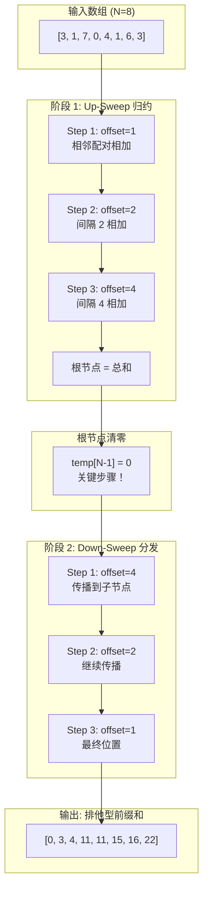

---

## Up-Sweep 阶段详解

### 概念说明

Up-Sweep 阶段构建一棵**归约树（Reduction Tree）**，自底向上逐层计算部分和。

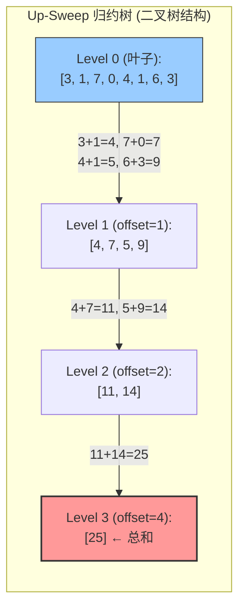

### Up-Sweep 详细步骤

**初始数据加载到 Shared Memory：**

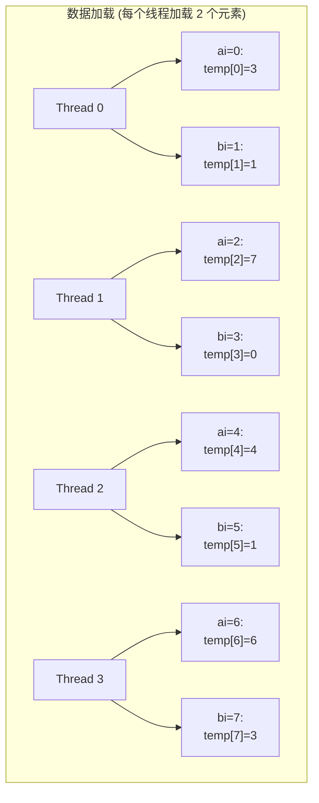

**Step 1: offset=1 (d=4, n/2)**

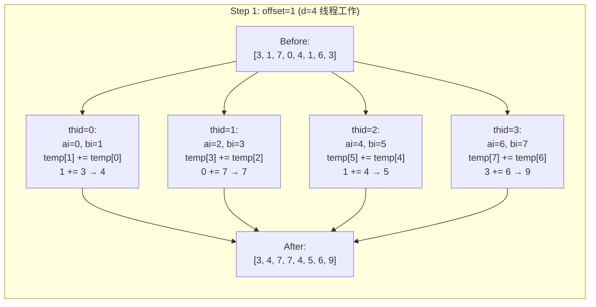

索引计算公式：
- `ai = offset * (2*thid + 1) - 1 = 1*(2*thid+1) - 1 = 2*thid`
- `bi = offset * (2*thid + 2) - 1 = 1*(2*thid+2) - 1 = 2*thid + 1`

**Step 2: offset=2 (d=2, 2 线程工作)**

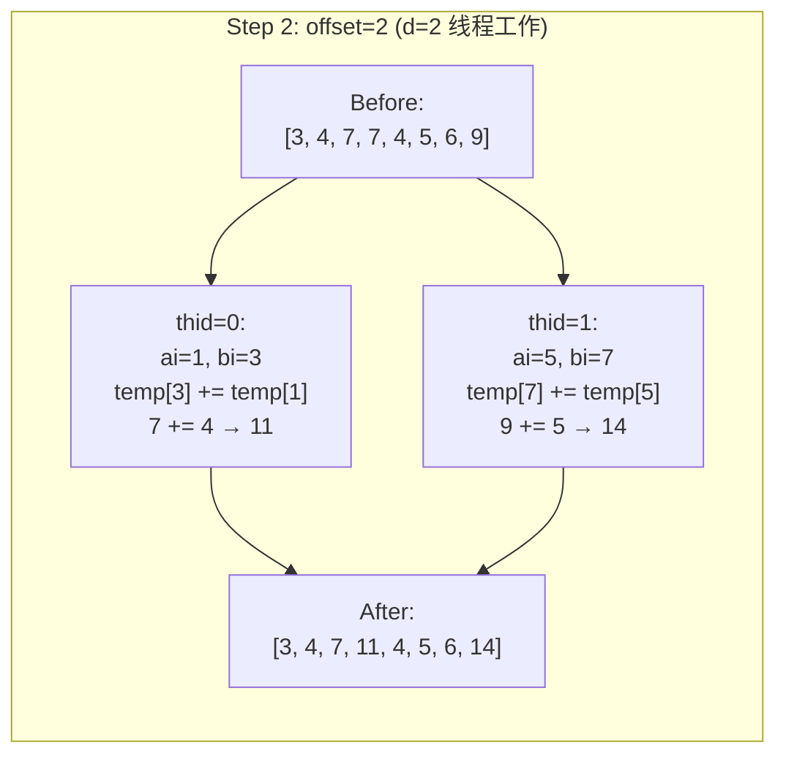

索引计算公式：
- `ai = offset * (2*thid + 1) - 1 = 2*(2*thid+1) - 1 = 4*thid + 1`
- `bi = offset * (2*thid + 2) - 1 = 2*(2*thid+2) - 1 = 4*thid + 3`

**Step 3: offset=4 (d=1, 1 线程工作)**

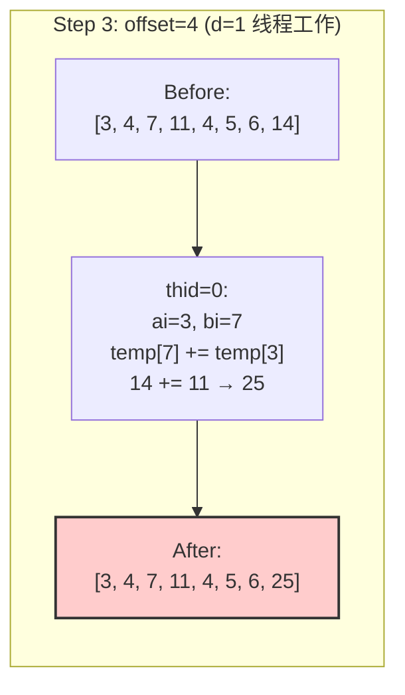

**根节点清零（排他型扫描的关键）：**

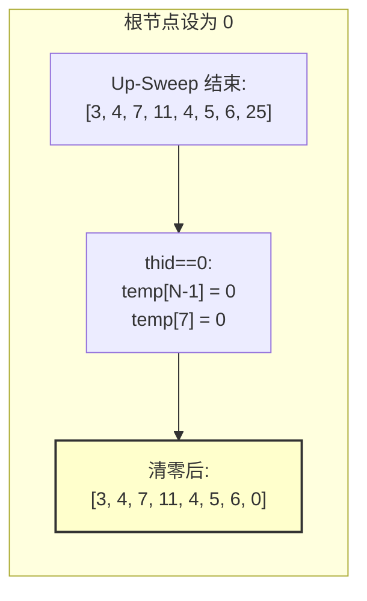

---

## Down-Sweep 阶段详解

### 概念说明

Down-Sweep 阶段自顶向下传播前缀和，通过交换和累加操作将部分和分发到正确位置。

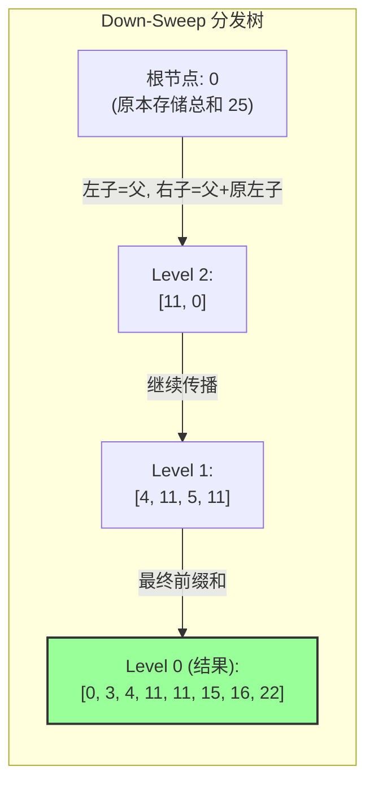

### Down-Sweep 详细步骤

**核心操作（交换与累加）：**
```
t = temp[ai]                    // 保存左节点值
temp[ai] = temp[bi]           // 左节点获得右节点值（父节点传来的前缀和）
temp[bi] += t                 // 右节点累加左节点原值（成为新的前缀和）
```

**Step 1: offset=4 (d=1)**

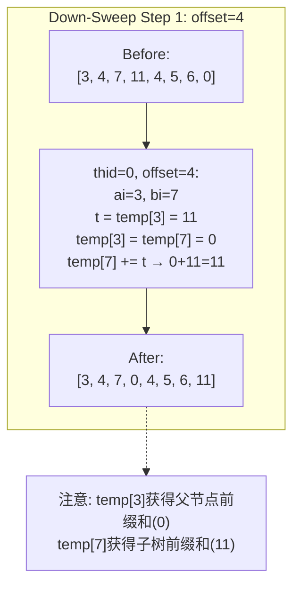

**Step 2: offset=2 (d=2)**

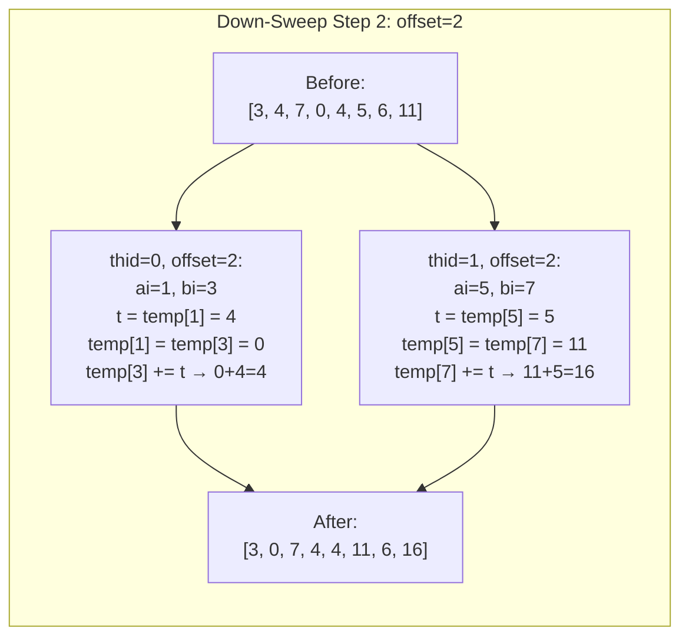

**Step 3: offset=1 (d=4)**

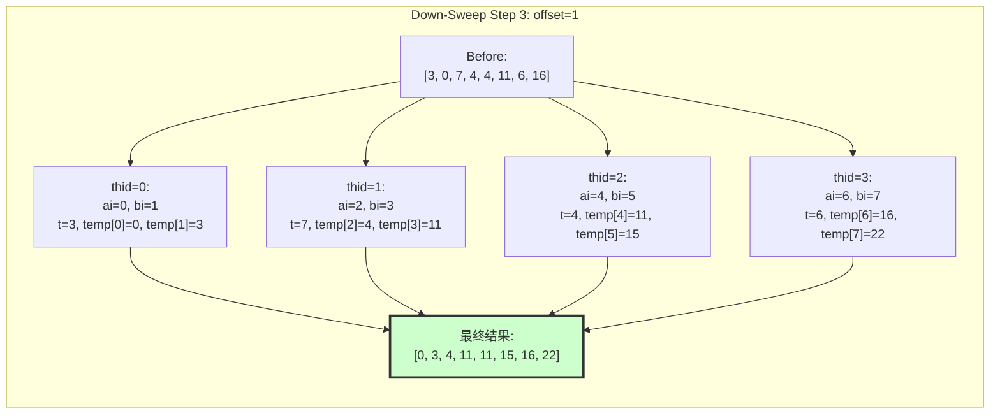

---

## 完整算法数据流图

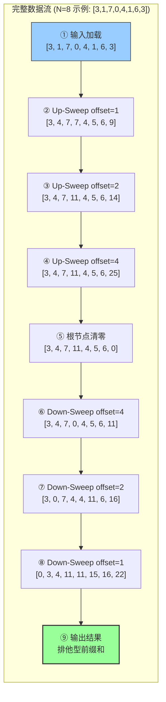

---

## 代码逐行解析

### 内核函数

```cpp
template <typename T>
__global__ void blelloch_scan_kernel(T* g_odata, const T* g_idata, int n) {
    extern __shared__ T temp[];    // 动态分配共享内存，只需 N 个元素
    int thid = threadIdx.x;        // 线程在 block 内的索引
    int offset = 1;                // 用于计算索引的偏移量
```

**关键点**：与 Hillis-Steele 的双缓冲（2N 内存）不同，Blelloch 只需 N 个元素的共享内存。

### 数据加载

```cpp
    // 每个线程加载两个元素到 Shared Memory
    // ai = 偶数索引, bi = 奇数索引
    int ai = 2 * thid;             // 偶数位置索引
    int bi = 2 * thid + 1;         // 奇数位置索引

    temp[ai] = (ai < n) ? g_idata[ai] : 0;   // 加载偶数位置
    temp[bi] = (bi < n) ? g_idata[bi] : 0;   // 加载奇数位置
```

**线程与数据映射**：
- Thread 0: 处理 temp[0] 和 temp[1]
- Thread 1: 处理 temp[2] 和 temp[3]
- ...以此类推

### Up-Sweep 阶段代码

```cpp
    // ========== 1. Up-Sweep 阶段 (归约) ==========
    // 从叶子节点向上归约，构建部分和树
    for (int d = n >> 1; d > 0; d >>= 1) {
        __syncthreads();           // 确保上一轮写入完成

        if (thid < d) {            // 只有前 d 个线程工作
            // 计算要操作的索引
            int ai_local = offset * (2 * thid + 1) - 1;   // 左节点索引
            int bi_local = offset * (2 * thid + 2) - 1;   // 右节点索引

            // 右节点累加左节点的值
            temp[bi_local] += temp[ai_local];
        }
        offset *= 2;               // 偏移量翻倍
    }
```

**循环分析**：
- 初始 `d = n/2`，每轮减半
- 线程数逐轮减少：n/2 → n/4 → n/8 → ... → 1
- `offset` 记录当前层级的跨度

### 根节点清零

```cpp
    // 将根节点设为 0 (这是排他型扫描的关键)
    if (thid == 0) {
        temp[n - 1] = 0;           // 最后一个元素清零
    }
```

**为什么清零能实现排他型扫描？**
- Up-Sweep 后，根节点存储总和（包含型）
- 清零后，Down-Sweep 会将 0 作为初始前缀和传播下去
- 最终每个位置存储的是它之前所有元素的和（不包含自己）

### Down-Sweep 阶段代码

```cpp
    // ========== 2. Down-Sweep 阶段 (分发) ==========
    // 自顶向下计算前缀和
    for (int d = 1; d < n; d *= 2) {
        offset >>= 1;              // 偏移量减半（反向）
        __syncthreads();           // 确保上一轮完成

        if (thid < d) {            // 逐轮增加工作线程
            int ai_local = offset * (2 * thid + 1) - 1;
            int bi_local = offset * (2 * thid + 2) - 1;

            // 交换并累加
            T t = temp[ai_local];              // 保存左节点值
            temp[ai_local] = temp[bi_local];   // 左节点获得右节点值
            temp[bi_local] += t;                // 右节点累加左节点原值
        }
    }
    __syncthreads();
```

**交换累加的含义**：
- `ai` 位置获得父节点传来的前缀和（原来的 `bi` 值）
- `bi` 位置成为新的前缀和（父节点前缀和 + 本子树和）

### 结果写回

```cpp
    // 将结果写回 Global Memory
    if (ai < n) g_odata[ai] = temp[ai];
    if (bi < n) g_odata[bi] = temp[bi];
}
```

### 主机端函数

```cpp
void blelloch_scan(const float* d_input, float* d_output, int n) {
    // Blelloch 算法需要 n 是 2 的幂次
    int threads = n / 2;           // 每个线程处理 2 个元素

    if (threads > 1024) {          // CUDA 最大线程数限制
        threads = 1024;
    }

    int smem_size = n * sizeof(float);   // 共享内存大小：N 个元素

    blelloch_scan_kernel<<<1, threads, smem_size>>>(d_output, d_input, n);
    cudaDeviceSynchronize();
}
```

---

## 线程活动可视化

### Up-Sweep 线程活动

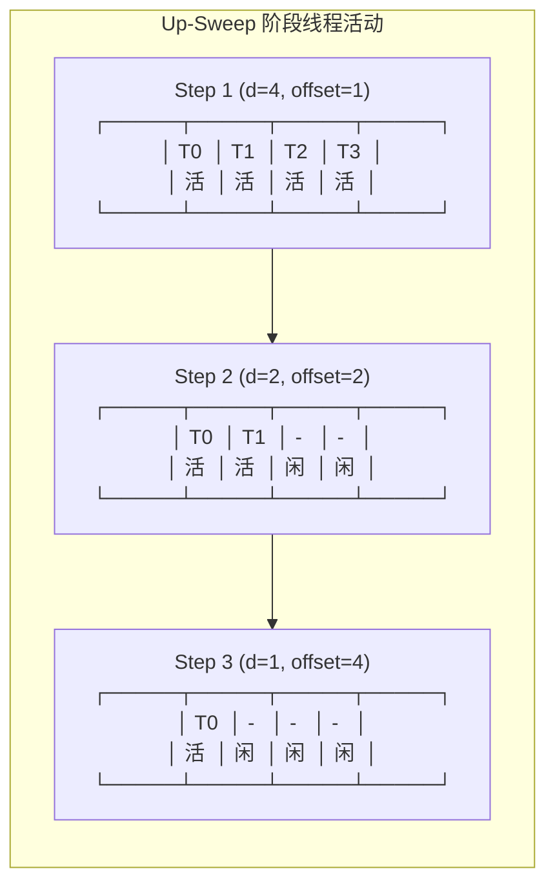

### Down-Sweep 线程活动

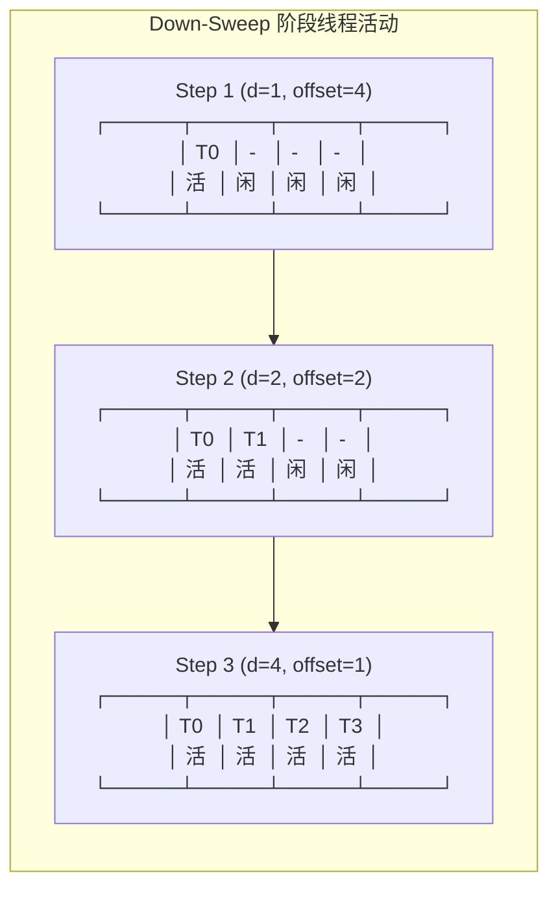

---

## 复杂度分析

### 工作量 (Work)

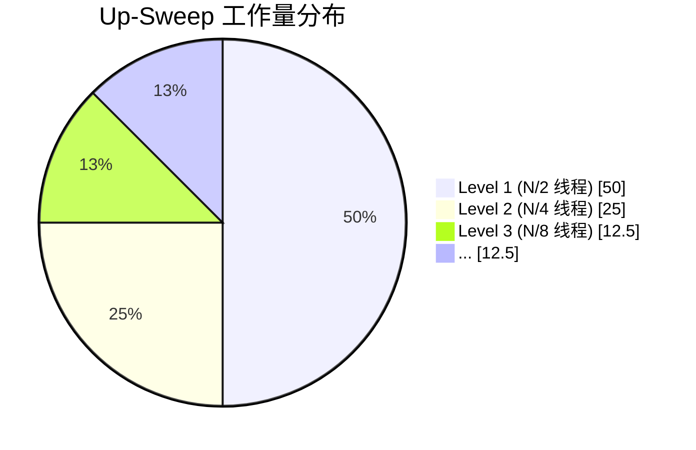

**总工作量计算**：

```
Up-Sweep:
  N/2 + N/4 + N/8 + ... + 1 = N - 1 次加法

Down-Sweep:
  1 + 2 + 4 + ... + N/2 = N - 1 次交换/加法

总工作量 = 2(N-1) = O(N)
```

对比：
- **Hillis-Steele**: O(N log N) = 10N (N=1024)
- **Blelloch**: O(N) = 2N
- **提升**：约 5 倍效率提升

### 跨度 (Span/Critical Path)

```
跨度 = 2 × log₂N

Up-Sweep: log₂N
Down-Sweep: log₂N
总计: 2log₂N = O(log N)
```

### 空间复杂度

```
共享内存使用 = N × sizeof(T)

对比 Hillis-Steele 的 2N，Blelloch 节省 50% 共享内存
```

---

## 与 Hillis-Steele 对比

| 特性 | Hillis-Steele | Blelloch |
|------|---------------|----------|
| **工作量** | O(N log N) | **O(N)** ✓ |
| **跨度** | O(log N) | O(log N) |
| **共享内存** | 2N | **N** ✓ |
| **同步次数** | log N | 2 log N |
| **线程利用率** | 高 (每轮全工作) | 低 (部分线程空闲) |
| **实现复杂度** | 简单 | 中等 |
| **结果类型** | 包含型/排他型 | 直接排他型 ✓ |

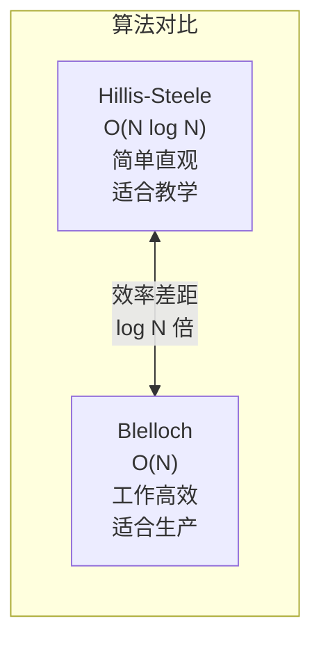

---

## 优缺点总结

### 优点

1. **工作高效**：O(N) 工作量，理论最优
2. **内存高效**：仅需 N 的共享内存
3. **直接排他型**：无需额外转换步骤
4. **适合大规模数据**：N 越大，优势越明显

### 缺点

1. **线程利用率低**：Up-Sweep 和 Down-Sweep 初期很多线程空闲
2. **需要 2 的幂次**：数据长度必须是 2 的幂次（可 padding 解决）
3. **实现稍复杂**：索引计算比 Hillis-Steele 复杂

---

## 使用建议

1. **生产环境首选**：Blelloch 是 CUDA 扫描的标准算法
2. **大规模数据**：N > 512 时，Blelloch 优势明显
3. **内存受限**：共享内存紧张时，Blelloch 更优
4. **学习曲线**：建议先学 Hillis-Steele，再学 Blelloch

---

## 参考

- Blelloch, G. E. (1990). Prefix sums and their applications.
- GPU Gems 3, Chapter 39: Parallel Prefix Sum (Scan) with CUDA
- Harris, M. (2007). Parallel Prefix Sum with CUDA
